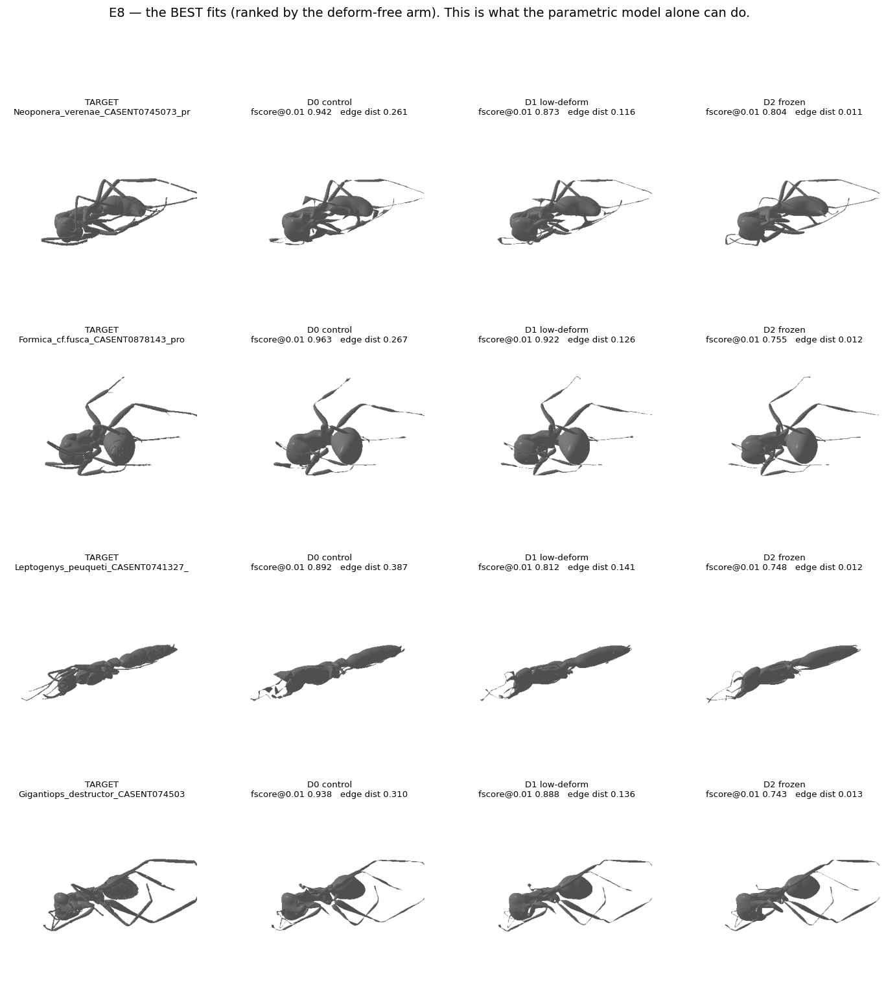
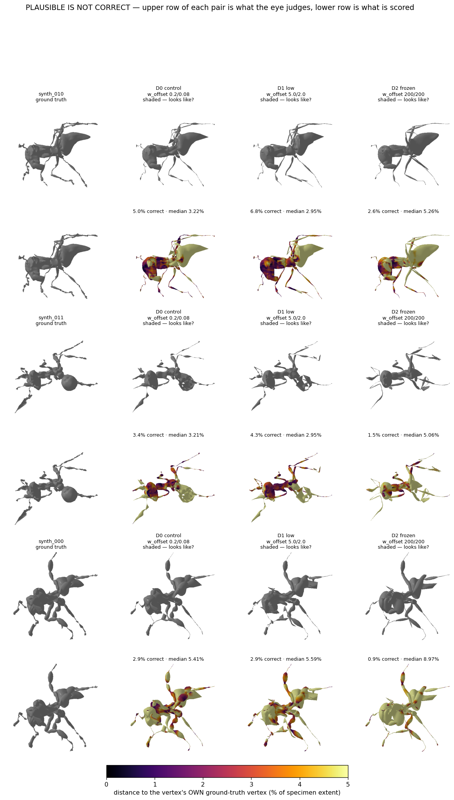
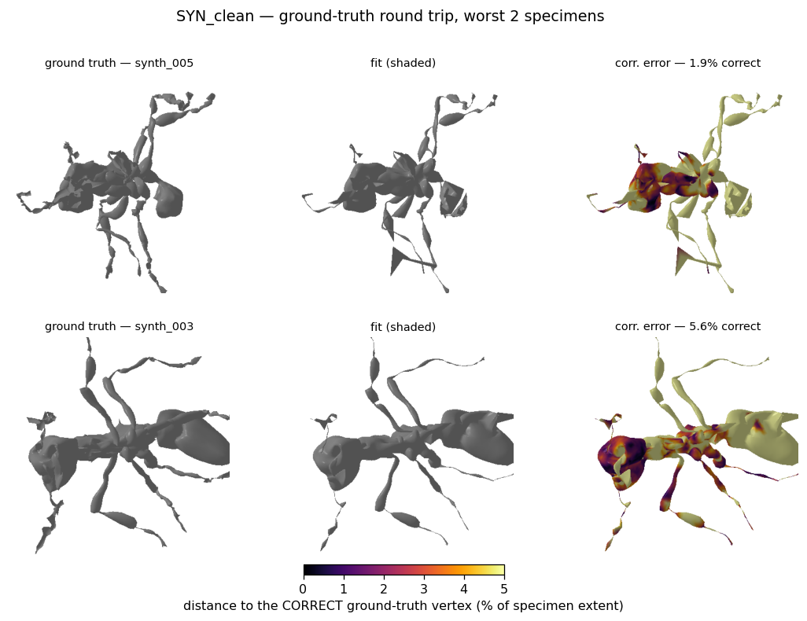

# Final report — mesh registration & morphometrics: what to keep, what died, what to try next

Branch `feature/registration_moonshot`, 2026-08-07. Synthesises and cross-checks:
[moonshot REPORT.md](moonshot/REPORT.md) · [REPORT_v1_superseded.md](moonshot/REPORT_v1_superseded.md) ·
[REPORT_E8.md](moonshot/REPORT_E8.md) · [hull/REPORT_HULL.md](moonshot/hull/REPORT_HULL.md) ·
[SYNTHETIC_ROUNDTRIP.md](moonshot/SYNTHETIC_ROUNDTRIP.md) (E6) ·
[morphometrics/REPORT_MORPHOMETRICS.md](morphometrics/REPORT_MORPHOMETRICS.md) ·
[SOURCES.md](moonshot/SOURCES.md) · [hull/SOTA_INVENTORY.md](moonshot/hull/SOTA_INVENTORY.md) ·
[khaoula_review/REVIEW_penetration_update.md](khaoula_review/REVIEW_penetration_update.md).
Every number below was re-verified against those documents and the working tree; discrepancies found
during that check are collected in Appendix B rather than silently reconciled.

---

## TL;DR

1. **The project's goal was correctly re-scoped, and the data supports the new scope.** Dense
   per-vertex correspondence is not achievable with the current machinery even under ceiling
   conditions: on targets generated *from the model itself* (E6 — exact ground truth, no noise,
   no debris; real workers can only be worse), the adopted recipe lands **6.69%** of vertices on
   their correct counterpart (control 4.81%, ~3.8 vertex-spacings of error, barely above the
   3.03% that pure noise scores), and 83.3% of that error never crosses a part boundary — out of
   reach of every partition-, kernel- or filter-shaped intervention, forever (measured on the
   ceiling corpus; the bound holds a fortiori on workers, though the proportions were not
   re-measured there). Morphometric measurements — weighted averages over hundreds of vertices —
   survive exactly the error that kills dense correspondence: genus classification at 6.1×
   chance lot-blind, replicated across two fully independent corpora at 3.8× chance.
2. **The best-candidate pipeline is (in these experiments) not `fitter_3d/optimise.py`.** It is the
   `optimise_hierarchical` → `optimise_moonshot` chain under recipe **D1** (§1). Stock
   `optimise.py`/`trainer.py`/`ants_cfg.yaml` are byte-identical to the master this branch
   forked from; **remote master has since gained the joint-limit term** (issue #97, with the
   25-PC model committed) but still carries the other measured defects — pose freeze, sampling
   asymmetry, shrinkage edge loss, unbounded joint scales (§2.1). §2 lists the generalisable
   changeset to carry forward.
3. **Only two interventions ever truly moved correspondence (when correspondance is treated primarily as vertex-to-vertex location between known template to target matches from synthetic examples, generated from sampling the OmniAnt model), and both act on what the model may
   *represent*, not on how the data term is shaped:** removing the `w_beta_prior` term (betas sd
   ×757, gen/spread 0.987 → 0.935) and the 25× free-form offset penalty (correctness 4.81% →
   6.69%, the largest single gain). Six-plus data-term interventions were nulls, all bounded by
   the same 16.7% ceiling (§3). **Provenance caveat (§2.1): the beta prior was never part of
   the original code — it was introduced on this branch and its removal is the reversion of a
   self-inflicted defect, not a win over the original pipeline. The offset penalty is the one
   genuinely new mechanism with a measured correspondence gain.**
4. **The metric suite is now two-tier by necessity:** surface-proximity metrics (chamfer, fscore,
   Hausdorff, all per-part distances) are gameable by shrink-wrapping and must never be read
   alone; target-independent integrity metrics (edge distortion, deform magnitude, folding,
   midline deviation, neighbourhood preservation) plus two correctness instruments (E6 round
   trip, probe-19 with known failure modes) are what actually adjudicate (§2.3, §3.2).
5. **Khaoula's independent penetration-loss work converges on the same diagnosis from a
   different loss** (§5): her deliverable's central finding — contact gets shallower but not
   less frequent — is explained by the same structural fact this investigation measured (pose
   frozen in the deform stages, so a collision can only be resolved by denting the mesh, never
   by rotating a limb away). Her detector is a named gap in our metric suite, and her proposed
   joint experiment (`scheme: 'all'` + gentle penetration weight) is queued and cheap.
6. **Next avenues, in order (§6):** ship the D1 config fixes (including two production-config
   defects found during this audit); sweep the offset penalty around its untuned 25×; run the
   penetration × `scheme: 'all'` joint experiment; bound `log_beta_scales`/`betas_trans` (the
   one untested mechanism behind the anterior failure); test Diff3F-style extrinsic features
   for the within-part 83%; and on the morphometrics side, recover absolute scale and break the
   collection-lot confound — both collections problems, not pipeline problems.

---

## 1. The recommended status quo: recipe D1, pinned exactly

"Recipe D1" — the recipe that fitted all 757 workers and all 81 `ALL_ANTS_CLEAN` meshes for the
morphometrics report — is a two-script chain. Stock `fitter_3d/optimise.py` is untouched by it.

```bash
export SMILIFY_SMAL_FILE=3D_model_prep/OmniAnt_25PCs_joint_limited.pkl

python -u -m fitter_3d.optimise_hierarchical --mesh_dir $M \
    --midline 2.0 --beta_prior 0.0 --limit 0.273 --offset 30.0 --results_dir $R/${t}_hier

python -u -m fitter_3d.optimise_moonshot --mesh_dir $M \
    --yaml_src diagnostics/moonshot/cfg/D1_low.yaml \
    --init_from $R/${t}_hier/H2_joint.npz --results_dir $R/$t
```

([run_m1_fit_all.sh:59-68](morphometrics/run_m1_fit_all.sh)). Stages H0_body → H1_legs →
H2_joint place the skeleton with a fit-derived per-part data term; `H2_joint.npz` is handed to
two `scheme: all` moonshot stages (1000 its each) whose defining setting is
**`w_offset: 5.0 / 2.0`** — the 25× offset penalty E8 validated on ground truth. Final artefact:
`Stage_3_deform_fine.npz`.

Lineage: `M7_handoff_midline` → `BPX_noprior` (beta prior actually removed from *both* files) →
**D1** (25-PC joint-limited model + calibrated joint limits + 25× offset penalty). Three recipes
(M7/D0, D1, D2) were scored by the direct ground-truth instrument; D1 is the one *adopted* on
that evidence rather than on proxies.



**Fix before using this as the test baseline** (found during this audit):

1. `D1_low.yaml` ships with joint limits **off** in the handoff, while every synthetic-validation
   config that justified it (`D1_SYN.yaml`, `M7_SYN_clean.yaml`) sets `w_limit: 0.006` in both
   stages. One-line YAML fix.
2. `H3_deform` is 600 wasted iterations/specimen (its npz is never consumed by the chain; the
   `--offset 30.0` flag is consequently inert). Make it a flag rather than deleting it — ~10
   diagnostic probes read `H3_deform.npz`. Related trap: H3's weight dict omits
   `w_limit/w_scale/w_trans` ([optimise_hierarchical.py:487-496](../fitter_3d/optimise_hierarchical.py)).

---

## 2. What works — carry forward and test

### 2.1 Provenance first: fixes vs reversions

Checked against **remote master** (`origin/master`, fetched 2026-08-07), whose complete stock
loss-weight set is `w_chamfer, w_edge, w_normal, w_laplacian, w_sdf, w_limit`:

- **Never in the original code:** `w_beta_prior` (the shape-freeze saga was entirely
  self-inflicted — the branch added the prior after misreading dormant legacy `betas_prec` as a
  bug; the stock baseline, prior-free, always had betas sd 0.256), the branch's rest-edge
  reference bug, and every new mechanism below (`w_offset`, `w_midline`, `w_sym`, hierarchical
  staging). Corollary: even E6's 4.81% "control" is a branch recipe — **the true stock pipeline
  has never been E6-scored.**
- **Genuine original defects, all still on remote master:** pose frozen 2000/2400 its
  (`ants_cfg.yaml` `scheme: 'deform'`, lines 27/38); vertex-vs-area chamfer asymmetry
  (`trainer.py:430,433`); shrinkage edge loss (`trainer.py:438`); nothing bounding
  `log_beta_scales`/`betas_trans` (the 889× antenna scale range is a *stock* measurement);
  `scaledirs`/`transdirs` shipped but never read; `posedirs` zero-substituted.
- **Remote master has moved** (local `f72d292` → remote `0f441b9`): the joint-limit hinge landed
  in stock `trainer.py` (issue #97; `ants_cfg.yaml` Stage_1 at `w_limit: 100.0`, correctly
  scaled for that regime per REPORT §6.9.1), and `OmniAnt_25PCs_joint_limited.pkl` is committed
  there. Rebase before porting.

### 2.2 The porting list, in order of measured value

| # | what works | evidence | status |
|---|---|---|---|
| 1 | **Free-form offset penalty `w_offset`** (L2 on `deform_verts`), D1 setting 5.0/2.0 | correctness 4.81 → **6.69%** (+39% rel., ground-truth corpus); edge distortion 0.35 → 0.14 (128 workers); zero free-form (D2) is *worse* — the optimum is interior | [trainer_moonshot.py:488](../fitter_3d/trainer_moonshot.py); **absent from stock** — nothing bounds `deform_verts` there |
| 2 | **Never freeze pose: `scheme: 'all'` in the deform stages** | stock freezes pose for 2000/2400 its (Δjoint_rot exactly 0.00000); switch improves nearly everything at zero cost, 3-seed replicated (deform_mag +23.52 ± 0.05%; chamfer inconclusive across seeds) | `param_map['all']` exists at [trainer.py:261](../fitter_3d/trainer.py); config-only fix in [ants_cfg.yaml](../fitter_3d/ants_cfg.yaml) |
| 3 | **Symmetric area-weighted sampling** (both meshes) | stock compares 3000 target samples vs all 10,229 raw vertices; fixing it: Stage_2 chamfer −48% | [trainer_moonshot.py:419-424](../fitter_3d/trainer_moonshot.py); defect still in stock |
| 4 | **Rest-edge loss** referenced to *current* pose/shape, offsets zeroed | stock `mesh_edge_loss` is an active shrinkage force at `w_edge 0.8`; corrected form scores an articulated-but-undeformed mesh exactly 0 | [trainer_moonshot.py:256-279](../fitter_3d/trainer_moonshot.py); note the D1 YAMLs still run `edge_mode: shrink` (reason undocumented) — porting `rest` needs one confirmation run |
| 5 | **Midsagittal planarity penalty** on the 223 `sym_verts` (variance of y), `w_midline 2.0` | swung midline deviation from +43.8% worse to −46.5% better; the scale-symmetry tie cannot see out-of-plane body rotations | [trainer_moonshot.py:122-143](../fitter_3d/trainer_moonshot.py) |
| 6 | **Joint limits**, weight measured per regime: 0.273 hier / 0.006 handoff (~47× apart) | violations 37.4 → 0.8 axes/specimen, overshoot → 0.0°; distal pose instability −34.3%. **Not a correspondence fix** (pre-registered kill fired) — an output-validity constraint | [joint_limits.py](../fitter_3d/joint_limits.py); landed on remote master (issue #97) — rebase, keep the measured weights for this chain |
| 7 | **Beta prior stays OFF** | never existed in the original code (§2.1); a warning, not a fix — even the "tuned" 1.5e-4 suppresses shape. The `betas_prec` assignment is *not* deletable (both experimental trainers read it); annotate it | defaults 0.0 everywhere |
| 8 | **Bounds on `log_beta_scales`/`betas_trans`** (`scale_barrier`/`trans_barrier`) | the stock baseline spans **889×** on one antenna joint — literally "the head shrinks into the thorax"; the one untested anterior mechanism (§6.3) | [joint_limits.py:79-135](../fitter_3d/joint_limits.py); implemented, calibrated, **never validated** — next experiment, not yet a default |
| 9 | **Hierarchical part-anchored staging** with the fit-derived, *revisable* partition | distal-leg placement −76% with pose alone; frozen and soft variants both worse or null — circularity is also the error-correcting mechanism | [trainer_hierarchical.py](../fitter_3d/trainer_hierarchical.py); this *is* the candidate front-end |
| 10 | **`scaledirs`/`transdirs` coupling**, env-gated | never validly tested — the §6.7 "refutation" ran on a wrong transform the code disowns ([smal_torch.py:339-343](../smal_model/smal_torch.py)); the defect stands: the model ships these blendshapes, the fitter never reads them | keep opt-in; first valid test is §6.3 |
| 11 | **`radial_med` fittability gate** (scan-only, no template) | held-out easy-vs-random: deform_mag +38.9% (p=4.5e-13); top-50% cut −21.3% vs full corpus. Surface-fitting triage only — **not needed for morphometrics** (§4) | `out/fittability_gate.csv` |

Also keep: `config.py`'s `SMILIFY_SMAL_FILE` override, and
[moonshot/preprocess_meshes.py](moonshot/preprocess_meshes.py) as a data-hygiene tool (measured
*not* to improve registration — §3.1).


### 2.3 Instruments that can be trusted (must travel with the fixes)

Every defect above survived for years because chamfer and fscore could not see it. Porting the
fixes without the instruments recreates that failure mode.

| instrument | file | measures | class |
|---|---|---|---|
| `edge_logratio`, `deform_mag`, `tri_quality` | [moonshot/metrics.py](moonshot/metrics.py) `deformation_metrics` | template-structure damage; target-independent | integrity |
| `dihedral_p99`, `folded_face_frac` | same | tearing/folding the suite once missed (M6: 142.7°/2.79% vs baseline 70.7°/0.54%) | integrity |
| `midline_dev` | `symmetry_metrics` | midsagittal verts off y=0 — "the closest thing to free ground truth" ([metrics.py:201](moonshot/metrics.py)) | integrity proxy |
| neighbourhood preservation | [probe_10](moonshot/probe_10_correspondence_quality.py) | fraction of each vertex's 12-NN surviving the fit | integrity |
| **E6 synthetic round trip** | [make_synth_corpus.py](moonshot/make_synth_corpus.py) → [score_synth_roundtrip.py](moonshot/score_synth_roundtrip.py) | *direct* correspondence correctness; the only instrument that ranked the E8 arms correctly | correctness (GT) |
| **probe-19** gen/spread | [probe_19](moonshot/probe_19_correspondence_quality.py) | population-level correspondence *consistency*; dynamic range 0.42@10 / 0.00@20 on exact correspondence — two known failure modes (§3.2) | correctness proxy |
| registration-quality composite | [morphometrics/measure.py](morphometrics/measure.py) `quality_composite` | z-sum of deform + edge + normal-roughness; the one downstream filter that works (§4) | integrity, per-specimen |
| `violation_report` | [joint_limits.py:58-76](../fitter_3d/joint_limits.py) | per-axis anatomical-range violations | validity |
| **penetration burden** | **missing** — Khaoula's detector, Drive-only (§5) | inter-part contact depth/count; nothing in the suite sees it. Import with a *normalised* statistic | validity — the named gap |

---

## 3. What did NOT work — the more valuable list

Every entry is a **branch-introduced mechanism** built, tried and abandoned here — none of them
removed anything from the original pipeline (§2.1). **TRUE** = dead on its own evidence for the
purpose tried; **COND** = dead for that purpose, alive for another.

### 3.1 Dead ends

| intervention | killing number | verdict |
|---|---|---|
| Robust kernel below the residual scale (v1's "E3" arm) | 83% of points in the zero-gradient region | TRUE |
| Mutual-NN + Lowe ratio | distal-leg *distance* 12× worse; retains 5.8× fewer correspondences, thin parts read as outliers at 36× body rate | TRUE |
| Sinkhorn / entropic OT | worst arm tested; spreads a leg's mass over several legs | TRUE |
| Raising pose lr / budget (v1's "E1_posebudget") | worse than its own initialisation — pose is *trapped* (multimodal), not starved; distal legs 14° apart across sampling seeds | TRUE, foundational |
| Geodesic branch decomposition | ≥6 branches on 58% vs its own 80% gate; 20% self-agreement — touching limbs have no bottleneck | TRUE on this data |
| Learned part field as a **frozen** partition | −18.5% distal `within_tau` vs byte-identical control, loses *both* metric families; the classifier itself is real (91.3% vs 24.8% baseline) | COND — frozen is the wrong way to use target-derived |
| Soft (EM) partition | gen/spread 0.9870 → 0.9871 — indistinguishable from hard | TRUE |
| Anterior split (own groups for head/mandible/antenna; REPORT.md's "E3") | head deform ratio 0.72× → 0.73× (had to rise toward 1.0) | TRUE — the partition is not the anterior failure |
| Convexity hull hierarchy + chunk voting (E7) | chunk vote 8–19 points worse at every usable k; best gain anywhere +0.0029 at k=45 | COND — the decomposition itself is reproducible (0.94–0.99; 0.91–0.999 on geodesic-collapsed specimens); useless *for the fitter* |
| `scaledirs` coupling as the shape-freeze fix | measured on a wrong transform the code has since disowned; never validly re-run | NOT VALIDLY TESTED — moot for the freeze (cause was the branch's own beta prior) |
| pose:shape lr ratio as the shape-freeze cause | betas sd unchanged; slack moved into joint scales | TRUE (cause was the beta prior, in **two** files) |
| Joint limits as a correspondence fix (REPORT.md's "E1") | violations → 0.0°, gen/spread monotonically *worse*; compensation flows into `log_beta_scales` +22% and `betas_trans` +10% | COND — kept for output validity + distal stability |
| Volumetric ellipsoid IoU | chamfer is 3–4× *more* sensitive to slide/stretch, IoU up to 39× *less*; prior art traded 52% accuracy for speed | TRUE, dropped before being built |
| Mesh preprocessing as the blocker | sign flips with scoring target; target-independent metrics marginally *worse* | TRUE |
| Shape-space enlargement from worker fits (M6 37-dir; gated 20-dir rebuild) | +0.004 fscore for 2.8× the space; rebuilt space changes nothing held-out; learned directions fold (2.79% vs 0.54%) | COND — worker offsets are correspondence noise; the *clean-corpus* 25-PC space carries real structure |
| Full-corpus co-registration (757 workers, multi-round) | never run — killed by a ten-minute measurement: gen/spread 0.99–1.00 at any corpus size | COND — reverses iff worker correspondence becomes consistent |
| HKS / intrinsic descriptors | 0.66% correct *with a part oracle* vs 0.14% chance; cannot break bilateral or six-leg symmetry; near-constant along tubes | COND — kills intrinsic-only, not the learned-extrinsic family |
| D2 frozen deform | 3.36% correct vs control 4.81% while *winning* probe-19 and the eye | TRUE — the optimum is interior |
| t-SNE/UMAP/HDBSCAN for genus clusters | ARI ≤ 0.004; silhouette of true labels *worse* in UMAP (−0.44) than PCA (−0.13) | TRUE — the taxonomic signal is local, not cluster structure |
| Species-level claims from this corpus | accession number alone: 95.7% vs shape's 31.9% — species = collection lot | TRUE until sampling changes |

**The unifying number.** Seven of these (robust kernels, per-part robust scaling, geodesic
branches, frozen part field, soft partition, anterior split, convexity hierarchy) were bounded
from the start by one measurement: correspondence error is **83.3% within-part**, so every
partition-shaped intervention was capped at 16.7% correctness even if perfect. (Ceiling corpus;
holds a fortiori on workers, proportions not re-measured there.) One probe retroactively
explains seven nulls and prospectively disqualifies the family — including any future
segmentation method, however good.


**The complementary pattern.** The only interventions that moved correspondence — removing the
(branch-introduced) beta prior, penalising free-form offsets — act on *what the model is allowed
to represent*. Everything acting on *how the data term is shaped* was null. Check any proposed
future fix against this pattern before building it.

### 3.2 Optimality criteria that are gamed too easily

`chamfer_l2`, `fscore@τ`, `hausdorff`, `normal_consistency`, and **all** per-part
`dist_mean`/`within_tau` reward proximity *by any means, including destroying the mesh*:

- **The snapping test:** snapping distal vertices onto the target "improves"
  `part_leg_distal_dist_mean` 53% while `edge_logratio` explodes 0.073 → 0.552.
- **The stock pipeline at scale:** good surface scores via 74% edge stretch and 36% of local
  neighbourhoods destroyed, pose frozen throughout.
- **Chamfer prefers wrong anatomy:** the chamfer-optimal roll is non-zero for 68% of
  canonically-aligned specimens.
- **Scoring-target choice flips signs:** cleaned-target fscore +6.6% becomes **−6.4%** against
  the raw target, same fits.
- **Renders are anti-evidence for constrained arms:** with offsets pinned, a fit is a plausible
  model ant *no matter where it lands* — D2 looked best and measured worst. The eye scores
  plausibility, not correctness.



- **probe-19's two failure modes:** it is a dimensionality measure (any arm that pins deform is
  guaranteed a good score — it ranked the E8 arms exactly backwards; retired as a primary
  outcome for deform-capacity changes), and it has almost no resolution in the 0.92–0.96 regime
  where all worker arms live.
- **E6's own honest calibration:** the control's 4.81% sits barely above the 3.03% noise floor;
  the defensible statement is "~3.8 vertex-spacings of error". The worst part is the **gaster**
  (1.5%), not the thin legs — a smooth ellipsoid carries no positional information.



**Methodology rules the investigation paid for:** run the stupid baseline (a box rule beat the
part field's gates; k-means beat every convexity criterion at usable k; an accession number beat
the measurement suite at "species"); pre-register the outcome and kill condition (twice
cancelled an expensive GPU arm); replicate over seeds before believing small effects; check
instruments against a perfect input (the anchor-init objective converged 16× below the
perfect-fit floor — it was optimising a sampling artefact).

---

## 4. Morphometrics — the working deliverable

The full experiment set, calibration, and figures live in
**[morphometrics/REPORT_MORPHOMETRICS.md](morphometrics/REPORT_MORPHOMETRICS.md)** — that report
is the guide for further efforts on this track; this section only fixes what carries over.


**What works:** bone lengths from `J_regressor @ verts` and part extents — weighted averages
over hundreds of vertices — survive exactly the within-part scrambling that kills dense
correspondence. Lot-blind genus classification 13.0% vs 2.1% null (**6.1×**, p < 0.0001, 82
genera); cross-corpus replication **3.8×** (immune to the lot confound by construction); textbook
myrmecology recovered unprompted (*Odontomachus* most elongate-headed *and* most
slender-mandibled of 62 genera; trap-jaw guild separates at p < 0.0001). Bilateral asymmetry
(4.5% median) gives a free per-specimen precision floor.

**What to use and what not to** (REPORT_MORPHOMETRICS §9):

- Genus- and subfamily-level comparative work on **head, mesosoma and gaster proportions**
  (cross-corpus R 0.40–0.76). See `out/fig_genus_indices.png` and `out/fig_crosscorpus.png`.
- **Not species** (species = collection lot; accession number alone predicts it at 95.7%) and
  **not leg ratios** (R = 0.136 against truth, R ≈ 0 across corpora; calibration in
  `out/fig_feature_reliability.png`).
- Filter on the **registration-quality composite** (deform/edge/normal z-sum), keep the best
  ~50% — lift 6.8× vs 4.2× size-matched random (`out/fig_filter_quality.png`). The scan-quality
  gate does nothing here (§2.2 row 11); chamfer is the wrong filter on principle (§3.2).
- The shape space has **no cluster structure** — the signal is local (1-NN), PC1 is ecological
  rather than phylogenetic (`out/fig_embeddings.png`, `out/fig_shape_space.png`).


---

## 5. Independent cross-check: Khaoula's penetration-loss deliverable

Reviewed in full ([khaoula_review/REVIEW_penetration_update.md](khaoula_review/REVIEW_penetration_update.md),
numbers recomputed from her raw CSVs). Two investigations attacked *different losses* and
converged on the *same structural defect*:

- **Her central finding is real and replicates on data she did not use to find it:** the gentle
  penetration weight makes contact *shallower* (4/5 independent specimens) but not less
  *frequent* (count rises on 3/5). Verified push-backs: "2/10 regress" is the optimistic
  aggregation (2–4/10 — her burden metric is an unnormalised sum of depths, the same
  outlier-dominated failure class as our retired `dist_mean`); the proposed single-seed
  regression flag cannot work at 38–146 pp per-seed noise; +26% wall time went unreported.
- **Her mechanism is our mechanism.** The loss runs only in stages where pose is frozen
  (her SDF-loss deliverable first surfaced the freeze; the review reconfirmed it), so it can
  only *dent* the mesh, never rotate a limb out of collision — depth falls, the surrounding
  shell touches anew. That is the count/severity split explained, and it is the same pathology
  E8 quantified globally: offsets doing pose's work. Her weight-reduction protocol and
  experimental discipline (pre-registration, 3-seed repeats, sign tests) are the template the
  moonshot followed.
- **Open and cheap:** her detector is the named gap in our metric suite (§2.3), and her joint
  experiment (`scheme: 'all'` + gentle weight) is designed and falsifiable (§6.2) — both
  blocked only on `penetration_loss.py` landing in the repo (currently Drive-only).

---

## 6. Next avenues, in order

### 6.1 Ship the config/code state (days, no research risk)

1. Fix the two production-chain defects (§1); add `w_limit/w_scale/w_trans` to H3's weight dict.
2. Rebase onto remote master (it already carries the 25-PC pkl and stock `w_limit`), then commit
   what only exists here: `hull_partition.py`/`hull_decomposition.py` and the uncommitted
   `optimise_hierarchical.py` edits.
3. Port §2.2 items 1–7 into the mainline path (or bless the hierarchical→moonshot chain *as*
   the mainline for 3D scan registration), with the §2.3 instruments alongside.
4. Annotate — do **not** delete — the `betas_prec` assignment in `trainer.py` (both
   experimental trainers read it; fix the stale comment at `trainer_moonshot.py:88-89` too).

### 6.2 Two cheap experiments

**Sweep the offset penalty** at handoff `w_offset` ∈ {2.0/0.8, 5.0/2.0, 10/4, 20/8} on
`synth_clean`, scored by E6. 25× was a round number; the optimum is known to be interior and the
instrument exists. One afternoon.

**Penetration loss × `scheme: 'all'`** (§5): falsifiable in advance — if the severity/count
split is caused by denting, letting rotation resolve collisions should shrink or invert it. One
bench50 run once `penetration_loss.py` is in the repo; import her detector into §2.3 either way.

### 6.3 The one untested mechanism: bound the per-joint scales

Of the three mechanisms that could produce the anterior failure ("head shrinks into the thorax,
mandibles/antennae explode to cover it"), the partition is tested and null, and rotation limits
cannot reach it by construction (45 of 48 non-leg, non-mandible axes carry no authored range).
The third — unbounded per-joint scale/translation, 889× on a stock antenna joint — has
calibrated barriers already implemented ([joint_limits.py:79-135](../fitter_3d/joint_limits.py)).
Run `--scale_cap`/`--trans_cap` with E6 + anterior deform ratios as outcomes. This is also the
`scaledirs` coupling's **first valid test** (§2.2 #10).

### 6.4 The within-part 83%: extrinsic learned features (Diff3F first)

The only family that can reach the error no partition can. **Diff3F** (CVPR 2024): zero-shot
per-vertex semantic features from image diffusion, extrinsic by construction — so it can break
the bilateral/six-leg symmetry that killed HKS. First measure whether the features transfer to
ant CT meshes at all: a one-day probe against E6 ground truth, success pre-defined as strict
correctness well clear of the ~3% noise floor and the 6.69% incumbent. Fallbacks: ULRSSM,
Hybrid Functional Maps, NFR — all facing the measured caveats (welded legs break near-isometry;
tubes are intrinsically homogeneous). PartField and all segmentation: bounded by the 16.7%
ceiling *as partitions*; only worth testing as feature sources.

### 6.5 Morphometrics queue (blockers are collections problems, not code)

1. **Recover absolute size** — if scan metadata retains voxel spacing, Weber's length and head
   width in mm come back, adding the largest single axis of ant morphological variation.
2. **Break the collection-lot confound** for species work — same-species specimens from
   *different* accessions; a museum question.
3. **Per-specimen adaptive offset penalty** — registration error varies fivefold; a failing fit
   could get a stiffer penalty instead of post-hoc exclusion.

### 6.6 Conditional / parked

Worker co-registration rounds (until worker correspondence comes off probe-19 ≈ 0.99; the clean
corpus already registers at the exact-correspondence reference and yielded the 25-PC model);
multi-start pose (M3, −13%, never combined with D1); **posedirs** — deliberately *not*
recommended: the near-hinge DOFs here produce only small rotation-based deformation (domain
assessment at the end of [REPORT.md §8](moonshot/REPORT.md)).

---

## Appendix A — what defeats the workers (for the record)

The pipeline is not broken as machinery: on `ALL_ANTS_CLEAN` it produces registrations at the
exact-correspondence reference (probe-19 gen@10 0.5383 vs 0.42, still improving at 40 modes).
What defeats it on workers is **pose**: ethanol-preserved, contracted, folded specimens, with
the residual multimodality concentrated in distal segments the area-sampled data term cannot see
(tibia+tarsus+pretarsus = 2.4% of a leg chain's area; ~0.3 expected samples on a pretarsus at
n=8000). Skeleton misplacement ≈ correspondence error (joint positions off 3.98% of extent ≈
E6's 3.48% median vertex error). The morphometrics re-scope routes around exactly this, which is
why it works.

## Appendix B — errata in the underlying reports (found during this audit, not yet fixed)

1. REPORT.md TL;DR bullet 5 still says "surface fits, not registrations, and no amount of
   additional corpus fixes it" — superseded by §6.4.1's worker-only correction.
2. REPORT.md §8 next-steps list is stale: E1 listed as "running" and E2 as "never measured";
   both are complete in §6.9.2/§6.9.4 above it. Its TL;DR also numbers four bullets "5".
3. REPORT.md §1 conflates the stock defects: the *shrinkage* edge loss (a genuine stock defect,
   v1 §1.4) vanished from the list, replaced by the description of the investigation's own
   rest-edge reference bug (which §7.3 separately owns).
4. Arm-name collisions across generations: "E1"/"E3" mean different experiments in v1 vs
   REPORT.md.
5. Morphometrics: ICC 0.167 (§3.3) vs 0.216 (§9); lot-blind lift 6.1× (§3.1/§3.4) vs 5.9×
   (§7.2 100% row); cross-corpus null 2.3% (TL;DR) vs 2.6% (§5.1 table).
6. HULL §7.1 quotes the pipeline at 4.38%/4.32% where E6/E8 use 4.81%/3.48% — an unexplained
   re-measurement delta (likely different sampling in `within_part_signal.py`; should be
   stated).
7. HULL says "83 methods surveyed"; SOTA_INVENTORY says 66 after de-duplication.
8. HULL §3.5's local-separator rows are flagged provisional by their own author — never quote
   them as a refutation of skeletonisation.
9. [smal_torch.py:339-343](../smal_model/smal_torch.py) retracts REPORT §6.7's coupling
   refutation ("measured with that wrong transform and is therefore not trustworthy — see
   §6.11") but the referenced §6.11 was never written, and REPORT.md §6.7 still presents the
   refutation without the retraction. The coupling's pre-registered test needs to be re-run on
   the corrected transform (§6.3).
10. [trainer_moonshot.py:88-89](../fitter_3d/trainer_moonshot.py) still claims the `betas_prec`
    assignment is the only occurrence of the symbol — falsified by the branch's own trainers
    (see §6.1 item 4).
11. HULL's TL;DR 2 says the chunk vote "never beats" the incumbent, contradicted by its own §4
    table (+0.0029 / +0.0026 at k=45 on two of four stages); the defensible statement is
    "never meaningfully beats, and is 8–19 points worse at every usable k".
12. Morphometrics quotes three mutually inconsistent PCA silhouettes for the true genus labels
    (−0.128 in the §6.1 table, −0.16 in TL;DR 9, −0.201 unfiltered in the §6.1 parenthetical);
    the §3.1 row here uses the best-50% table values (−0.128/−0.439).
