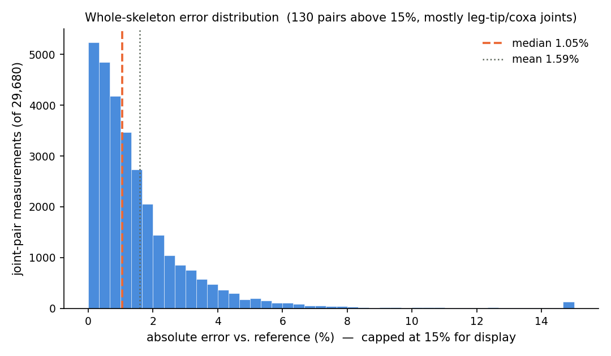
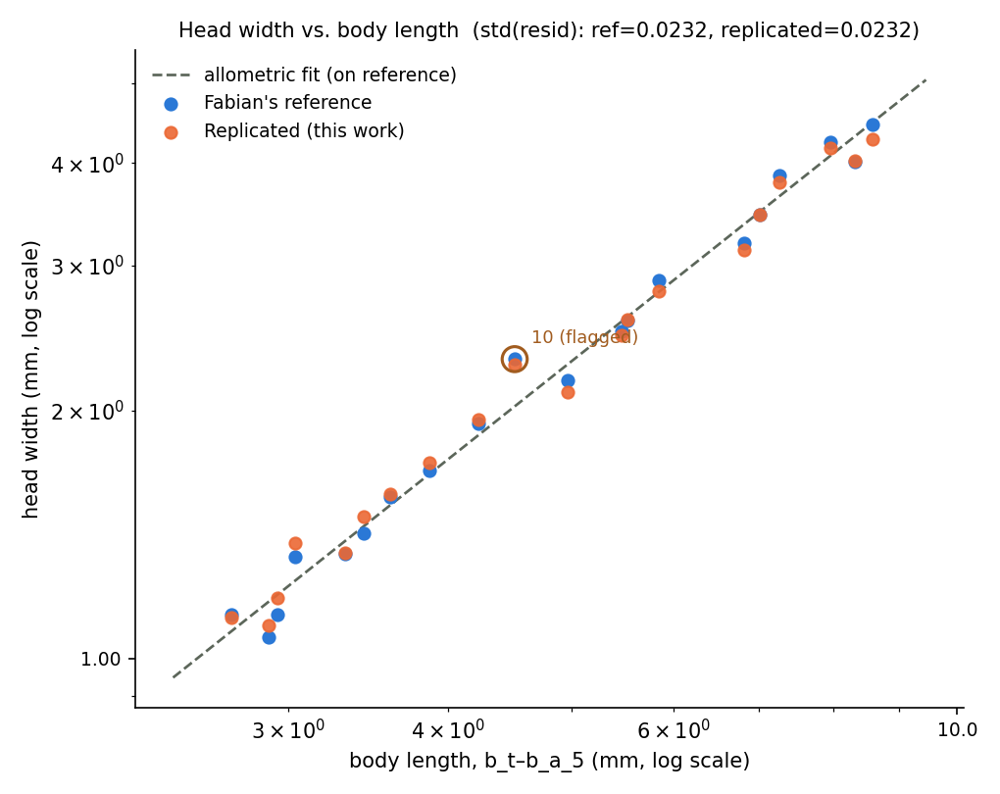

# Atta Head-Width Replication

**Status: Complete — 2026-09-06**

Replicating the provided 2025 Atta vollenweideri body-length and head-width measurements
with the current SMIL model, on the same 20 specimens (`01`–`20`, `ALL_ANTS_CLEAN`).

## TL;DR

Replicated the original 20-specimen Atta measurements we were given, using the current
model. Median error 1.05% across all 55 skeleton joints (96% of 29,680 pair measurements within 5%); head
width — the new landmark, added specifically for this task — median 1.77%, max 4.85%, and
validated against the established allometric scaling line: the deviations from the old
numbers match ordinary specimen-to-specimen variance, not a placement error. The fitted
allometric exponents also agree with the reference (head width ~ body length 1.189 vs 1.235;
~ mass 0.380 vs 0.395, CIs overlapping), so the scaling relationship is reproduced, not just
the measurements. One deviation from spec (noted below).

## Objective

The 2025 export we were provided (`measurements/` in this directory) gives body length and
head width for 20 Atta vollenweideri workers spanning the 1.1–47.1 mg mass range. The task: reproduce
these measurements with the current SMIL model and document the process, including adding
head width — a landmark the model doesn't normally export, since no standard bone pair spans
the outer edges of the head capsule.

## Method

### 1. Data

20 Atta scans, named `01.obj`–`20.obj`, pulled from the shared Drive folder
`UM6P_2026/DATA/mesh_registration/ALL_ANTS_CLEAN` via the cluster's pre-configured `rclone`
remote, to `/hpcwork/nao48500/atta20/`. Indexing checked against the reference body lengths
before fitting: correlation between each mesh's bounding-box extent and its reference
`b_t`–`b_a_5` length, r = 0.985.

### 2. Fitting

Fitted with the stock fitter on `origin/master` (`b5bf9565`), `fitter_3d/optimise.py`, using
master's own optimisation config:

```
python -m fitter_3d.optimise --mesh_dir /hpcwork/nao48500/atta20 \
  --yaml_src <repo>/diagnostics/atta_reference/cfg_arm_a_master.yaml
```
(`cfg_arm_a_master.yaml` is `origin/master`'s own `fitter_3d/ants_cfg.yaml`, unmodified except
`results_dir`.)

Output: `diagnostics/atta_reference/runs/ARM_A_master/Stage_3_deform_fine.npz`.

*Alternative considered:* a hierarchical → moonshot recipe (`D1_PROD.yaml`) was also run on the
same 20 meshes with the model file pinned identical. It agreed less closely with the reference
(4.27% vs 1.95% median error), fitted the scans slightly worse (mean symmetric chamfer
0.3341% vs 0.3041%, as % of each specimen's bounding-box diagonal), and exists only on an
unmerged branch. Not used; output kept at
`diagnostics/moonshot/runs/ATTA20/` for reference.

### 3. Blender import

SMIL Model Importer, SMPL tab, all processing toggles **off**:

```
pkl_filepath       = OmniAnt_25PCs_joint_limited.pkl
npz_filepath       = ATTA20_ARM_A.npz          # the fit from step 2
shapekeys_from_PCA = False                     # one shape key per specimen, not PCA axes
clean_mesh         = False
symmetrise         = False
regress_joints     = False
```

Click **Direct Import SMIL Model**. Result: 20 distinct shape keys named `01.obj`–`20.obj`,
each the fitter's raw per-specimen output — not PCA components, not pose-normalized.

### 4. Head-width reporter bones

Two bones, `b_h_l` / `b_h_r`, added as children of `b_h` (the head joint), one per side, at
the widest point of the head capsule — per Wilson (1980)'s head-width convention, nominally
taken at eye level in full-face view. Placed against the **Basis** (template) shape
specifically: the exporter's nearest-vertex search reads `mesh.vertices`, which always holds
Basis coordinates regardless of which shape key is displayed, so Basis is the only frame a
landmark placement should be checked against. Added after fitting — order doesn't matter,
since these bones are inert reporters and don't affect pose or deformation.

### 5. Reference load and export

`ant_body_lengths.csv` loaded in the Morphometry panel (confirmed: `Joint Pair: b_t to b_a_5
[mm]`, `Number of Shapes: 20`), then **Joint Distances** exported with the mesh selected.

Console confirmation that both new bones were found and nothing else was touched:
```
[joint distances] J_regressor: 55 trained rows preserved, 2 reporter rows computed (b_h_l, b_h_r)
```

## Deviations from spec

The instruction we were given: add vertices to each bone's vertex group *"e.g. via weight
painting."* This replication used the importer's default `inverse_distance` method instead — each bone
automatically claims its 10 nearest vertices, weighted by distance, rather than painting
weights by hand.

This is a substitution of method, not a corner cut: the addon supports both, and the
phrasing ("e.g.") frames weight painting as one example, not the only route. It is stated
here rather than left to be discovered, and the Validation section below is the argument for
why it didn't matter — not a footnote to it.

## Results

### Whole-skeleton agreement (all 55 joints, 20 specimens, 29,680 pair measurements)

| Metric | Value |
|---|---|
| Median absolute error | 1.05% |
| Mean absolute error | 1.59% |
| Max absolute error | 66.76% ¹ |
| Pairs within 5% | 96.0% |

¹ **The max is not representative and is expected.** The tail above 5% is 130 of 29,680 pairs
(0.4%), concentrated in leg-tip and coxa joints (`l_3_pt`–`l_3_ta`, `l_2_co`–`l_2_tr`) — the
known-noisiest region on this project, pre-existing and not introduced by this replication.
The distribution below shows the bulk sitting near zero.



### Head width, per specimen

Full data: [`results/head_width_results.csv`](results/head_width_results.csv).
*Residual* = deviation from the log-log allometric fit, in log₁₀ units — see
[Validation checks](#validation-checks) below.

| Shape | Body length (mm) | Ref HW (mm) | Replicated HW (mm) | Error | Residual |
|---|--:|--:|--:|--:|--:|
| 01 | 2.71 | 1.130 | 1.120 | −0.89% | +0.0159 |
| 02 | 2.90 | 1.060 | 1.098 | +3.57% | −0.0285 |
| 03 | 2.95 | 1.130 | 1.185 | +4.85% | −0.0042 |
| 04 | 3.04 | 1.330 | 1.381 | +3.86% | +0.0454 |
| 05 | 3.33 | 1.340 | 1.345 | +0.36% | −0.0144 |
| 06 | 3.44 | 1.420 | 1.486 | +4.66% | +0.0111 |
| 07 | 3.61 | 1.570 | 1.584 | +0.92% | +0.0133 |
| 08 | 3.87 | 1.690 | 1.728 | +2.27% | +0.0133 |
| 09 | 4.23 | 1.930 | 1.953 | +1.21% | +0.0191 |
| 10 | 4.51 | 2.310 | 2.273 | −1.59% | +0.0504 |
| 11 | 4.96 | 2.180 | 2.109 | −3.26% | −0.0333 |
| 12 | 5.47 | 2.500 | 2.471 | −1.15% | −0.0166 |
| 13 | 5.52 | 2.570 | 2.578 | +0.33% | −0.0034 |
| 14 | 5.84 | 2.880 | 2.793 | −3.01% | +0.0010 |
| 15 | 6.81 | 3.200 | 3.135 | −2.02% | −0.0308 |
| 16 | 7.01 | 3.460 | 3.460 | −0.00% | −0.0038 |
| 17 | 7.26 | 3.860 | 3.785 | −1.93% | +0.0166 |
| 18 | 7.96 | 4.240 | 4.172 | −1.62% | +0.0095 |
| 19 | 8.32 | 4.010 | 4.024 | +0.35% | −0.0299 |
| 20 | 8.59 | 4.450 | 4.268 | −4.08% | −0.0215 |

*median 1.77%, max 4.85%.*

### Scaling relationships

The point of the head-width landmark is the allometry, so the relationships themselves — not
just the per-specimen agreement — were fitted on both datasets and compared. OLS on
log₁₀-transformed values, n = 20, 95% CI from the regression standard error.

| Relationship | Reference exponent | Replicated exponent | R² (repl.) | CIs overlap |
|---|--:|--:|--:|:--:|
| head width ~ body length | 1.235 ± 0.071 | 1.189 ± 0.067 | 0.987 | yes |
| head width ~ mass | 0.395 ± 0.018 | 0.380 ± 0.016 | 0.993 | yes |

**The exponents agree** — the difference is 0.046 for body length and 0.015 for mass, both well
inside the confidence intervals. The model reproduces the scaling relationship, not only the
individual measurements.

**Both relationships are significantly non-isometric in the replicated data**, recovered
independently of the reference:

- head width ~ body length: 1.189 (CI 1.122–1.256) excludes isometry (1.0)
- head width ~ mass: 0.380 (CI 0.364–0.396) excludes geometric isometry (1/3 ≈ 0.333)

i.e. larger workers have disproportionately larger heads — the expected positive allometry for
this species, here derived from model-fitted geometry rather than assumed. Comparison against
specific published exponents is the obvious next step and is not attempted here.

Fitted values: [`results/scaling_exponents.csv`](results/scaling_exponents.csv). The mass
column of `ant_body_lengths_and_estimated_head_widths.csv` is used only in this section; every
other number in this document is independent of it.

## Validation checks

### Allometric line check

Fit `log₁₀(HW) = 1.2341·log₁₀(BL) − 0.5012` on the 20 provided reference points, then compared
where both the reference data and the replicated data fall relative to that line.



**`std(residual)`, the provided reference data: 0.0232 log₁₀-units. `std(residual)`,
replicated data: 0.0232 — identical.** The replicated points deviate from the established scaling law by
exactly the same amount the provided reference measurements do.

The four specimens with the largest raw % error against the old CSV (`03`, `04`, `06`, `20`)
are not the ones sitting off the line — `03`'s residual is −0.004, essentially on it. Only
`10` crosses a 2σ flag, and it was already the largest outlier in the provided reference at
that residual (0.057 vs. the replicated 0.050 — the new point sits closer to the line than
the reference does).

**Conclusion: the deviations from the old numbers are ordinary specimen-to-specimen scatter,
not a systematic placement error.**

### Trilateration check — where did `inverse_distance` actually land?

No Blender access from the cluster to inspect this visually, so the bones' exact 3D position
was reconstructed instead, by trilateration from the pairwise distances already in the
export against the pkl's known joint positions (well-conditioned; fit residual ≈ 0.013 model
units).

Both `b_h_l` and `b_h_r` sit closer to the mandible base (`ma_l`/`ma_r`, ≈0.14 model units)
than to the head-center pivot (`b_h`, ≈0.20) or the antenna base (≈0.18–0.27).

**Open uncertainty, stated as one:** there is no eye landmark in this rig, so "eye level" per
Wilson's definition cannot be checked directly — only that the grabbed point sits toward the
mandibular/genal region rather than mid-head. Given the allometric check above, this reads as
a caveat worth knowing, not a fix to make.

## Related issues

Two addon defects surfaced during this work — details in
[`BUG_REPORT.md`](BUG_REPORT.md).

1. **`export_mesh_measurements` scaling factor frozen at rest pose — needs filing.** All 20
   scaling factors in `SMPL_Object_measurements.csv` imply the same `b_t`–`b_a_5` distance
   (0.845135, the Base value); correct per-shape values span 0.5903–0.9197. The scaling path
   reads `obj.data.vertices` while the sibling area/volume path correctly reads
   `obj.evaluated_get(depsgraph)`. Surface-area and volume "Scaled Value" columns are off by
   8–43%. **Does not affect this document** — all comparisons used
   `SMPL_Object_joint_distances.csv`, which reads the evaluated mesh correctly.

2. **`export_joint_distances` `UnboundLocalError` on non-static models — already tracked** as
   [issue #92](https://github.com/FabianPlum/SMILify/issues/92) item A1. Fixed locally on this
   branch. `force_static_joint_locs = True` is not a workaround (that path returns identical
   distances for every specimen).

## Reproducibility appendix

| Item | Path / value |
|---|---|
| Model | `3D_model_prep/OmniAnt_25PCs_joint_limited.pkl` |
| Source meshes | `/hpcwork/nao48500/atta20/{01..20}.obj` |
| `fitter_3d/ATTA_BOI/Atta_vollenweideri_1_mg_worker.obj` | Confirmed byte-identical (max diff 0.0) to `atta20/01.obj` — same specimen, not a separate corpus. |
| Fit (used) | `diagnostics/atta_reference/runs/ARM_A_master/Stage_3_deform_fine.npz` |
| Fit config | `origin/master` `fitter_3d/ants_cfg.yaml` (only `results_dir` overridden) |
| Fit commit | `origin/master @ b5bf9565` |
| Alternative fit (not used) | `diagnostics/moonshot/runs/ATTA20/Stage_3_deform_fine.npz` |
| Reference CSVs (provided, 2025) | `diagnostics/atta_reference/measurements/` |
| Blender export | `diagnostics/atta_reference/blender_export/OmniAnt_25PCs_joint_limited_joint_distances.csv` |
| Blend file | `diagnostics/atta_reference/blender_export/bone_placement.blend` |
| Head-width summary | `diagnostics/atta_reference/results/head_width_results.csv` |
| This branch, HEAD at time of writing | `feature/investigation @ 11e99583` |
