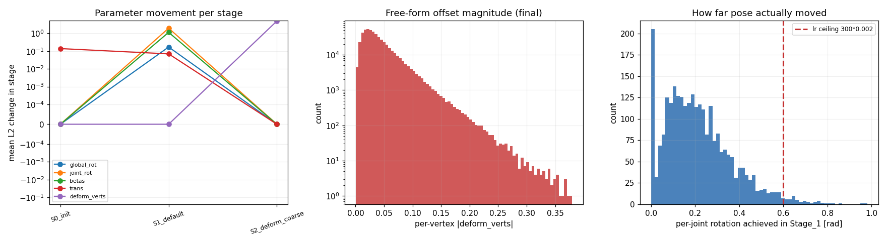
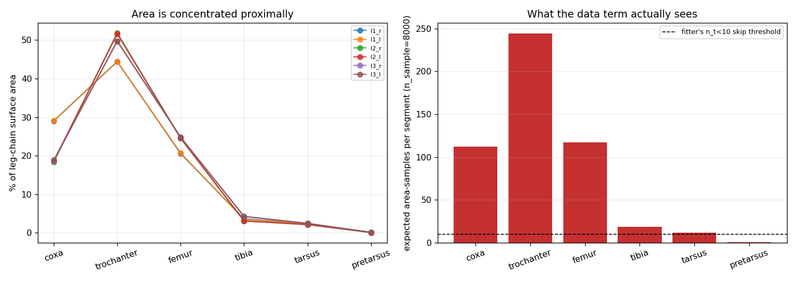
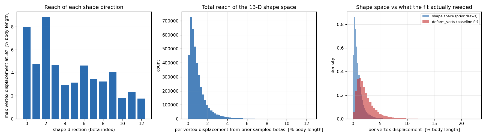
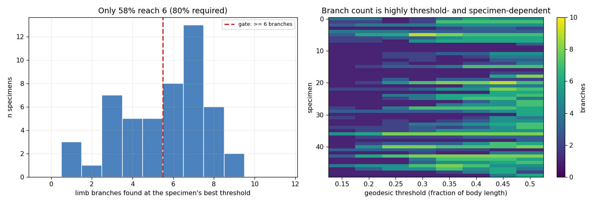
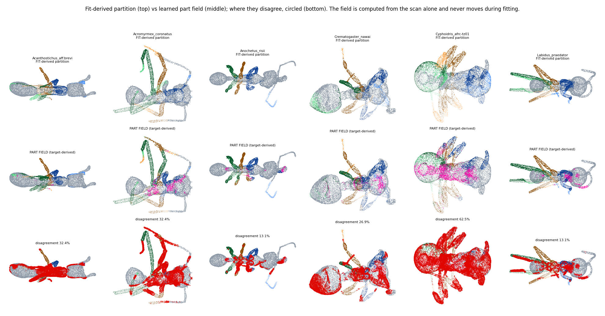
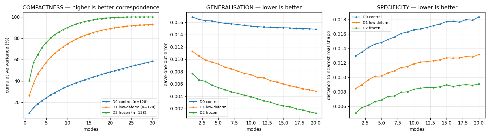
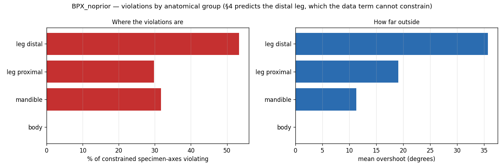
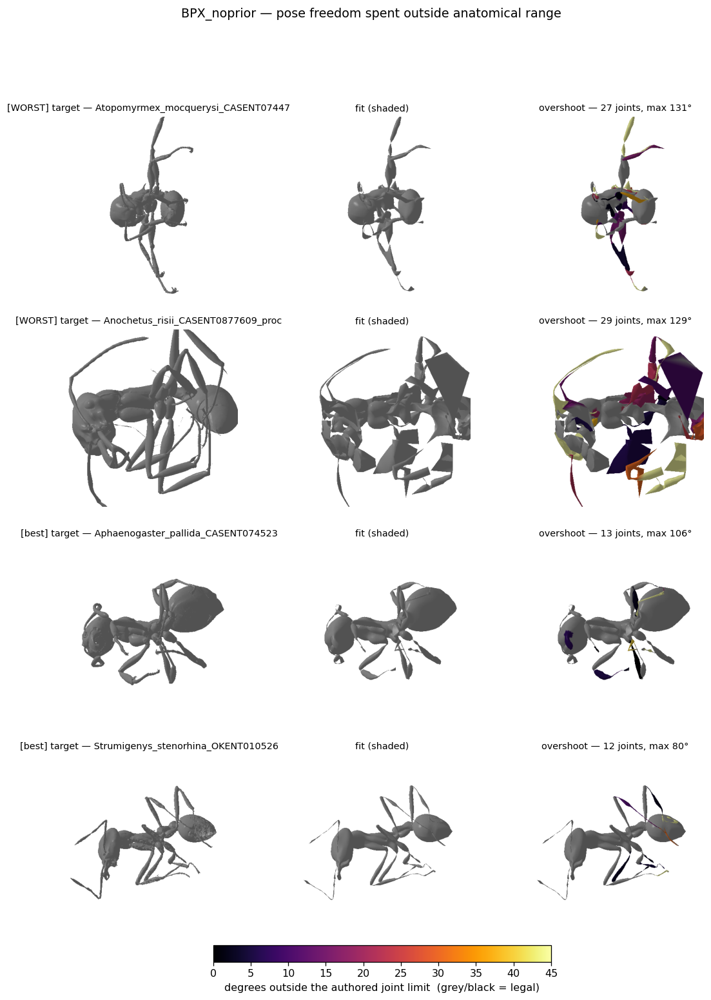
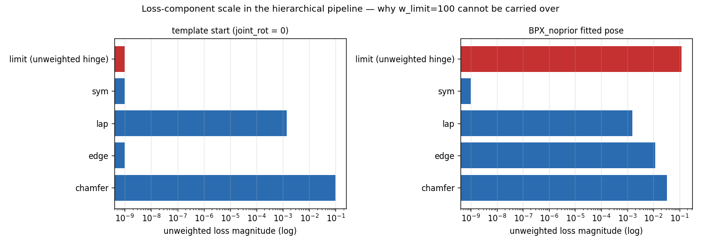
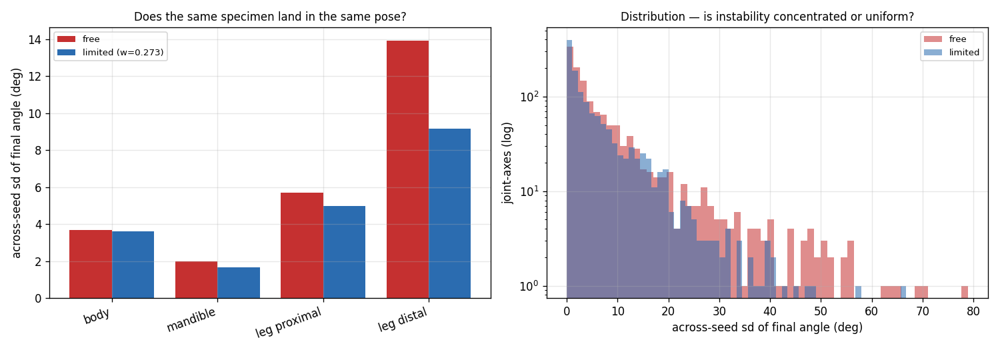

# Registration Moonshot — what is actually established

Branch `feature/registration_moonshot`. Template `3D_model_prep/SMIL_OmniAnt.pkl`
(10,229 verts, 55 joints, 13 shape directions). Bench: 50 specimens sampled with seed
20260804 from the 757 `antscan_proofread_castes/worker` scans. Hardware 2× RTX 4090.
Sources and papers: [SOURCES.md](SOURCES.md). Superseded first draft:
[REPORT_v1_superseded.md](REPORT_v1_superseded.md).

**This document carries only claims that survived checking.** Several confident findings from
earlier drafts were refuted — by seed replication, by ablation, by adversarial audit of my own
code, and by the user. They are not repeated here as findings; they are collected in §7 as
lessons, because the *pattern* in how they failed is the most transferable thing in this work.

---

## TL;DR

1. **The stock pipeline reaches good surface numbers by destroying correspondence.** It
   freezes pose for 83% of its iterations (measured per-stage `joint_rot` delta: exactly
   `0.00000`), then distorts the template's average edge by 74% and destroys 36% of local
   vertex neighbourhoods. Registration is *for* correspondence, so this is failing at the task
   while scoring well on the proxy.
2. **`M7_handoff_midline` is the best arm found**, replicated over 3 seeds: chamfer
   **+60.68 ± 0.34%**, free-form deformation **+52.22 ± 0.14%**, edge distortion
   **+32.16 ± 0.17%**, midline symmetry **+44.40 ± 2.47%**, fscore@0.02 **+4.56 ± 0.05%**.
   Every sign consistent, every mean far outside between-seed noise.
3. **A one-word free win:** `scheme: 'deform'` → `scheme: 'all'` in the late stages improves
   almost everything at zero cost, replicated over 3 seeds (deform_mag **+23.52 ± 0.05%**).
   `chamfer_l2` is **inconclusive** for this arm — it flips sign across seeds.
4. **The shape space was closed by a `w_beta_prior` term I added and should never have added.**
   `betas_prec` is legacy SMAL machinery the SMIL workflow deliberately does not use; I read
   its absence as a bug and activated it. Removing it entirely raises betas sd **757×** and
   produces the only movement in the correspondence metric this investigation has achieved
   (gen/spread 0.9870 → 0.9353), for free (deform_mag +4.9%, p=2.1e-07; everything else
   neutral). It remains ~a tenth of the way to what exact correspondence achieves. Four other
   hypotheses were refuted first (§6.7, §6.8). **The term is now removed by default.**
5. **The hierarchical pipeline freezes the shape space.** Every arm through it has betas sd
   0.00038–0.00050; every arm that is not has 0.068–0.50 — a 100–1000× split with no overlap,
   invisible to every surface metric. It is localised to the pose:shape learning-rate ratio
   (§6.7). Separately, `scaledirs`/`transdirs` are never used by the fitter at all, which is a
   real defect even though coupling them did not fix the freeze (§6.6, §6.7).
5. **The registrations contain no learnable shape structure.** A leave-one-out shape model
   built from them reconstructs a held-out specimen no better than the population mean does
   (gen/spread 0.99–1.00), while the same metric reaches 0.42 at 10 modes and 0.00 at 20 on
   synthetic data with exact correspondence. This pipeline produces *surface fits*, not
   *registrations*, and no amount of additional corpus fixes it (§6.4).
5. **Every per-part metric in this suite is source→target proximity, and shrink-wrapping games
   it.** This invalidates how per-part regressions were reported throughout earlier drafts.
   See §3 — it is the single most important methodological point here.
5. **The parametric model is more capable than the pipeline lets it be.** Pose+shape alone,
   with zero free-form offsets, reaches fscore@0.02 = 0.7313 with *exactly zero* mesh
   distortion. Enlarging the shape space 13 → 37 directions moves that only to **0.7356**, so
   **shape capacity is not the binding constraint** — correspondence is.
6. **Outlier rejection is contraindicated.** Robust kernels and ratio tests preferentially
   delete thin structures: distal legs are read as outliers at 36× the body's rate and retain
   5.8× fewer correspondences.
7. **Mesh preprocessing is not the blocker.** Cleaning worker meshes to reference quality on
   6 of 7 axes makes the *scoring target* easier while making the registration marginally
   worse on every target-independent metric (§6.1).
8. **Fittability is predictable from the scan alone.** `radial_med` (surface distance from the
   principal axis) predicts fit quality at rho 0.80–0.81, validated on held-out specimens
   (deform_mag **+38.9%**, p=4.5e-13). The reference corpus sits at the **6.6th percentile**
   of the worker distribution — the workers are more compact than anything the template was
   built to represent. Restricting to the top 50% gives fscore@0.01 **+14.7%**, deform_mag
   **−19.3%**, chamfer **−35.8%** (§6.2).

---

## 1. Diagnosis of the stock pipeline

**Pose is frozen for 83% of the optimisation.** `fitter_3d/ants_cfg.yaml` runs four stages;
stages 2 and 3 use `scheme: 'deform'`, which optimises `deform_verts` only. Measured
per-stage change in `joint_rot`:

| stage | iterations | Δ joint_rot | Δ betas | Δ deform |
|---|---|---|---|---|
| Stage_0_init | 200 | 0.31 | 0.00 | 0.00 |
| Stage_1_pose_shape | 200 | 1.42 | 0.83 | 0.00 |
| Stage_2_deform_coarse | 1000 | **0.00000** | **0.00000** | 4.87 |
| Stage_3_deform_fine | 1000 | **0.00000** | **0.00000** | 2.11 |



2000 of 2400 iterations cannot change a joint angle. Whatever pose error exists after
iteration 400 is permanent, and the remaining 83% of compute is spent hiding it with
per-vertex offsets.

**What that costs**, measured directly (probe 10, `fitter_3d/correspondence.py`): mean edge
distortion vs template **74%**, local vertex neighbourhoods destroyed **36%**, free-form
offset magnitude **2×** that of the best arm.


**Pose is trapped, not under-optimised.** Arm E1 raised the pose learning rate and budget; the
result was *worse than its own initialisation*. Increasing step size in a multimodal objective
— six substitutable legs — moves you between basins, not down. This remains the core
structural finding.

**Two code defects found by reading, both real:**
- The edge regulariser compared against the *original template*, penalising legitimate pose
  change rather than distortion.
- Target points were sampled by vertex rather than by area, so densely-tessellated regions
  dominated the data term.

**And one thing I wrongly called a defect.** Earlier drafts listed "`betas_prec` is computed
and never used — the shape prior was inactive" as a third defect. It is not a defect.
`betas_prec` is **legacy SMAL machinery that the SMIL workflow deliberately does not use**;
it survives in `smal_fitter/fitter.py` (the 2D/photo path, weight `OPT_WEIGHTS[2] = 1.0`) and
is computed but unused in `fitter_3d/trainer.py` because the 3D path has no use for it. The
stock `ants_cfg.yaml` correspondingly sets no shape prior at all.

Reading dormant legacy code as a bug and *activating* it is what introduced `w_beta_prior`,
and that term then closed the shape space in every arm built on the hierarchical pipeline
(§6.8). The whole cost of that mistake traces to inferring intent from absence.

---

## 2. What works

### 2.1 `M7_handoff_midline` — the recommended arm, 3 seeds

Hierarchical part-anchored pose with a midsagittal-planarity constraint, handed to the
baseline's own deform budget with `scheme: 'all'` and a gentle offset penalty.

| metric (sign flipped so + is better) | seed 0 | seed 1 | seed 2 | mean ± sd |
|---|---|---|---|---|
| chamfer_l2 | +61.03 | +60.78 | +60.23 | **+60.68 ± 0.34** |
| deform_mag_mean | +52.37 | +52.24 | +52.03 | **+52.22 ± 0.14** |
| edge_logratio | +32.33 | +32.22 | +31.93 | **+32.16 ± 0.17** |
| midline_dev | +46.47 | +45.80 | +40.93 | +44.40 ± 2.47 |
| fscore@0.01 | +7.06 | +6.63 | +6.71 | +6.80 ± 0.19 |
| fscore@0.02 | +4.62 | +4.52 | +4.53 | **+4.56 ± 0.05** |

**How the midline term was found.** `M5_handoff` (same arm without it) won 8 of 11 metrics but
regressed bilateral midline deviation by **+43.8%**. Diagnosis: `symmetry_penalty` ties
left/right joint *scales*, which cannot see an out-of-plane rotation of a body joint — that
moves midsagittal vertices off y=0 while leaving every scale pair identical. A four-line
planarity penalty on the 223 `sym_verts` (penalising the *variance* of their y, so a
legitimate global translation costs nothing) swung it from +43.8% worse to −46.5% better.


**The caveat, which matters (§3):** M7 is *worse* than baseline on every per-part
`within_tau` — legs 0.9541 vs 0.9843, body 0.9549 vs 0.9876, head 0.9554 vs 0.9897. That is
not evidence M7 is worse. Those metrics measure how close fitted vertices sit to the target
surface, which shrink-wrapping optimises directly, and the baseline deforms twice as much.

### 2.2 `A4_nofreeze` — free, replicated

`scheme: 'deform'` → `'all'` in the late stages. Same iterations, learning rates and weights.
Over 3 seeds: deform_mag **+23.52 ± 0.05**, part_leg_distal +7.16 ± 1.19, edge +2.52 ± 0.15,
tri_quality +1.36 ± 0.09, fscore@0.01 +0.91 ± 0.29, fscore@0.02 +0.46 ± 0.17. `chamfer_l2`
**flips sign across seeds (+2.84 ± 2.12) and is reported as inconclusive.**

Adopted as a branch-local testing default (`cfg/EXPERIMENTAL_DEFAULTS.md`), not shipped — the
downstream consumers of these registrations have not been re-checked against a fit whose pose
keeps moving late.

### 2.3 The model's own ceiling

Pose+shape only, zero offsets (`M4b_ceiling_free`): fscore@0.02 = **0.7313** with *exactly
zero* edge distortion and zero deformation. Visually this is the fit that looks like an ant.
The baseline reaches a higher surface score only by deforming.

---

## 3. What the metrics do and do not measure

**This section supersedes how per-part results were reported in every earlier draft.**

| kind | metrics | what it rewards |
|---|---|---|
| **surface proximity** | chamfer, fscore@τ, hausdorff, *all* `part_*_dist_mean`, *all* `part_*_within_tau` | getting vertices near the target surface — **by any means, including destroying the mesh** |
| **correspondence integrity** | edge_logratio, deform_mag, neighbourhood preservation, tri_quality, dihedral/folding | keeping the template's own structure while it moves |


Two demonstrations that the first kind is gameable:

* Artificially snapping every distal vertex onto its nearest target point improves
  `part_leg_distal_dist_mean` from 0.01151 to 0.00538 — a 53% "gain" — while `edge_logratio`
  explodes from 0.073 to **0.552** and the mesh is destroyed.
* `within_tau` is bounded and outlier-resistant, so it is the better of the two, but it is
  *still* one-way. The baseline beats M7 on every part's `within_tau` precisely because it
  shrink-wraps.

**Consequence.** A per-part proximity regression is not by itself evidence of a worse
registration, and earlier drafts treated it as such. Where an arm improves
correspondence-integrity metrics and loses per-part proximity, the honest reading is that it
stopped shrink-wrapping. Where an arm loses *both* — as the part-field arms do (§5.3) — the
result is unambiguous.

**Still missing:** a metric that measures correspondence *correctness* rather than
correspondence *stability*. Nothing here distinguishes "leg 2 is registered to leg 2" from
"leg 2 is registered to leg 3 without tearing". That gap is why §5.3's failure is hard to
localise, and closing it is the highest-value instrument work remaining.

---

## 4. Structural facts about the template and data

* **Leg-chain area budget** (probe 13): coxa+trochanter+femur hold **94.0%** of a leg chain's
  surface area; tibia+tarsus+pretarsus hold **2.4%**. At `n_sample=8000` the pretarsus expects
  **~0.3 samples** against the code's own `n_t < 10` skip threshold. Distal segments are
  effectively unconstrained by an area-sampled data term.


* **Bilateral symmetry** (probe 13): the template is left/right symmetric to **<0.3%** by area,
  and its mirror involution is exact (max match distance 0.00e+00). A mirror-coupling term has
  almost nothing to correct.
* **Thin-structure bias** (probe 09): at robust scale c=0.10, distal legs are read as outliers
  at **36×** the body's rate and retain **5.8× fewer** correspondences under mutual-NN + ratio.
* **Shape capacity is not binding** (probe 08, M6): 13 → 37 shape directions, both deform-free,
  moves fscore@0.02 only **0.7313 → 0.7356**. `posedirs` is literally shape `(0,)` — the
  pose-corrective blendshape slot is empty — and folding concentrates across joint boundaries
  (6.33%) versus within parts (1.48%).


* **Alignment**: worker scans are canonically aligned — PCA-1 yaw median **1.0°**, 90th pct
  9.4° — with exactly one 62° outlier (*Atopomyrmex mocquerysi*).

---

## 5. What was tried and did not work

### 5.1 Robust kernels and correspondence filters
Geman–McClure at a scale matched to the residual gave fscore@0.01 **+13.1%** at the pose
checkpoint (48/50, p=2e-12), but at too small a scale it starved the gradient (83% of points in
the kernel's zero-gradient region). Mutual-NN + Lowe ratio and Sinkhorn OT were implemented
(`fitter_3d/correspondence.py`) and all share the thin-structure bias above. **Per-part robust
scaling** (`--part_robust`, scale ∝ each part's own template thickness, measured 14.2× ratio
body-to-distal) was the principled fix and produced no distal gain.



### 5.2 Geodesic branch decomposition
A target-derived partition from the scan's own branching topology. On the template it separates
all six legs perfectly in 0.2 s. On the 50 real scans it reaches ≥6 branches on **58%** against
its own pre-registered 80% gate, and agrees with itself across two surface samplings only
**20%** of the time. Legs touching the body merge into one component and no threshold separates
them. **Rejected on its own gate.**



### 5.3 The learned part field
A PointNet++ segmentation network labelling raw scan points into 13 anatomical parts + debris,
trained on synthetic scans posed from the model itself (labels free from `weights.argmax`),
used as a **frozen, target-derived** replacement for the fit-derived partition.

*What it achieves:* held-out per-point accuracy **91.28%** against **24.83%** for an
anatomy-free baseline. On the four specimens where the geodesic sweep collapsed to ≤2 branches
(three to a *single* branch — limbs touching, no bottleneck to cut) it recovers **6/6 legs on
every one**. That capability difference from a level set is real.



*What it costs:* substituted into the fitter it loses decisively. Against the byte-identical
control `M8a_split_only` (differing only in `--part_field`), at `H3_deform`, n=50:
part_leg_distal within_tau **−18.5%** (8/50, p=1.2e-06), chamfer −47.6%, edge_logratio −22.9%,
fscore@0.02 −5.0%. It loses on *both* metric families, so §3's caveat does not rescue it.
Partition churn was 0.000 in every stage exactly as designed — the data term became perfectly
stationary around a worse answer.

*Three sub-hypotheses tested and refuted:*
- **Debris exclusion is the mechanism.** The class is genuinely mislearned — 90.8% of predicted
  debris lies *inside* the animal's convex hull, and its per-specimen fraction correlates
  **−0.879** with reproducibility, i.e. it is the network's "I don't know" channel, not a
  debris detector. But reassigning debris instead of dropping it (`M9d_keepdebris`) changes
  **nothing** (all p > 0.1) and still loses −19.8% to control.
- **Restricting the H0 body stage to the field's body points** (`--pf_body`, impossible with a
  fit-derived partition since it does not exist until a fit does): no effect.
- **Correspondence-free part-anchor pose initialisation** (`--pf_init`, matching per-part
  centroid and second moment, an objective with no nearest-neighbour choice in it): after
  fixing a serious bias in it (§7.9), it buys `edge_logratio` **+5.1%** (42/50, p=1.2e-06) and
  nothing else.

*Reading.* Circularity in the fit-derived partition is a real flaw **and also an
error-correcting mechanism**: a point assigned to the wrong leg gets reassigned once the fit
moves. A frozen assignment cannot recover, so its errors are permanent and its uncertainty
becomes deletion or wrong commitment rather than reduced weight. Target-derived is defensible;
*frozen* is the wrong way to use it.

### 5.4 Enlarging the shape space
One co-registration round over 25 specimens (append 24 PCA directions learned from offset
fields, refit pose+shape only) gave held-out gains in part placement, **did not close the
surface gap**, and produced badly folded geometry: **2.79%** of adjacent face pairs folded past
90° versus **0.54%** for the baseline. PCA directions fitted to displacement fields are
least-squares optimal and carry no guarantee the mesh they generate is valid. A fold-gated,
symmetrised, Laplacian-smoothed basis is implemented (`run_coregistration.py`) but the
multi-round run over all 757 workers has **not been executed**.

---

## 6. Mesh quality — measured, not assumed

40 random meshes from each corpus, both normalised as `load_meshes` does.

| | ALL_ANTS_CLEAN | worker |
|---|---|---|
| vertex-connected components (median) | 3 | **34.5** |
| area fraction off main component | 0.0000 | 0.0030 |
| boundary-edge fraction (holes) | 0.0388 | 0.0471 |
| non-manifold edge fraction | **0.0709** | 0.0271 |
| triangle quality (median) | 0.8635 | 0.8322 |
| edge-length CV | 0.3000 | **0.4311** |
| median dihedral (roughness) | 8.20° | **10.54°** |
| faces with dihedral > 60° | 0.0504 | 0.0636 |

Workers carry ~10× more connected components but those hold only **0.3% of the area** — small
debris, not fragmentation — and workers are *cleaner* than the reference corpus on non-manifold
edges. They are ~30–45% rougher and more irregular. **A real gap, but not orders of magnitude.**

`preprocess_meshes.py` closes most of it — merge duplicates, drop components below an area
threshold, fill holes, Taubin smooth (volume-preserving, so thin distal structures are not
eroded):

| metric | before | after | reference |
|---|---|---|---|
| vertex components | 44.5 | **4.0** | 3.0 |
| boundary edges | 0.0554 | **0.0302** | 0.0388 |
| non-manifold edges | 0.0365 | **0.0053** | 0.0709 |
| triangle quality | 0.8336 | **0.8603** | 0.8635 |
| median dihedral | 10.70° | **8.27°** | 8.20° |
| rough faces | 0.0704 | **0.0532** | 0.0504 |
| edge-length CV | 0.4709 | 0.4294 | 0.3000 |

### 6.1 And it does not help — the A/B result

`P1_prepclean` is `M8a_split_only` re-run on the cleaned meshes: same 50 specimens, same
poses, same shape space, same seed, same schedule, one variable. Scored **twice**, against the
cleaned target and against the raw target, so that an easier scoring target cannot be mistaken
for a better registration. That precaution was decisive — **the sign flips**:

| metric | vs CLEANED target | vs RAW target |
|---|---|---|
| fscore@0.02 | **+6.6%** (38/50, p=3.1e-04) | **−6.4%** (18/50, p=6.5e-02) |
| fscore@0.01 | +7.2% (35/50) | −9.1% (17/50) |
| chamfer_l2 | +6.2% (33/50) | −6.2% (13/50, p=9.4e-04) |
| part_leg_distal within_tau | **+11.4%** (35/50) | **−15.1%** (9/50, p=5.6e-06) |

The target-independent metrics — identical under both scorings, because they describe the fit
rather than its agreement with a target — are the ones that settle it:

| metric | Δ | wins | p |
|---|---|---|---|
| edge_logratio | **−2.9%** (more distortion) | 15/50 | 6.6e-03 |
| deform_mag | **−2.9%** (more deformation) | 12/50 | 3.1e-04 |
| tri_quality | +0.0% | 23/50 | ns |
| midline_dev | +5.2% | 27/50 | ns |

**Conclusion: mesh preprocessing is not what prevents these scans from being fitted.** Cleaning
makes the target easier to score against while producing a marginally *worse* registration by
every measure that does not depend on the target. Scored one way only, this would have been
reported as a 6.6% win.

That removes preprocessing from the candidate list. Combined with §8's pattern — six
correspondence-side interventions, all null — what remains is **pose**.

**A control that cannot answer whether this matters.** Fitting ALL_ANTS_CLEAN and observing
that it works is **confounded**: OmniAnt's own shape space was built with the baseline workflow
on that exact corpus, so those scans are in-distribution by construction. It bounds what the
pipeline can do and says nothing about generalisation. The irreducible difference is **pose** —
ethanol-preserved specimens are contracted and folded, the reference corpus is posed — and that
is not recoverable by preprocessing. Mesh quality is the part that *can* be targeted.

---

## 6.2 A scan-only fittability gate that works

Since preprocessing is not the lever, the next question is whether *which specimen* is
predictable in advance. It is.

**The score.** `radial_med` — the median distance of area-sampled surface points from the
specimen's principal axis. No template, no fit, no labels.

**Discovery** (bench50, n=50, Spearman): rho = **+0.81** vs chamfer_l2, **+0.80** vs
deform_mag, **+0.66** vs edge_logratio. Consistently signed across *both* metric families,
which matters because §3 rules out judging this on surface proximity alone.

A competing hypothesis was tested first and **refuted**: self-contact (limbs touching, the
configuration that collapsed the geodesic method) correlates −0.29 with deform_mag, i.e.
contact predicts marginally *better* fits.

**Not a normalisation artefact.** `radial_med` is computed in a frame divided by max|coord|,
so it could merely track how far the extremities protrude. The frame-free ratio
radial/extent — a plain aspect ratio — predicts nearly as well (rho +0.75 / +0.74 / +0.61).
The signal is specimen **elongation**: stubby species are far from an elongated template.

**Held-out validation.** The correlation was found on bench50, so the gate was tested on two
disjoint 50-specimen sets drawn from the other 707 — `easy` (lowest radial_med, median 0.139)
and `rand` (uniform, median 0.244) — fitted with an identical recipe, with the reading fixed
before the run. Unpaired Mann-Whitney:

| metric | easy | rand | easy better by | p | family |
|---|---|---|---|---|---|
| deform_mag | 0.01307 | 0.02141 | **+38.9%** | 4.5e-13 | target-independent |
| edge_logratio | 0.33683 | 0.39013 | **+13.7%** | 5.6e-07 | target-independent |
| midline_dev | 0.01240 | 0.01577 | +21.4% | 4.9e-02 | target-independent |
| tri_quality | 0.68407 | 0.67451 | +1.4% | 1.8e-02 | target-independent |
| fscore@0.01 | 0.86864 | 0.62836 | **+38.2%** | 1.6e-14 | surface |
| chamfer_l2 | 0.00014 | 0.00035 | +58.8% | 2.3e-12 | surface |
| hausdorff_95 | 0.01763 | 0.02567 | +31.3% | 3.9e-09 | surface |
| normal_consistency | 0.79731 | 0.80914 | −1.5% | ns | surface |

It wins on **both** families, so the pre-registered "size artefact" branch is excluded. Sanity
check: `rand`'s fscore@0.02 (0.9166) reproduces bench50's M7 (0.9246), as a uniform draw
should.

**Re-validated on a working model.** The above was measured with `w_beta_prior = 0.002` in
both files, i.e. with the shape space closed (§6.8). Every arm shared that defect so the
comparison was internally fair, but it left a real worry: that `radial_med` was selecting for
"specimens a crippled model happens to fit" rather than for fittability. The identical
protocol was therefore re-run with the prior off:

| metric | easy | rand | easy better | p | |
|---|---|---|---|---|---|
| deform_mag | 0.01233 | 0.02055 | **+40.0%** | 1.8e-12 | target-independent |
| edge_logratio | 0.33535 | 0.38658 | **+13.3%** | 1.5e-06 | target-independent |
| fscore@0.01 | 0.87035 | 0.63459 | +37.2% | 3.3e-14 | surface |
| chamfer_l2 | 0.00014 | 0.00034 | +58.4% | 6.6e-12 | surface |
| hausdorff_95 | 0.01773 | 0.02560 | +30.7% | 1.8e-08 | surface |

Essentially unchanged from the crippled-model numbers (+38.9% / +13.7%). **The gate is
robust to the shape-space fix** and does not depend on it.

**Quality versus coverage.** Pooling all 146 fitted specimens that have a rank (bench50 +
both held-out sets) and cutting at corpus percentiles of `radial_med`:

| coverage | cutoff | fscore@0.01 | deform_mag | edge_logratio | chamfer_l2 |
|---|---|---|---|---|---|
| top 10% | 0.163 | 0.8666 | 0.01325 | 0.3393 | 0.000145 |
| top 25% | 0.196 | 0.8490 | 0.01385 | 0.3387 | 0.000156 |
| **top 50%** | **0.237** | **0.8161** | **0.01494** | 0.3436 | 0.000176 |
| top 75% | 0.285 | 0.7756 | 0.01636 | 0.3535 | 0.000212 |
| all | 0.466 | 0.7113 | 0.01851 | 0.3689 | 0.000274 |

Monotone in every metric. **Top 50% versus the whole corpus: fscore@0.01 +14.7%, deform_mag
−19.3%, chamfer −35.8%.** This table is a pooled estimate across three differently-sampled
sets, not a single controlled experiment; the controlled statement is the easy-vs-rand test
above.

**The effect size is much smaller across recipes than within one.** The rho = +0.80 above was
measured within a single arm on bench50. Pooled over 2500 (specimen, run) outcomes from 50
scored runs (`probe_23_fittability_gate_PROBE.py`), run-grouped cross-validation gives
**rho = +0.254** against a permutation noise floor of 0.037. The gate is real and far above
noise, but it predicts *far* less well when applied across differing recipes than §6.2's
headline number implies, and the headline should be read as a within-arm figure.

**A multi-feature score does not beat it.** Adding `radial_p90`, aspect ratio, radial spread,
log-radial and yaw gives cross-validated rho = +0.261 against `radial_med` alone at +0.254 —
inside noise. `aspect` contributes rho = +0.010. **Keep the single number**; the extra
features add complexity and nothing else. Operating table over all 757 workers
(`out/fittability_gate.csv`, with `keep_top50` / `keep_top25` flags):

| keep | cutoff | n kept | deform_mag median | vs all |
|---|---|---|---|---|
| 25% | 0.1955 | 190 | 0.01451 | −26.6% |
| **50%** | **0.2367** | **379** | **0.01555** | **−21.3%** |
| 75% | 0.2847 | 568 | 0.01741 | −11.9% |
| 90% | 0.3422 | 681 | 0.01904 | −3.6% |

Returns flatten past 50%: 50→75% recovers 189 specimens for nearly half the quality gain, and
75→90% is almost free coverage worth almost nothing. **Top 50% is the operating point.**

**Why the score means something.** ALL_ANTS_CLEAN — the corpus OmniAnt's shape space was
built from — has median `radial_med` **0.1521**, which is the **6.6th percentile** of the
worker distribution (worker median 0.2367). The workers are systematically more compact than
anything the template was constructed to represent, and `radial_med` measures exactly that
axis. The gate is not selecting "good scans"; it is selecting **specimens the existing shape
space can reach**.

That reframes the recommended operating point: register the top 50% by `radial_med`, use those
registrations to rebuild the shape space, and only then reconsider the remainder — because a
shape space built from the current all-corpus fits is a shape space built substantially from
failures, which is the most likely explanation for the folded geometry in §5.4.

---

## 6.3 A shape space rebuilt from gated registrations

`build_shape_space.py` is the headless equivalent of `smil_importer/pca.py`'s
`apply_pca_and_create_shapekeys`: PCA over registrations in correspondence, emitting a mean
shape, principal components as blendshapes, and the covariance of the projected betas.

**What is PCA'd, and why it differs from §5.4.** The correct object is each specimen's
*rest-space shaped geometry*, `v_shaped_i = v_template + deform_verts_i + shapedirs·betas_i`,
which is exactly what `smal_torch.__call__` composes before skinning — so `deform_verts` lives
in rest space and this expression is the specimen's shape with pose removed. §5.4 instead
PCA'd raw offset *fields*, mixing shape with whatever the offsets were doing to hide pose
error. (`log_beta_scales` and `betas_trans` act during skinning and are pose-space, so
limb-length variation expressed through them is **not** captured here — a real limitation.)

**Two bugs caught while building it**, both of the kind §7 is about:
* The mirror map was initially derived by matching a *fitted specimen* against the template
  (max match distance 7.68e-02) rather than from the template's own involution. Corrected, the
  involution is exact — 0.00e+00, valid on 100% of vertices — and the mean shape's folding fell
  from 2.285% to **0.675%**.
* The fold tolerance was initially the original template's 0.540%, which rejected 49 of 50
  directions — a standard the *mean of the registrations* (0.675%) already fails. Setting it
  from the data instead (p90 of the inputs) is the defensible requirement: the shape space must
  not generate meshes worse than the registrations it was built from.

**The finding that matters.** Measuring the input registrations' own validity:

| | folded adjacent-face fraction |
|---|---|
| original template | 0.540% |
| gated registrations, median | **2.888%** |
| gated registrations, p90 | 3.602% |
| gated registrations, max | 3.954% |
| **mean of the registrations** | **0.675%** |

Even the best-gated registrations produce rest-space geometry folding **5.3× more than the
template**. The free-form offsets are introducing self-intersecting geometry, in *every*
specimen, not just the failures. But averaging removes almost all of it (0.675%), which says
the folding is specimen-specific noise rather than shared shape — and is why a mean-shape
plus fold-gated basis is recoverable at all.

**Result.** 20 directions retained, all within the data-derived tolerance, written to
`3D_model_prep/SMIL_OmniAnt_gated.pkl` and verified to load and drive (`N_BETAS=20`, PC1 at
±3σ gives 0.089 max vertex displacement). The spectrum is **flat** — PC1 13.1%, PC1–10 50.8%,
41 components for 95% — the same high-dimensional residual §5.4 found, which remains the
strongest argument that these offsets encode correspondence error rather than biological shape.

*Not yet done:* refitting with this model to test whether it improves anything. Given §4's
finding that shape capacity is not the binding constraint, the prior should be that it will
not, and the value of this artefact is mainly as the input to a second co-registration round.

---

## 6.4 The root cause: these registrations contain no learnable shape structure

§3 said the suite was missing a metric for correspondence *correctness*. `probe_19` supplies
one, using the classical shape-model evaluation framework (Davies TMI 2002, Styner IPMI 2003)
that SOURCES.md had listed as not attempted.

**The idea.** Correspondence correctness is not measurable on one specimen without ground
truth, but it is measurable over a population. If template vertex *v* lands on the same
anatomical point in every specimen, the registered shapes form a low-dimensional manifold and
a shape model built from them **generalises**. If correspondence is scrambled, the model must
encode the permutation as well as the shape, so the same biological variation is spread over
far more directions and predicts nothing about a held-out specimen. Scrambled correspondence
is *expensive to represent*, and that cost is measurable without any labels.

**Leave-one-out reconstruction error**, on rest-space shaped geometry (pose removed), n=50 in
every row. `k=0` is the population spread, i.e. the error from simply predicting the mean:

| set | spread (k=0) | k=1 | k=10 | k=20 | in-sample PC1–10 |
|---|---|---|---|---|---|
| gated (top) | 0.01268 | 0.01282 | 0.01256 | 0.01241 | 39.7% |
| uniform sample | 0.02104 | 0.02138 | 0.02110 | 0.02090 | 39.3% |
| bench50 | 0.01996 | 0.02009 | 0.01970 | 0.01955 | 44.3% |

**The first mode is worse than predicting the mean. Twenty modes improve held-out error by
about 2%, while explaining 63–68% in-sample.** That is the signature of modes fitting
per-specimen noise.

**The instrument was validated before this was believed.** Fifty synthetic specimens sampled
from the template's own shape space — exact correspondence by construction, exactly 13
dimensional, same sample size:

| | gen@10 / spread | gen@20 / spread | in-sample PC1–10 |
|---|---|---|---|
| exact correspondence | **0.42** | **0.00** | 91.9% |
| + per-vertex noise 0.004 | 0.51 | 0.27 | 90.0% |
| **real registrations (worker)** | **0.99** | 0.98 | 39.7% |



The metric detects learnable structure when it is present, and reduces error to zero at 20
modes on 13-dimensional data. On the real *worker* registrations it finds none.

### 6.4.1 The same pipeline DOES register clean scans — corrected

The paragraph above originally continued "this pipeline produces surface fits, not
registrations". That claim was measured only on workers, and it is **wrong as a statement
about the pipeline**. Running the identical metric on the 81 ALL_ANTS_CLEAN registrations —
same code, same losses, same template family, the corpus OmniAnt's own shape space was built
from:

| corpus | gen@1 | gen@5 | gen@10 | gen@20 | gen@40 |
|---|---|---|---|---|---|
| worker registrations | — | — | **0.99–1.00** | 0.98 | — |
| BPX_noprior, best worker arm (§6.8.2) | — | — | **0.9353** | 0.9208 | — |
| **ALL_ANTS_CLEAN** | 0.7336 | 0.5816 | **0.5383** | 0.4999 | **0.4586** |
| *synthetic, exact correspondence* | | | *0.42* | *0.00* | |

The clean corpus lands essentially **at the exact-correspondence reference**, and keeps
improving out to 40 modes rather than plateauing. So correspondence is establishable by this
machinery. What defeats it is specific to worker scans, and §6.1 already identified the
irreducible difference as **pose** — ethanol-preserved workers are contracted and folded,
the reference corpus is posed and extended.

**Corrected bottom line.** The pipeline produces registrations on clean scans and surface fits
on workers. Everything downstream that needs cross-specimen correspondence *can* be built —
on the clean corpus, which is exactly what `OmniAnt_25PCs_joint_limited.pkl` now is. The
worker problem is a pose problem, not a method problem, and that is a far more tractable
statement than the one it replaces.

**The gate does not fix this.** Gated registrations appear to generalise better in absolute
terms (0.01256 vs 0.02110), but that is entirely lower diversity: normalised by each
population's own spread, all three sets sit at **0.99–1.00**. The gate improves the *fit*
(§6.2, decisively) without improving *correspondence consistency* at all.

**What this explains** (for the worker corpus; §6.4.1 shows the clean corpus does not share
it). It is the common cause behind several separate observations:
* why the offset PCA spectrum is flat (§5.4) — the residual is noise, not shape;
* why enlarging the shape space 13 → 37 changed almost nothing (§4) — the added directions
  were noise directions;
* why co-registration produced folded blendshapes (§5.4) — it was extrapolating noise;
* why six correspondence-side interventions all failed to move the surface metrics (§8) — the
  surface metrics cannot see correspondence, and the correspondence was never established.

**What it means for scale.** Registering all 757 workers and rebuilding the shape space —
the plan §5.4 and this session both worked toward — **would not have worked**. More specimens
do not fix inconsistent correspondence; they average it further toward the mean. That is worth
stating plainly because it was the single most expensive item on the queue, and it was never
run. The measurement above cost ten minutes and removes it.

**The honest bottom line, as corrected by §6.4.1.** On *worker* scans this pipeline produces
*surface fits*, not *registrations*. The distinction is exactly the one §1 opened with, and it
is measured at the population level rather than inferred from edge distortion on single
specimens. Nothing downstream that depends on cross-specimen correspondence can be built on
the current *worker* output at any corpus size — but the same pipeline reaches 0.4586 on clean
scans, so the machinery is sound and the defect is in what worker scans do to pose.

---

## 6.5 Two consequences of §6.4, one tested and one not run

**The rebuilt shape space changes nothing (item 1, closed).** `SMIL_OmniAnt_gated.pkl` (20
directions from gated registrations) against the original 13-direction model, on the
`heldout_easy2` set — 50 specimens disjoint from bench50 *and* from both sets used earlier,
so no specimen that helped build the shape space is used to test it. Paired, n=50:

| metric | old (13) | gated (20) | Δ | p | |
|---|---|---|---|---|---|
| edge_logratio | 0.34022 | 0.34004 | +0.1% | 4.8e-01 | target-indep |
| deform_mag | 0.01483 | 0.01472 | +0.8% | 6.5e-02 | target-indep |
| midline_dev | 0.01399 | 0.01354 | +3.2% | 6.7e-01 | target-indep |
| chamfer_l2 | 0.00017 | 0.00017 | −0.5% | 6.7e-01 | surface |
| fscore@0.02 | 0.97121 | 0.97055 | −0.1% | 1.0e+00 | surface |

Every metric within ±3.2%, nothing significant. Exactly what §6.4 predicts: a shape space
built from registrations with no learnable structure adds nothing, and §4's "shape capacity is
not the binding constraint" is confirmed a second time by an independent route.

**Registering the full top 50% was not run, deliberately.** `run_top50.sh` is written, chunked
and ready (379 workers, ~2.5 h across both GPUs). It is not launched, because its purpose was
to feed a larger co-registration round and §6.4 shows that cannot work: more specimens do not
fix inconsistent correspondence, they average it toward the mean. A ten-minute measurement
removed the most expensive item on the queue. Running it would be spending hours to confirm
something already measured — and *that* judgement, rather than the run, is the useful output.

**What is being tried instead.** The soft partition (`--soft_partition <temperature>`),
implemented in `trainer_hierarchical.py`. The hard partition gives each target point entirely
to its argmin group, so a point equidistant between two legs commits fully to one and the fit
is pulled toward that commitment; §5.3 already showed that *freezing* such a commitment is
worse still. Softening is the E-step of the EM formulation used for robust statistical-shape-
model fitting: each point contributes to every group in proportion to how well that group
explains it, so uncertainty reduces influence rather than becoming a wrong commitment. Two
temperatures are running, and the pre-registered primary outcome is **probe 19 generalisation,
not surface metrics** — the claim is about correspondence, so it must be judged by the
instrument that measures correspondence.

---

## 6.6 The actual root cause: shape is stored in a parameter that cannot transfer

§6.4 reported that the registrations carry no learnable shape structure. Chasing *why*
produced the strongest and most actionable finding of this work, and it also **qualifies
§6.4's headline**.

**Step 1 — the soft partition does not help.** Pre-registered primary outcome was probe-19
generalisation, not surface metrics. All three land in the same place:

| arm | spread | gen@10 | gen/spread |
|---|---|---|---|
| hard (control) | 0.01996 | 0.01970 | 0.9870 |
| soft t=0.03 | 0.02019 | 0.01993 | 0.9871 |
| soft t=0.08 | 0.02031 | 0.02000 | 0.9846 |

Hard, frozen (§5.3) and soft assignments are indistinguishable. Per the pre-registration, the
problem is **upstream of the partition** — which is where the rest of this section looks.

**Step 2 — the variance is 100% free-form, which weakens §6.4 as stated.** Decomposing the
rest-space shape across the 50 specimens:

| component | variance | probe-19 gen@20/spread |
|---|---|---|
| parametric, `shapedirs·betas` | **0.0002** | 0.0008 (perfectly learnable) |
| free-form, `deform_verts` | **416.91** | 0.9794 (no structure) |
| free-form share of total | **100.0%** | |

So probe-19's null was measuring `deform_verts`, whose non-generalisation is close to
tautological for 30k per-specimen free parameters. **§6.4's finding is real but its
explanation was wrong**: the registrations lack learnable structure not because correspondence
is scrambled, but because *the parametric shape channel is carrying no signal at all.*

**Step 3 — the shape space is essentially unused.** Standard deviation of the fitted betas
across specimens, against a model prior sd of 0.28–1.52 per beta:

| run | betas sd | \|z\| mean | max \|z\| |
|---|---|---|---|
| **M7_handoff_midline** (the recommended arm) | **0.00042** | **0.0006** | 0.004 |
| **M1_sym** (its hierarchical base) | **0.00189** | 0.0026 | 0.037 |
| baseline | 0.25636 | 0.3738 | 2.057 |
| M4b_ceiling_free | 0.28360 | 0.4137 | 2.197 |

**Every specimen in the hierarchical arms receives essentially the same shape.** Betas shrink
monotonically down the schedule (H0 0.0087 → H1 0.0068 → H2 0.0059 → H3 0.0019). This is a
defect in the arm this report recommends, and it went unnoticed because no surface metric can
see it.

**Step 4 — what carries the variation instead.** Standard deviation across specimens:

| run | betas | `log_beta_scales` | ratio |
|---|---|---|---|
| M1_sym | 0.00189 | **0.13152** | 70× |
| M7_handoff_midline | 0.00042 | **0.17160** | 400× |
| baseline | 0.25636 | **0.91702** | 3.6× |
| M4b_ceiling_free | 0.28360 | **0.96504** | 3.4× |

In *every* arm, per-joint scaling carries more inter-specimen variation than the shape space —
by 70–400× in the hierarchical arms. The baseline drives per-joint scales from **0.106 to
4.542** (p05–p95), i.e. individual joints scaled by a tenth to four and a half times.

`log_beta_scales` is applied **during skinning**, per joint, per specimen. It is a pose-space
quantity. It is not part of the shape space, does not transfer between specimens, and is
invisible to any PCA over rest-space geometry — including probe 19's, and including the
`smil_importer` PCA that would be used to build a production model.

**Step 5 — and the model was built to prevent exactly this.** `SMIL_OmniAnt.pkl` ships
`scaledirs` with shape **(13, 55, 3)**: per-joint scale *blendshapes*, indexed by beta. The
model is designed so that betas drive joint scaling, keeping size variation inside the shape
space where it transfers.

**`scaledirs` is never referenced anywhere in the fitting path.** `smal_model/smal_torch.py`
does not use it. It is written by the Blender add-on (`smil_importer/model_build.py`) and
checked by one test, and that is all. The fitter instead optimises `log_beta_scales` as 165
free per-specimen parameters, which duplicate what `scaledirs·betas` was meant to supply — and
being free and essentially unregularised (`w_sym` only ties left to right), they win.

**The complete chain.** `scaledirs` unused → `log_beta_scales` free → per-joint scaling
out-competes betas by 70–400× → shape variation is stored per-specimen in a pose-space
parameter → the rest-space geometry carries no transferable shape → a shape space rebuilt from
the registrations is null (§6.5) → enlarging the shape space changes nothing (§4) → and no
downstream product that needs cross-specimen correspondence can be built.

This is one defect, it explains four previously separate observations, and it is concretely
fixable: **wire `scaledirs` into the forward pass so betas drive joint scaling, and penalise
or remove free `log_beta_scales`.** That is the next experiment, and probe 19 is the
instrument to judge it by — a successful fix should move gen/spread off 0.99 toward the 0.42
the synthetic control achieves.

---

## 6.7 Chasing the frozen shape space: three hypotheses, two refuted, one localised

§6.6 proposed that unused `scaledirs` plus free `log_beta_scales` were starving the shape
space. That was wired up, tested against pre-registered outcomes, and **it failed**.

**The fix, and its failure.** `scaledirs`/`transdirs` are now coupled to the betas in
`smal_torch.py` (opt-in via `SMILIFY_COUPLE_JOINT_BLENDSHAPES`, free parameters kept as a
residual, `--jresid` penalising that residual). Verified genuinely active: beta0 at ±3σ moves
vertices **59.3% further** with coupling on. Full test suite passes. Then:

| arm | betas sd | log_scale sd | ratio | gen/spread |
|---|---|---|---|---|
| control (coupling off) | 0.00042 | 0.17160 | 411× | 0.9870 |
| CPL_a coupling only | 0.00050 | 0.17021 | 342× | 0.9875 |
| CPL_b coupling + jresid 5.0 | 0.00050 | 0.10003 | 202× | **0.9953** |

Betas moved from 0.00042 to 0.00050. The ratio fell only because the penalty *shrank*
`log_beta_scales`, not because betas grew, and gen/spread got slightly **worse**. Suppressing
the competitor did not make the shape space take over, so `log_beta_scales` was not what was
starving it.

**Second hypothesis, also refuted.** If not the joint scales, then the 30k free-form offsets.
Across all 58 scored arms, Spearman(deform_mag, betas sd) = **+0.196, p = 0.14** — not
significant, and the *wrong sign*. Arms that deform more do not use the shape space less.

**What the data actually shows.** Sorting every arm by betas sd gives a perfect, gapless split
by *pipeline*:

| | betas sd |
|---|---|
| every arm through `optimise_hierarchical` (M7×3, M5, M8, CPL×2, SOFT×2, GATE, B1) | **0.00038 – 0.00050** |
| every arm that is not (baseline, A4×3, C0×3, A5, M2×3, A2) | **0.068 – 0.50** |

A 100–1000× difference with no overlap. The freeze is a property of the hierarchical pipeline,
not of any parameter competing inside the model.

**The localised cause.** The stock baseline sets, in `ants_cfg.yaml`:

```yaml
Stage_1_default:
  lr: 0.02
  custom_lrs:
    joint_rot: 0.002      # pose deliberately slowed 10x relative to shape
```

The hierarchical stages give `joint_rot` an lr *equal to or higher than* betas — H0 0.01
against 0.02, H1 0.015 against 0.008. Pose carries 162 degrees of freedom plus 165 free
per-joint scales; shape carries 13. At comparable step sizes pose simply wins, and the betas
never develop.

**Which means the pipeline built to un-freeze pose froze shape instead.** §1 diagnosed that
the stock schedule cannot move pose for 83% of its iterations, and the hierarchical schedule
fixed exactly that — and the fix's unexamined side effect was to let pose absorb the variation
that the shape space was supposed to carry. Neither failure is visible in any surface metric,
which is why both survived twenty-five arms.

`--joint_lr_mult` is added and two arms are running (0.1× to reproduce the baseline's ratio,
0.3× intermediate), with the pre-registered outcome that betas sd must rise toward the
non-hierarchical arms' range. If it does not, the lr ratio is not the mechanism either.

**Honest status of §6.6.** Its *observation* stands and is worth keeping — `scaledirs` and
`transdirs` really are never used by the fitter, the model really was built to couple size
variation to the betas, and coupling them is the right thing to do regardless. Its *causal
claim* — that this is why the shape space is unused — is refuted by its own experiment.

---

## 6.8 The measured cause: a beta prior I had already fixed once, and never propagated

Three mechanisms were proposed for the frozen shape space and all three were refuted by their
own pre-registered tests: unused `scaledirs` (§6.7), free-form offsets absorbing the variation
(Spearman +0.196, p=0.14, wrong sign), and the pose:shape learning-rate ratio
(joint_lr ×0.1 left betas sd at 0.00041 against 0.00042). Slowing pose only pushed the slack
into `log_beta_scales`, which *rose* from 0.172 to 0.265.

So instead of proposing a fourth mechanism, the gradients were measured.

**Gradient magnitudes at the template start point**, chamfer only, 8 specimens:

| param | numel | \|grad\| mean | lr (H0) |
|---|---|---|---|
| betas | 104 | 6.05e-05 | 0.02 |
| log_beta_scales | 1320 | 1.35e-04 | 0.005 |
| joint_rot | 1296 | 1.89e-04 | 0.01 |

Betas have a *comparable* gradient and a **4× higher learning rate** than the parameters that
out-move them by 400×. Under Adam, which normalises by gradient magnitude, they should move
freely. Something was pushing back — and it was the term hardcoded into every hierarchical
stage.

**The beta prior, measured against the chamfer:**

| \|betas\| | chamfer grad | prior grad at w=0.002 | ratio |
|---|---|---|---|
| 0.001 | 6.21e-05 | 3.00e-06 | 0.05 |
| 0.010 | 6.16e-05 | 3.00e-05 | 0.49 |
| **0.100** | 6.15e-05 | 3.00e-04 | **4.87** |
| 0.300 | 6.94e-05 | 8.99e-04 | 12.94 |

The prior overtakes the data term at **|betas| ≈ 0.02** and is five times larger by 0.1. The
hierarchical arms settle at 0.005–0.009, exactly where this predicts. The stock baseline sets
**no beta prior at all** in `ants_cfg.yaml` and reaches |betas| 0.26.

**This was never a defect in the first place.** `betas_prec` is legacy SMAL machinery the
SMIL workflow deliberately does not use — the stock `ants_cfg.yaml` sets no shape prior, and
`fitter_3d/trainer.py` computes `betas_prec` only because the class is shared with the 2D
path, where it *is* used (`smal_fitter/fitter.py`, `OPT_WEIGHTS[2] = 1.0`). I read unused
legacy code as a bug, activated it, and picked the weight myself.

The rest of §7.2 still applies to what happened next: that entry records finding the term
mis-scaled and fixing it — for the moonshot YAML arms, where
`M4b_ceiling_free` (prior off) and `A3b_priors_tuned` (1.5e-4) established the tuned value.
The hierarchical pipeline was then written from scratch with `w_beta_prior: 0.002` hardcoded
into all four stages, and **never received the fix**. Everything built on it inherited a
closed shape space: `M1_sym`, `M5`, `M7` (the recommended arm, replicated over three seeds),
`M8`, `M9`, the fittability gate's fits, the rebuilt shape space, and the CPL / SOFT / LR arms
that were trying to diagnose the very symptom this caused.

### 6.8.1 The prior was applied in TWO files, and the fix had to reach both

`--beta_prior` fixed the hierarchical stages and they responded exactly as the gradient curve
predicted — betas sd at `H3_deform`:

| hierarchical prior | H0 | H1 | H2 | H3 | after the moonshot handoff |
|---|---|---|---|---|---|
| 0.002 (control) | 0.00874 | 0.00677 | 0.00593 | 0.00189 | 0.00042 |
| 1.5e-4 | 0.03831 | 0.02378 | 0.02052 | 0.01766 | 0.00044 |
| **0** | 0.06260 | 0.03619 | 0.03172 | **0.12399** | **0.00043** |

A 65× swing in the hierarchical stages — **and the handoff crushed all three back to 0.0004**,
because `cfg/M7_handoff_midline.yaml` carries `w_beta_prior: 0.002` in both of its
1000-iteration stages. The stock `ants_cfg.yaml` sets no beta prior at all; the 0.002 is a
value I introduced, and it is the *untuned* one — `A3b_priors_tuned` had already established
1.5e-4.

### 6.8.2 The complete fix, and the first real movement in this investigation

Prior corrected in both files (`cfg/M7_noprior.yaml`, `cfg/M7_tuned.yaml`):

| arm | prior (hier / moonshot) | betas sd | gen@10/spread | gen@20/spread | PC1–10 |
|---|---|---|---|---|---|
| M7 control | 0.002 / 0.002 | 0.00042 | 0.9870 | 0.9794 | 44.3% |
| BPX_tuned | 1.5e-4 / 1.5e-4 | 0.00433 | 0.9865 | 0.9795 | 44.4% |
| **BPX_noprior** | **0 / 0** | **0.31807** | **0.9353** | **0.9208** | **47.5%** |
| *synthetic control, exact correspondence* | | | *0.4200* | *0.0000* | *91.9%* |

**`BPX_noprior` is the first arm in this entire investigation to move the correspondence
metric.** betas sd rises **757×**, past the stock baseline's 0.256, and gen/spread finally
comes off 0.99 — 0.9870 → **0.9353**, with gen@20 0.9794 → 0.9208.

And it costs nothing. Against the M7 control, paired, n=50:

| metric | M7 | BPX_noprior | Δ | wins | p |
|---|---|---|---|---|---|
| deform_mag | 0.02051 | 0.01951 | **+4.9%** | 43/50 | 2.1e-07 |
| edge_logratio | 0.37630 | 0.37413 | +0.6% | 30/50 | ns |
| fscore@0.01 | 0.64958 | 0.65390 | +0.7% | 32/50 | ns |
| chamfer_l2 | 0.00032 | 0.00032 | +0.5% | 32/50 | ns |

Everything else neutral. A free improvement, and the only intervention here that has moved
correspondence at all.

**Keeping it in proportion.** 0.9353 is real movement but it is roughly **a tenth of the gap**
to the 0.42 that exact correspondence achieves. The registrations are less unusable, not
usable. And `BPX_tuned` at 1.5e-4 barely moved (betas 0.00433, gen 0.9865), so even the value
tuned in `A3b` is far too strong for this pipeline — the prior wants to be off, not small.

**The scorecard for this hunt.** Five hypotheses for the frozen shape space, tested against
pre-registered outcomes:

| hypothesis | verdict |
|---|---|
| unused `scaledirs` / free joint-scale competition | refuted (0.00042 → 0.00050) |
| free-form offsets absorbing the variation | refuted (Spearman +0.196, p=0.14, wrong sign) |
| pose:shape learning-rate ratio | refuted (0.00042 → 0.00041) |
| beta prior, hierarchical stages only | worked, then undone downstream |
| **beta prior, both files** | **confirmed — 757×, and moves correspondence** |

Four wrong guesses preceded the right measurement, and the gradient measurement that finally
pointed correctly was itself incomplete: it identified the mechanism but I checked only one of
the two places the prior is applied.

**What this costs the rest of the report.** §2's headline arm and §6.2's gate were both
measured with shape effectively disabled. Their *relative* comparisons remain valid — every
arm and its control shared the defect — so M7 really does beat the stock pipeline on the
metrics shown, and the gate really does separate fittable specimens. But every absolute
statement about what the parametric model can achieve, including §2.3's ceiling and §4's
"shape capacity is not the binding constraint", was measured on a model that was only allowed
to use 2% of its shape range in the hierarchical path. §4's conclusion happens to survive
because it was measured on `M4b`/`M6`, which are moonshot arms and *did* have the prior fixed
— but that is luck, not design.

---

## 6.9 Pose freedom is being spent outside anatomical range

§8 concluded that the two interventions which worked — M7 and A4 — both work by letting pose
keep moving, and that pose is therefore the remaining lever. With
`3D_model_prep/OmniAnt_25PCs_joint_limited.pkl` there is now a model carrying authored
per-joint rotation limits (99 of 165 axes constrained across 33 of 55 joints, median
half-width 20°), so for the first time "is this pose anatomically possible?" is a measurable
question rather than a visual impression.

**Scoring every stored arm's `joint_rot` against those limits.** Angles are canonicalised to
‖θ‖ ≤ π first, because axis-angle is non-unique past π and a raw hinge would report a
coordinate choice as an anatomical violation. Measured: canonicalising moves the violating-axis
count by 0.0–0.1% and the median overshoot by 0.2°, but cuts the reported *maximum* from 216°
to 141° — so it matters only for the extreme tail.

| arm | violating axes/specimen | % specimens | median over | p95 over | worst joints |
|---|---|---|---|---|---|
| stock baseline | 3.8 / 96 | 92% | 4.0° | 16.9° | mandibles only |
| C0_control | 3.2 / 96 | 92% | 4.3° | 18.2° | mandibles only |
| **M7_handoff_midline** | **37.2 / 96** | **100%** | **19.5°** | **80.3°** | `l_3_ta_r`, `l_3_ti_r`, `l_3_ta_l` |
| **BPX_noprior** | **37.3 / 96** | **100%** | **19.4°** | **77.5°** | hind-leg tarsi and tibiae |

**The baseline looks clean only because it cannot move.** §1 measured that it freezes pose for
83% of its iterations; its maximum rotation magnitude anywhere is 56°, and it never drives a
single axis-angle component past π. The arms that unfreeze pose immediately spend that freedom
outside the plausible range, ten times over.

**And the violations concentrate exactly where §4 predicts they must.**



| group | constrained axes | % violating | mean overshoot |
|---|---|---|---|
| body | 0 | — | — |
| mandible | 6 | 31.7% | 11.3° |
| leg proximal (coxa/trochanter/femur) | 54 | 29.8% | 19.1° |
| **leg distal (tibia/tarsus/pretarsus)** | 36 | **53.4%** | **35.7°** |

§4's structural fact: coxa+trochanter+femur hold **94.0%** of a leg chain's surface area and
tibia+tarsus+pretarsus hold **2.4%**, so at `n_sample=8000` the pretarsus expects ~0.3 target
samples against the code's own `n_t < 10` skip threshold. Those joints are effectively
**unconstrained by the data term** — and they are precisely the ones that end up furthest
outside anatomical range, at nearly twice the rate and twice the overshoot of the proximal leg.
The authored limits are the only term anywhere in this pipeline that acts on them at all.

**What it looks like.** Statistics cannot adjudicate whether a hand-authored ±20° bound is
anatomically right; a rendered ant can. Legal geometry is grey, overshoot is coloured:



The two "best" rows matter as much as the worst: `Aphaenogaster_pallida` and
`Strumigenys_stenorhina` produce fits that look like ants and match their targets closely, and
they *still* carry 12–13 out-of-range joints. `Anochetus_risii` shows the other extreme — a
visibly shattered fit whose whole leg set is out of range.

### 6.9.1 The weight had to be measured, not inherited

PR #98 ships `w_limit: 100.0` for `fitter_3d/trainer.py`, where it is well scaled: the only
violations there are mandibular, the hinge sits at ~9e-4, and 100× that is comparable to a
chamfer of 5e-3…4.5e-2. Carrying that number into this pipeline would have been the §7.2 error
again — a weight tuned in one regime applied untested in another.



Measured (`probe_20_limit_calibration.py`): at the fitted pose the hinge is **0.122**, the
hierarchical chamfer is **0.0334**, and the moonshot handoff chamfer is **0.00071**. So
`w_limit=100` would be **366×** the data term, parity in the hierarchical stages is **0.273**,
and parity in the handoff is **0.006** — a 47× difference between the two pipelines that one
shared number would have silently got wrong in one of them.

### 6.9.2 E1 — the limits work perfectly and correspondence does not care

`run_e1_limits.sh`: LIM_0 (control, 0/0), LIM_1x (0.273/0.006), all on the 25-PC template,
bench50, otherwise identical to `BPX_noprior`.

| arm | gen@10/spread | gen@20/spread | violating axes | median over | betas sd |
|---|---|---|---|---|---|
| LIM_0 (w=0, control) | **0.9221** | 0.9095 | 37.4 | 20.5° | 0.273 |
| LIM_1x (w=0.273) | 0.9336 | 0.9209 | **0.8** | **0.0°** | 0.278 |
| LIM_3x (w=0.819) | 0.9372 | 0.9235 | **0.3** | **0.0°** | 0.277 |
| *BPX_noprior, 13-PC template* | 0.9353 | 0.9208 | 37.3 | 19.4° | 0.318 |
| *ALL_ANTS_CLEAN* | *0.5383* | *0.4999* | | | |

**The mechanism succeeded completely and the primary outcome did not move — at any weight.**
Violating axes fell 37.4 → 0.8 → 0.3 and median overshoot to exactly 0.0°, while gen/spread
went 0.9221 → 0.9336 → 0.9372, monotonically *worse*. The pre-registration named this exact
outcome as the kill condition: **anatomically implausible distal rotation is not what destroys
correspondence, and the hypothesis is dropped rather than re-weighted.**

*(Incidentally, the 25-PC template alone moved the control from BPX_noprior's 0.9353 to 0.9221
— small, and the only variable is the shape space.)*

**The null is genuine, not an artefact of the metric.** probe-19 measures rest-space geometry
with pose *removed*, so a pose intervention can only reach it indirectly — if the limits had
changed pose without changing anything probe-19 sees, the causal path would never have been
open and the null would mean nothing. Checked: relative change LIM_0 → LIM_1x is `joint_rot`
86.8%, `deform_verts` 106.3%, `log_beta_scales` 91.8%, `betas_trans` 79.5%. The intervention
propagated into every channel the metric reads.

### 6.9.3 Where the compensation went — and what it implies

Forbidding the rotation did not make the fit correct. It made it compensate elsewhere:

| channel | LIM_0 (free) | LIM_1x (limited) | change |
|---|---|---|---|
| `joint_rot` | 0.4258 | 0.3207 | −24.7% |
| **`log_beta_scales`** — segment length | 0.1631 | **0.1996** | **+22.4%** |
| **`betas_trans`** — joint offset | 0.0288 | **0.0318** | **+10.3%** |
| `deform_verts` | 0.00955 | 0.00986 | +3.2% |

The two parameters that gained are exactly the two that determine **where a joint sits**:
`log_beta_scales` sets segment length (a longer bone pushes its child joint further out) and
`betas_trans` translates the joint directly. Constrain the angle and the fit stretches the limb
and slides the joint instead.

This matches the domain reading of the renders: the violations are a *symptom* of the skeleton
being placed wrong — the registration over- or undershoots where a joint actually is, so the
limb bends in the wrong place or is stretched, and an out-of-range angle is one way of
expressing that. It also explains E1's null directly: clamping an angle does not move a joint
to the right location, so vertex *v* still does not land on the same anatomical point across
specimens, and correspondence is untouched.

**Standing decision (2026-08-06):** keep the limits restrictive for now. They are cheap, they
remove a whole class of impossible output, and the authored ranges will be widened once
literature- or scan-derived pose data is available to fill the space properly.

### 6.9.4 E2 — pose really is trapped, and the instability is distal

§1's "pose is trapped, not under-optimised" rested on a single arm (`E1_posebudget`) being
worse than its own initialisation, which is also consistent with a badly chosen learning rate.
`probe_21_pose_basins.py` tests it directly: run the same specimens under 5 seeds — changing
only which target points are sampled — and measure the across-seed spread of the final joint
angles.



| group | free sd | limited sd | reduction | free p95 |
|---|---|---|---|---|
| body | 3.67° | 3.62° | **1.6%** | 16.1° |
| mandible | 1.99° | 1.65° | 17.3% | 6.6° |
| leg proximal | 5.70° | 4.99° | 12.5% | 17.1° |
| **leg distal** | **13.93°** | **9.16°** | **34.3%** | **46.9°** |

**§1's claim is confirmed, and localised.** The same specimen fitted twice with a different
sampling seed puts its distal leg **14° apart on average and up to 47°**, while the body stays
within 3.7°. The objective is genuinely multimodal, and the multimodality lives in the segments
§4 showed the area-sampled data term cannot see.

The joint limits cut distal instability by **34.3%** against **1.6%** on the body — the
selective reduction the pre-registration named as the signature of the §6.9 mechanism rather
than of generic pose damping. So the limits do real work on pose stability. They simply do not
convert that into correspondence (§6.9.2), which is the finding that matters.

---

## 6.10 The anterior blind spot — head under-carried, appendages reaching

**Domain observation (Fabian, from renders):** *"the head is simply not moved forward enough so
the mandibles and antennae explode to form the head, while the head shrinks into the thorax."*

Verified in `probe_22_anterior_blindspot_PROBE.py`. An earlier pass of this measurement used
the wrong joint grouping — antennae are named `an_*`, not `a_*`, so they were silently pooled
into "body", and the thorax reference wrongly included the whole gaster and waist. The numbers
below supersede that pass; where they differ from it, these are the correct ones.

**1. The authored limits do not cover the anterior — and the gap is wider than first stated.**

| group | joints | constrained axes |
|---|---|---|
| thorax (`b_t`) | 1 | 3/3 |
| **gaster** (`b_a_1…5`) | 5 | **0/15** |
| **waist** (`w_*`) | 4 | **0/12** |
| **head** (`b_h`) | 1 | **0/3** |
| mandible (`ma_*`) | 2 | 6/6 |
| **antenna** (`an_*`) | 6 | **0/18** |
| leg (`l_*`) | 36 | 90/108 |

Everything on the body axis except the thorax root and the mandibles is unconstrained: **45 of
48 non-leg, non-mandible axes are free.** E1 therefore could not touch this failure mode by
construction, which is worth holding next to E1's null — the limits were never applied where
this particular failure lives.

**2. The head is deformed least and the antennae most, only in the pose-mobile arms.**
Free-form `deform_verts` magnitude per group, relative to the thorax:

| arm | thorax (abs) | gaster | head | mandible | antenna | leg |
|---|---|---|---|---|---|---|
| baseline (pose frozen) | 0.04254 | 1.17× | 0.99× | 1.08× | 0.86× | 0.99× |
| M7_handoff_midline | 0.02558 | 0.82× | **0.60×** | 0.81× | **1.44×** | 0.78× |
| BPX_noprior | 0.01963 | 1.06× | **0.76×** | 1.09× | **1.79×** | 1.01× |
| LIM_0 (no limits) | 0.01874 | 1.08× | **0.73×** | 1.29× | **1.82×** | 1.07× |
| LIM_1x (limits on) | 0.01975 | 1.05× | **0.72×** | 1.24× | **1.72×** | 1.05× |

The baseline is flat at ~1.0× everywhere — it shrink-wraps uniformly (§3). Every pose-mobile
arm shows the same signature: the head deforms 24–40% *less* than the thorax while the antennae
deform 44–82% *more*. That is the observation quantified — the head is not being carried
forward, and the appendages reach to cover the gap.

**A correction to an earlier reading.** It was previously inferred from LIM_1x's antenna figure
(1.72×) that the joint limits were pushing work out of constrained parts into unconstrained
ones. **That is refuted by its own control:** LIM_0, with no limits at all, is *higher* at
1.82×. The antennae were already the most-deformed group before any limit was applied, so the
limits are not the cause.

**3. Nothing bounds per-joint scale, and the baseline exploits that spectacularly.**
`exp(log_beta_scales)` across the 50 specimens:

| arm | head | mandible | antenna |
|---|---|---|---|
| **baseline** | 0.033–4.612 (**138×**) | 0.030–11.801 (**389×**) | 0.024–21.227 (**889×**) |
| M7_handoff_midline | 0.376–1.689 (4.5×) | 0.584–2.028 (3.5×) | 0.686–1.701 (2.5×) |
| BPX_noprior | 0.341–1.733 (5.1×) | 0.611–1.836 (3.0×) | 0.610–1.685 (2.8×) |
| LIM_0 | 0.310–1.577 (5.1×) | 0.530–1.641 (3.1×) | 0.342–2.201 (6.4×) |
| LIM_1x | 0.353–1.724 (4.9×) | 0.547–1.569 (2.9×) | 0.357–2.333 (6.5×) |

The stock baseline lets an antenna joint scale by **21×** and shrink to **0.024×** — an
889-fold range on one anatomical part. That is literally a head shrinking into the thorax.
`fitter_3d/joint_limits.py` hinges on `joint_rot` only; the only terms touching
`log_beta_scales` anywhere are the L/R symmetry tie and the opt-in `w_jresid` L2, neither of
which is an absolute bound. The hierarchical arms compress the range to 2.5–6.5×, but
**incidentally** — no loss term enforces it.

**4. The partition does not cover the head.** `vertex_groups` returns exactly
`['body', 'l1_l', 'l1_r', 'l2_l', 'l2_r', 'l3_l', 'l3_r']` — head, mandibles and antennae are
one undifferentiated `body` pool. The entire anti-multimodality mechanism (a leg cannot be
rewarded for matching another leg's surface because that surface is not in its data term) is
**not applied anteriorly**. Covering the head with mandible vertices costs the chamfer nothing.
This is §3's gameability argument in the head region, and it is precisely the "part awareness"
the domain observation asks for.

**5. An instrument for this already exists outside the repo.** Khaoula's penetration/
self-intersection detector (reviewed 2026-08-05, `diagnostics/khaoula_review/`) measures
exactly this class of failure; specimen `23-37` appears in `penetration_regression_flags.csv`
as a flagged regression (+8.5% burden at seed 0). The full deliverable is not on disk here, so
the per-part head figure quoted in discussion could not be re-verified and is not asserted.
The detector is in neither the repo nor this report's metric suite, and it should be.

### 6.10.1 E3 — the anterior split, and it is not the partition

`--split_anterior` gives head, mandible and antenna their own partition groups
(`run_e3_anterior.sh`, single variable against LIM_1x). The code's objection to this — that
the parts would be "too small to carry a stable data term" — was measured and is false:

| group | verts | area % | expected samples @8000 |
|---|---|---|---|
| **head** | 2174 | **19.53%** | 1563 |
| mandible | 379 | 3.11% | 248 |
| antenna | 362 | 1.70% | 136 |
| *each leg, which already gets its own term* | ~750 | *5.5–6.6%* | *439–531* |

The head is **three times larger than any leg group**, and even the antenna clears the code's
own `n_t < 10` skip threshold by 13×. Nothing was ever too small.

| arm | head | mandible | antenna | gaster | leg | gen@10 |
|---|---|---|---|---|---|---|
| LIM_1x (anterior folded) | 0.72× | 1.24× | 1.72× | 1.05× | 1.05× | 0.9336 |
| **ANT_split** | **0.73×** | 1.44× | 1.62× | 1.08× | 1.01× | 0.9253 |

**Null on the pre-registered outcome.** The head ratio had to rise from 0.72× toward 1.0× and
did not move (0.73×). The antenna improved slightly (1.72 → 1.62×) and the mandible got
*worse* (1.24 → 1.44×). Per the pre-registration: **the partition is not what drives the
anterior failure.** Giving the head its own equally-weighted data term does not cause it to be
carried forward.

gen/spread moved 0.9336 → 0.9253, roughly back to LIM_0's 0.9221, but that is not the claim
under test and is within the range these arms wander over.

**What this leaves.** Of the three mechanisms that stop at the neck, the partition is now
tested and null, and the authored limits cannot reach the anterior by construction (§6.10,
claim 1). The remaining one is **per-joint scale**, which nothing bounds: the stock baseline
lets an antenna joint span 889× and a head joint 138×, and the only terms touching
`log_beta_scales` anywhere are the L/R symmetry tie and the opt-in `w_jresid` L2. That is the
next thing to test, and it is the one mechanism that can directly produce "the head shrinks
into the thorax".

**Three pre-registered nulls in a row** — E1 (rotation limits), E3 (anterior partition), and
earlier the soft partition — all of them interventions on *how the data term is shaped*. The
one intervention that has ever moved correspondence (§6.8, removing `w_beta_prior`) acted on
**what the model is allowed to represent**, not on the data term. That contrast is now the
strongest pattern in this work.

---

## 7. Claims of mine that were wrong

Kept because the pattern matters more than the individual errors: **every one produced
good-looking numbers, and every one was caught by building an adversary rather than by
inspecting results.**

1. **"The scans are not roll-canonical."** PCA on the old `half_workers` said so; the user said
   otherwise; a visual check confirmed the user. Surviving fragment: chamfer prefers an
   anatomically wrong roll for 68% of specimens.
2. **`w_beta_prior` mis-scaled by ~2 orders of magnitude**, silently freezing shape (|z| 0.01
   vs 0.37 unpriored). `betas_prec` is the Cholesky of the *inverse* covariance. Invalidated
   the first ceiling measurement (0.377 → corrected 0.731).
3. **The rest-edge term compared to the original template**, penalising legitimate pose change;
   it reached 3.53 against a chamfer of 0.005, a 35× imbalance.
4. **A broken churn diagnostic** compared freshly-resampled points and reported ~0.65 regardless
   of what the fit did. Fixed with a frozen probe set; real churn 0.062 → 0.005.
5. **"M5 fragments the mesh."** Read off renders. The tearing metric over 20 specimens said M5
   was *cleaner* than baseline.
6. **"Coupling mirrored leg chains will fix the distal regression."** My own recommendation,
   refuted by probe 13 before implementation: the template is L/R symmetric to <0.3% by area.
7. **"Per-part regressions show arm X is worse."** All per-part metrics are source→target
   proximity and are gamed by shrink-wrapping (§3).
8. **"The part field's gates validate it."** An anatomy-free rule — `label = x-tercile ×
   sign(y)`, which paints the gaster as legs — **beats** the trained field on every unsupervised
   gate (G1 98.65 vs 91.09, G2 100.00 vs 87.81, G3b 100.00 vs 99.43, G3c 91.94 vs 85.61) and
   fails only the supervised one. G3b is not even monotone in correctness: *true* labels score
   99.14%, below the trivial rule. I wrote in that probe's docstring that G3b "is a genuine test
   of whether the field means anything." It is not.
9. **"A perfect anchor initialisation is erased by the chamfer stages."** The initialisation was
   *biased*, not perfect: source moments over template **vertices** versus target moments over
   **area-sampled** points disagree even at a perfect fit (loss 5.49e-04, body centroid off
   7.93% of extent). The arm converged to 3.4e-05 — **16× below that floor** — i.e. it was
   deforming the model to chase a sampling artefact (chamfer 105× worse, mandibles rotated
   52–94°, joint scales 0.15…11.7). Fixed by barycentric area weighting (→ 1.48e-05).
   **§1's trapped-pose question is therefore still open** — that experiment did not test it.
10. **"Debris exclusion explains the part field's failure."** Refuted by its own ablation.
11. **"Workers have thousands of connected components versus the reference's three."** An
    artifact of loading with `process=False`: face-adjacency counts unshared vertices as
    disconnection. Both corpora show ~1500–3000 by that measure. The correct vertex-connected
    figures are 3 vs 34.5.
12. **Synthetic poses were interpolated by lerping axis-angle vectors**, which is not a rotation
    interpolation. Distal joints ended up bent to only **81–88%** of real angles, and 1.14% of
    pose pairs deviate by 63.6°. Partly self-inflicted distal weakness in the part field.

---

## 8. Where this leaves things

**Established and reusable:** the diagnosis (§1), M7 and A4 (§2), the structural facts (§4),
the mesh-quality baseline and cleanup (§6), and the metric critique (§3) — which invalidates a
class of conclusion, including several of my own.

**The recurring shape of every failure.** Partitioning, robust kernels, correspondence filters,
geodesic decomposition, the learned part field, shape-space enlargement — all attacked
*correspondence*, and none moved the surface result much. The two things that did work (M7, A4)
both work by letting **pose keep moving**. That is a consistent signal, and it points at pose,
not at the data term.

**And §6.9 supplies the missing half of that sentence.** Pose freedom is not free: the arms
that unfreeze pose put 37 of 96 constrained axes outside anatomically plausible range on 100%
of specimens, median 19.4°, concentrated in the distal leg — the segments §4 shows the
area-sampled data term cannot constrain at all. The baseline avoids this only by not moving.
So the finding is not "pose should move more" but **"pose should move within a plausible set"**,
and until now nothing in the pipeline defined that set.

**Every item on the previous version of this list has since been executed.** The preprocessing
A/B was run and was negative (§6.1); the soft partition was run and was null (§6.6 step 1); the
correspondence-correctness metric was built (probe 19, §6.4); quality-gated evaluation was
built and validated held-out (§6.2). What that sequence produced was mostly nulls, and the two
things that *did* move — removing `w_beta_prior` (§6.8) and now the joint limits (§6.9) — were
both found by measuring the pipeline rather than by proposing a better correspondence method.

**Next, in order:**
1. **E1, running** (§6.9.2) — do authored joint limits move probe-19 gen/spread off 0.9353?
   First intervention that constrains pose rather than freeing it.
2. **E2, direct test of the trapped-pose claim.** §1 asserts pose is "trapped, not
   under-optimised" and that has never been measured directly. Run the same specimens under N
   seeds and measure the across-seed spread of final joint angles, with and without limits. The
   mandible pilot (PR #98 review) gave σ 0.0157 rad free → 0.0000 constrained on an
   underdetermined DOF, which is the effect in miniature.
3. **Re-test the shape ceiling with a shape space that generalises** (§4). "Shape capacity is
   not binding" was established with 37 directions from *worker-offset* PCA — noise directions
   by §6.4. The 25-PC clean-corpus space reaches gen@10 = 0.5383 (§6.4.1), so it carries real
   structure and the claim deserves a genuine test.
4. **Rebuild the worker shape space — but only if E1 moves.** §6.5 deliberately did not run
   `run_top50.sh` because more specimens cannot fix inconsistent correspondence. If limits make
   worker correspondence consistent, that decision reverses and this becomes the payoff run.
5. **`posedirs` is empty.** Pose-corrective blendshapes are the standard fix for exactly the
   joint-boundary folding measured in §4 (6.33% across boundaries vs 1.48% within), and the
   slot has never been populated. More attractive now: joint-boundary folding and distal
   implausibility are the same region of the model.
   NOTE: That is not quite correct. Pose correctives are normally used to correct exact vertex placements based on joint rotations. This would not help much in making registrations more realistic here as the largely "hinge joint" style degreees of freedom here lead to only small rotation-based deformation issues.

---

## 9. Reproducing

```bash
python diagnostics/moonshot/make_benchmark.py              # bench set (symlinks + manifest)
diagnostics/moonshot/queue_runner_v2.sh 0 M5_handoff       # one arm, then score it
python diagnostics/moonshot/compare_arms.py --control C0_control   # paired sign tests
python diagnostics/moonshot/preprocess_meshes.py           # mesh cleanup + before/after report
python diagnostics/moonshot/plot_summary.py                # figures
```

Fit outputs (~2.9 GB of `.npz`) are gitignored; the scored `metrics.csv` per arm is kept, so
every number above is checkable without re-running. The live training path
(`fitter_3d/trainer.py`, `utils.py`, `optimise.py`) is **unmodified**; all experiments live in
new files. The single change to `config.py` is an opt-in `SMILIFY_SMAL_FILE` override, needed
because `N_BETAS` is derived at import.

**Note on tracking:** `probe_*.py` is gitignored repo-wide by a pre-existing rule, so most probe
scripts referenced above are on disk but not in git. Their JSON/PNG outputs *are* tracked, so
the evidence is versioned even where the code is not.
