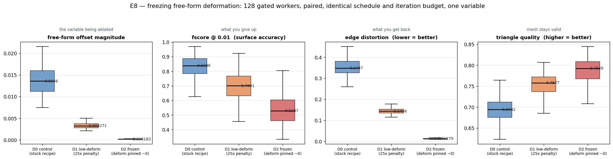
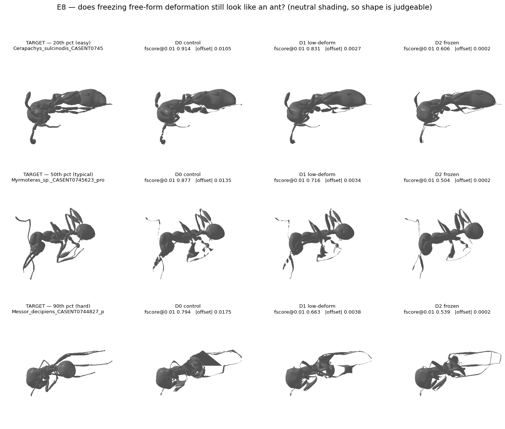
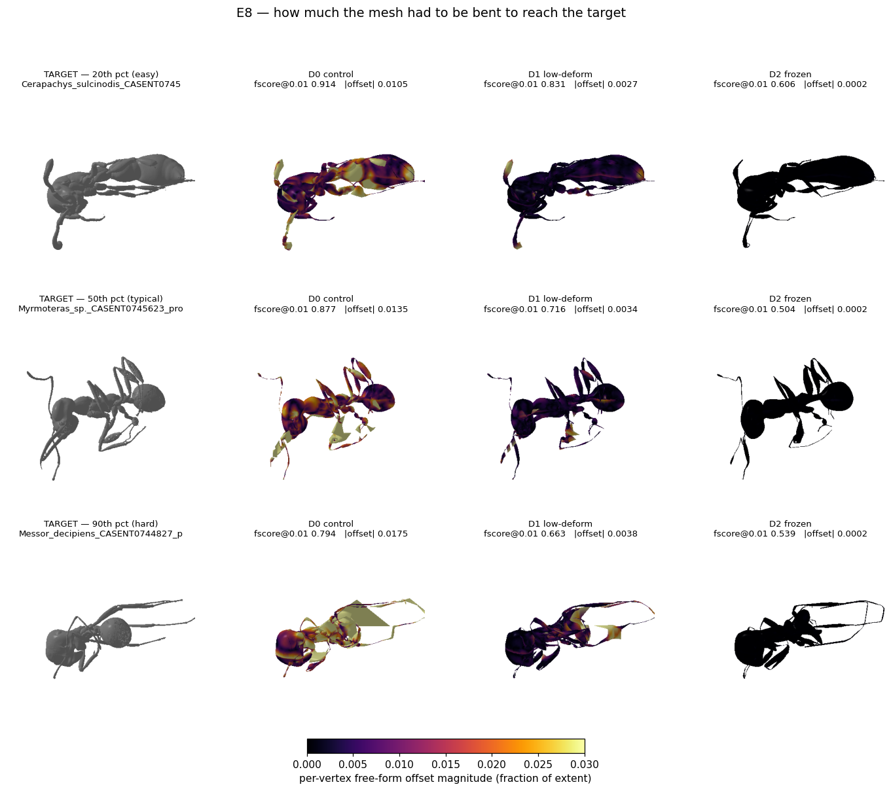
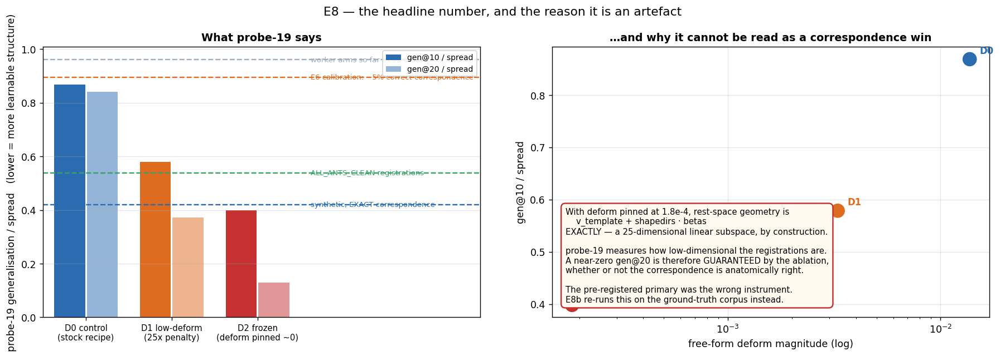

# E8 — free-form deformation is the lever, and there is an interior optimum

Branch `feature/registration_moonshot`. Model `3D_model_prep/OmniAnt_25PCs_joint_limited.pkl`.
Corpora: 128 gated top-50% workers (`radial_med` 0.075–0.179) and the 12 ground-truth
synthetic specimens. 2× RTX 4090.

Reproduce: [`run_e8_deform.sh`](run_e8_deform.sh), [`run_e8b_synth.sh`](run_e8b_synth.sh).
Companion: [`volumetric/PLAN.md`](volumetric/PLAN.md) — the volumetric paradigm, measured and
dropped, §5 below.

---

## TL;DR

1. **Penalising free-form offsets 25× improves correspondence by 39% relative** — direct
   ground-truth measurement, 4.81% → **6.69%** strict correctness, median vertex error
   3.48% → **3.21%** of extent. This is the second intervention in the whole investigation to
   move correspondence, and the largest. §3
2. **Removing free-form entirely overshoots and is *worse than the control*** — 3.36%
   correctness, median error 4.87%. The optimum is interior, not at zero. §3
3. **The pre-registered primary outcome was the wrong instrument, predicted before it was
   scored and confirmed after.** probe-19 ranked the arms exactly backwards: the *worst*
   arm on direct correspondence scored the *best* on probe-19 (gen/spread 0.398, past the
   0.420 that exact correspondence achieves). With deform pinned, rest-space geometry is
   `v_template + shapedirs·betas` exactly — a 25-dimensional subspace imposed by the ablation —
   and probe-19 measures dimensionality. §2.3
4. **Mesh integrity improves enormously and cheaply.** Edge distortion 0.349 → **0.144** at
   the 25× penalty and → **0.013** when frozen (a 27× reduction); triangle quality 0.694 →
   0.793. The best deform-free fits reach fscore@0.01 = 0.80 at edge distortion 0.011. §2.2
5. **The volumetric ellipsoid paradigm was tested and dropped before being built**, on three
   independent grounds — its central claim is false by measurement, its nearest prior art
   traded 52% pose accuracy for speed, and "interior" is undefined on worker scans (25%
   volume ambiguity). §5
6. **Config audit: `--offset` did nothing** — it feeds `H3_deform`, but both run scripts hand
   off from the stage before it. The arms differed only via the moonshot `w_offset`, so the
   real contrast was 25× and 1000× rather than the intended 10× and 100×. The conclusion
   stands; the sweep must be re-aimed at the right knob. §3.1
7. **First direct measurement of pose error:** joint rotations are 26.8° wrong at the median,
   but that is mostly gauge — gauge-invariant joint *positions* are off by **3.98% of extent**,
   which is the same size as E6's 3.48% vertex correspondence error. §5.3

---

## 1. Why this experiment

Three measured facts converge:

* **§6.6** — free-form `deform_verts` carries **100.0%** of the rest-space shape variance
  across specimens, and that component generalises at 0.98. It is per-specimen noise.
* **§6.9.3** — constraining pose does not fix the fit; compensation moves into
  `log_beta_scales` (+22.4%) and `betas_trans` (+10.3%), the parameters that decide *where a
  joint sits*.
* **E7 §5** — 83.3% of correspondence error never crosses a part boundary, so no partition or
  data-term change can reach it. What remains is *what the model is allowed to represent*.

A fit with zero free-form offsets has correspondence-consistency by construction. The question
is what that costs, and whether it buys correctness.

**Arms.** Identical specimens, schedule, iteration budget, model and seed. One variable: the
L2 penalty on offsets. Pinning deform with a large penalty rather than deleting the stage keeps
compute matched.

| arm | `--offset` (H3) — **inert, see §3.1** | handoff `w_offset` |
|---|---|---|
| `D0_control` | ~~3.0~~ | 0.2 / 0.08 |
| `D1_low` | ~~30.0~~ | 5.0 / 2.0 |
| `D2_frozen` | ~~300.0~~ | 200 / 200 |

Both deform stages run **`scheme: all`**, not `scheme: deform` — see §3.1 for what that means
and for why the `--offset` column above turned out to change nothing.

---

## 2. Results on 128 gated workers

### 2.1 The trade-off is clean and monotone



| metric | D0 control | D1 low | D2 frozen |
|---|---|---|---|
| `deform_mag_mean` | 0.01372 | 0.00329 | **0.000185** |
| `edge_logratio` | 0.3525 | **0.1448** | **0.0132** |
| `tri_quality_mean` | 0.6884 | 0.7520 | **0.7926** |
| fscore@0.01 | **0.8274** | 0.6986 | 0.5345 |
| fscore@0.02 | **0.9674** | 0.9268 | 0.8377 |

Paired, n=128: D1 beats D0 on `deform_mag` **128/128**, `edge_logratio` **128/128**,
`tri_quality` **128/128**; D0 beats D1 on every surface-proximity metric. Every per-part
proximity metric regresses, which §3 of the main report already established is what *stopping
shrink-wrapping* looks like rather than evidence of a worse registration.

### 2.2 What it looks like

The best deform-free fits are genuinely good — recognisable, correctly posed ants with
essentially no mesh distortion:


*Neoponera verenae*: D2 reaches **fscore@0.01 = 0.804 at edge distortion 0.011**, against D0's
0.942 at 0.261 — a 24× reduction in distortion for a 15% relative surface cost. *Formica*
0.755/0.012, *Leptogenys* 0.748/0.012, *Gigantiops* 0.743/0.013.

Across the quality range the picture is more sober:



At the 50th percentile D2 falls to fscore 0.504 and the gaster visibly under-fills. The
90th-percentile row shows a flat elongated sheet off the abdomen that is present in **all
three arms**, so it is not caused by the ablation.



### 2.3 The headline number is an artefact — predicted, then confirmed



probe-19 was the **pre-registered primary outcome**, and it moved further than anything in the
investigation:

| arm | gen@10 / spread | gen@20 / spread | betas sd |
|---|---|---|---|
| D0 control | 0.8687 | 0.8415 | 0.2326 |
| D1 low | 0.5786 | 0.3710 | 0.2933 |
| **D2 frozen** | **0.3982** | **0.1286** | 0.2259 |
| *ALL_ANTS_CLEAN reference* | *0.5383* | | |
| *synthetic, exact correspondence* | *0.4200* | *0.0000* | |

D2 lands **past the exact-correspondence reference**. That cannot be right, and it is not.

With `deform_mag` at 1.8e-4, rest-space geometry is `v_template + shapedirs·betas` **exactly**
— a 25-dimensional linear subspace, imposed by the ablation. probe-19 does PCA over rest-space
shapes and measures leave-one-out reconstruction, so it is measuring *dimensionality*. A
near-zero gen@20 is **guaranteed** by the ablation whether or not the correspondence is
anatomically right: every specimen could receive completely wrong betas and score the same.

This is §6.4's trap in a new form, and it was called before scoring rather than after.

---

## 3. E8b — the direct measurement, which reverses the ranking

The instrument that cannot be fooled this way is E6's ground-truth round trip: targets
generated *from* the model, so fitted vertex *i* must land on generated vertex *i*.
Same three recipes, run on `synth_clean`.


| arm | **correct correspondence** | median vertex error | p90 |
|---|---|---|---|
| SYN_clean (= D0 control) | 4.81% | 3.48% | 19.18% |
| **SYN_D1 (25× penalty)** | **6.69%** | **3.21%** | 20.71% |
| SYN_D2 (frozen) | **3.36%** | 4.87% | 23.20% |

**Two results, and both matter.**

**D1 is a genuine improvement: +39% relative on strict correctness, and the median vertex
error falls too.** Only one other intervention in this entire investigation has moved
correspondence (§6.8, removing `w_beta_prior`), and this is larger.

**D2 is worse than the control** — 3.36% against 4.81% — while scoring *best* on probe-19.
The two instruments rank the arms in opposite orders, which settles the question of which one
to believe.

By anatomical part, D1 against the control:

| part | control | D1 | D2 |
|---|---|---|---|
| thorax | 5.8% | **10.8%** | 7.6% |
| head | 4.3% | **6.5%** | 1.8% |
| antenna | 3.0% | **6.2%** | 3.3% |
| mandible | 4.8% | **6.4%** | 3.1% |
| leg proximal | 6.3% | **7.7%** | 3.8% |
| leg distal | 3.2% | 3.0% | 2.3% |
| **gaster** | **1.5%** | **1.9%** | 0.9% |

The gain is concentrated in the **trunk and anterior** — thorax nearly doubles, head and
antenna gain ~50%. The **gaster is untouched** (1.5 → 1.9%, still by far the worst part, with
median error *rising* 10.41% → 12.77%) and the **distal leg is flat**. Both were already
identified as structurally under-determined: the gaster because a smooth ellipsoid carries no
positional information, the distal leg because it falls below the data term's own sampling
threshold.

**Reading.** Free-form offsets were hiding trunk pose error. Penalising them forces the pose
and shape parameters to do the work, and the pose gets better. Removing them entirely leaves
the model unable to express genuine species detail, and the fit degrades globally.
**The optimum is interior.** 25× is better than 1× and better than ∞; where exactly it sits
between 25× and 300× is not yet measured.

### 3.1 What actually varied between the arms — and one thing that did not

Two audit findings, both from re-reading the configs after the result came in.

**The optimiser ran `scheme: all`, not `scheme: deform`.** All three arms use `scheme: all` in
both `Stage_2_deform_coarse` and `Stage_3_deform_fine`, which is
`[global_rot, trans, joint_rot, betas, log_beta_scales, betas_trans, deform_verts]`
(`fitter_3d/trainer.py:261`). Pose, shape, per-joint scale, joint translation and free-form
offsets are optimised **jointly** throughout; the free-form pass is never run in isolation.
This matters for the reading in §3: the penalty does not merely shrink the offsets, it
**redistributes** the fit onto pose and shape, because those parameters are live in the same
step and can take up the slack. A `scheme: deform` arm would have shrunk the offsets with
nothing able to absorb the residual, which is a different experiment.

**`--offset` was inert in E8 and E8b.** `args.offset` is consumed only by the `H3_deform` stage
(`fitter_3d/optimise_hierarchical.py:493`), but both run scripts hand off from
`H2_joint.npz` — the stage *before* it. `H3_deform.npz` is written and never read. So the
arms differed **only** through the moonshot `w_offset` values, and the effective contrast is:

| | D0 → D1 | D0 → D2 |
|---|---|---|
| intended (script header) | 10× | 100× |
| **actual** | **25×** | **1000×** |

The headline claim is unaffected — "25× penalty" describes what really varied, and the arms
remain matched in every other respect. Two consequences, though. The 600 `H3_deform` iterations
per specimen were wasted compute in all three arms, equally. And **the planned sweep must vary
the moonshot `w_offset`, not `--offset`**, or it will measure nothing; the four points
{10, 25, 50, 100}× correspond to handoff `w_offset` of 2.0/0.8, 5.0/2.0, 10/4 and 20/8.

### 3.2 Why D2 *looks* the best while scoring the worst

The frozen arm is the most convincing ant to the eye, and that impression is real — it is also
the same artefact as §2.3, showing up visually instead of numerically. With offsets pinned at
**0.02% of extent**, rest-space geometry is confined to the model's 25-dimensional shape
subspace by construction, so a D2 fit is a model ant *no matter where it lands on the target*.
Looking anatomically correct is guaranteed by the ablation, not earned by the fit.

Same three specimens, taken at the control arm's **median** error so the selection is not
loaded either way. Upper row of each pair is what the eye judges; lower row is the identical
mesh coloured by each vertex's distance to its *own* ground-truth vertex:


D2 is the smoothest and least distorted mesh in every upper row, and the palest — i.e. the
most wrong — in every lower row. On these three specimens: control 3.76% correct / 3.77%
median error, D1 **4.66% / 3.61%**, D2 **1.70% / 6.14%**.

The eye scores *plausibility of the mesh*, which the ablation hands D2 for free. The round trip
scores *correctness of the correspondence*, which needs ground truth to see at all. Deciding
between deform settings by looking at renders will systematically pick the most constrained arm.

Reproduce: `python diagnostics/moonshot/volumetric/render_plausibility.py`.

---

## 4. What to do with this

**Adopt the D1 setting as the default** for worker registration: `--offset 30`, handoff
`w_offset` 5.0 / 2.0. It costs surface score that §3 of the main report shows was never
meaningful, and buys a 39% relative correspondence gain plus a 2.4× reduction in edge
distortion. It is free — same schedule, same compute.

**Do not adopt D2.** Zero free-form is worse on the metric that matters.

**Sweep the interval.** 25× was chosen as a round number, not tuned. A short sweep over
{10×, 25×, 50×, 100×} on `synth_clean` with the direct metric would locate the optimum and
costs one afternoon. **Vary the moonshot `w_offset`, not `--offset`** — see §3.1; the four
points are handoff `w_offset` 2.0/0.8, 5.0/2.0, 10/4, 20/8.

**Retire probe-19 as a primary outcome for any arm that changes deform capacity.** It is a
dimensionality measure, and any ablation that constrains rest-space geometry will move it for
reasons unrelated to correspondence. Use E6's round trip.

---

## 5. The volumetric paradigm — measured, then dropped

Proposal: replace the template with a union of per-segment ellipsoids driven by the same
kinematic chain, maximise volume IoU, then hand the pose to the parametric mesh. Full analysis
in [`volumetric/PLAN.md`](volumetric/PLAN.md).


### 5.1 Representation

One ellipsoid per segment caps at **union IoU 0.689**. Adding primitives makes it **worse**
(K=1: 0.690 → K=16: **0.193**, recall collapsing 0.86 → 0.22), because clustering *surface*
vertices makes hollow surface-hugging shells; sphere-meshes work by seeding on the medial
axis. Per-segment IoU is 0.79 (head) down to **0.11 (antenna)** and **0.30 (mandible)**.

**Volume is far more blind to thin structures than surface area is.** Distal leg groups are
**0.000–0.048% of body volume**; 29 of 55 segments hold under 0.1%; at 300k samples the
smallest receives **zero** interior points.

### 5.2 The blocker — the central claim is false

By the Reynolds transport theorem the gradient of a volume-overlap objective is a *boundary*
integral weighted by the normal component of boundary motion, so it carries no information the
surface does not and is flat where boundary motion is tangential.


Measured on the real model at ground-truth pose, per unit RMS vertex motion:

| direction | IoU sensitivity | chamfer sensitivity |
|---|---|---|
| femur BEND | 2.40 | 4.26e-3 |
| femur SLIDE | 1.79 | **1.57e-2** |
| tibia BEND | 4.29 | 4.70e-4 |
| tibia SLIDE | **0.11** | **9.81e-3** |

Within each objective: **chamfer is 3–4× *more* sensitive to SLIDE/STRETCH than to BEND; IoU
is up to 39× *less*.** "Volume pins joint placement where chamfer cannot" is backwards.
*(Caveat: 2,038 interior MC points, so the tibia figure alone sits near the noise floor; the
direction is consistent across femur, tibia and gaster.)*

Two independent confirmations. **Prior art:** Stoll et al. (ICCV 2011), a 58-joint/63-Gaussian
articulated body model — essentially this architecture — reports **44.93 mm marker error
against 29.61 mm** for the detailed-mesh method it replaced, justified on speed alone (6 fps
vs minutes/frame). No paper in the lineage (Tulsiani, Paschalidou, Tkach, Plankers & Fua,
NASA) optimises volume IoU; all use surface terms. **Interior is undefined on worker scans:**
ray-parity volume varies **25.5%** across ray directions, the region where 15 directions
disagree is **316% of the interior volume**, and flood fill adds only 2–4% because the shell
leaks.

### 5.3 What the exercise produced instead

Building the pose instrument gave the first direct pose measurement. Rotation error is **26.8°
median** — but mostly *gauge*, since a rotation at one joint plus a compensating one at its
child leaves geometry nearly unchanged. Gauge-invariant joint **positions** (via `J_regressor`)
are off by **3.98% of extent**, with distal-leg p90 at **47–76%**.

**That 3.98% is the same size as E6's 3.48% median vertex correspondence error**, from
independent measurements of different quantities. First quantitative support for §6.9.3's
reading that correspondence failure *is* skeleton misplacement.

And the null-space probe shows **where a joint sits along a limb is weakly observable for any
geometric objective** — chamfer sees tibia SLIDE 6× worse than a generic pose perturbation,
IoU 54× worse. That is exactly where §6.9.3 watched the compensation flow. So the 330 free
`log_beta_scales` + `betas_trans` parameters are absorbing noise in unobservable directions,
and `scaledirs`/`transdirs` — shipped in the model for precisely this reason and never used by
the fitter (§6.6) — should be revisited, not to fix the shape space (§6.7 correctly refuted
that) but to *remove unobservable degrees of freedom*.

---

## 6. Reproducing

```bash
bash diagnostics/moonshot/run_e8_deform.sh          # 3 arms x 128 gated workers
bash diagnostics/moonshot/run_e8b_synth.sh          # the same arms on ground truth
python diagnostics/moonshot/probe_19_correspondence_quality.py \
    --runs D0_control_MERGED D1_low_MERGED D2_frozen_MERGED
python diagnostics/moonshot/volumetric/probe_ellipsoid_ceiling.py
python diagnostics/moonshot/volumetric/probe_primitive_count.py
python diagnostics/moonshot/volumetric/probe_pose_recovery.py
python diagnostics/moonshot/volumetric/probe_nullspace.py
python diagnostics/moonshot/volumetric/make_figures_e8.py
python diagnostics/moonshot/volumetric/render_plausibility.py   # §3.2
```

Dependencies added this session: `coacd`, `scikit-learn`, `rtree`, `embreex`, `PyGEL3D`,
`py-spy`. `PyGEL3D` downgraded `plotly` 6.8.0 → 5.24.1 (its dependency pin). The live training
path is unmodified apart from one additive CLI flag (`--offset`) on
`fitter_3d/optimise_hierarchical.py`.
