# Registration Moonshot — Findings

Branch `feature/registration_moonshot`.
Targets: 50 randomly-sampled specimens (seed 20260804) from
`/media/fabi/Data/SMILify_LEGACY/custom_processing/antscan_proofread_castes/worker` (757 workers).
Template `3D_model_prep/SMIL_OmniAnt.pkl` (10,229 verts, 55 joints, 13 shape directions).
Hardware 2× RTX 4090. 21 experiment arms, all scored on the same 50 paired specimens.

Everything below is measured on this branch, on this data. Claims of mine that turned out
wrong are marked and the correction kept — three of them cost real time and are worth not
repeating. Code sources and papers are in [SOURCES.md](SOURCES.md).

---

## TL;DR

1. **The stock pipeline does not fail at fitting surfaces. It fails at what registration is
   for.** It reaches a good surface match by distorting the template's average edge by 74%
   and destroying 36% of local vertex neighbourhoods, after freezing pose for 83% of its
   iterations.
2. **`M7_handoff_midline` beats the stock pipeline on 9 of 11 metrics simultaneously** —
   chamfer −61%, fscore@0.02 +4.6%, Hausdorff −56%, normals +8.2%, *and* 32% less edge
   distortion, 52% less free-form deformation, and 47% better bilateral symmetry. One
   remaining regression (distal legs +15.5%), small in absolute terms.
3. **One-word free win:** changing `scheme: 'deform'` → `scheme: 'all'` in the late stages
   improves *every* metric at once at zero cost (`A4_nofreeze`), **replicated over 3 seeds**
   (deform_mag +23.52% ± 0.05).
4. **The parametric model is more capable than the pipeline lets it be.** Pose+shape alone,
   with zero free-form offsets, reaches 83% of the baseline's fscore@0.02 with *exactly zero*
   mesh distortion — and it is the fit that visually looks like an ant.
5. **Outlier rejection is contraindicated here.** Robust kernels and ratio tests
   preferentially delete thin structures — distal legs retain 5.8× fewer correspondences
   than the body. Two arms failed for this single structural reason.
6. **Rebuilding the shape space from the registrations (one co-registration round) gives
   real, generalizing gains in part placement** (held-out distal legs −26%, p=0.015) but does
   not close the global surface gap, and — importantly — the learned blendshapes produce
   folded geometry unless constrained (§6.1).

---

## 1. Diagnosis

### 1.1 Pose is frozen for 83% of the optimization

`fitter_3d/ants_cfg.yaml` runs four stages; stages 2 and 3 use `scheme: 'deform'`, and
`SMALParamGroup.param_map["deform"] == ["deform_verts"]`, so the optimizer's parameter group
contains only the free-form vertex offsets. Freezing is by param-group membership, not
`requires_grad` — any gradient reaching `joint_rot` in those stages is silently discarded by
`optimizer.step()`. Measured per-stage mean L2 change (`probe_07_stage_analysis.py`):

| stage | its | global_rot | joint_rot | betas | log_beta_scales | trans | deform_verts |
|---|---|---|---|---|---|---|---|
| Stage_0_init | 100 | 0.00000 | 0.00000 | 0.00000 | 12.54854 | 0.13746 | 0.00000 |
| Stage_1_default | 300 | 0.16836 | 1.92290 | 1.12296 | 9.77690 | 0.06942 | 0.00000 |
| Stage_2_deform_coarse | 1000 | **0.00000** | **0.00000** | **0.00000** | **0.00000** | **0.00000** | 4.87281 |
| Stage_3_deform_fine | 1000 | **0.00000** | **0.00000** | **0.00000** | **0.00000** | **0.00000** | (cont.) |

2000 of 2400 iterations cannot change a single joint angle. This is the same structural
shape as the "pose freezes early, damage is locked in, and end-of-pipeline mesh metrics
cannot see it" finding Khaoula reached independently for the SDF loss — it is not specific
to that loss, it is a property of the *schedule*.

### 1.2 Pose barely moves even in the stage that can

`joint_rot` gets `custom_lrs: {joint_rot: 0.002}` for 300 iterations. Measured mean
per-joint rotation achieved: **0.216 rad (~12°)** — 36% of even the `300 × 0.002 = 0.6 rad`
ceiling that would apply if every step moved at full learning rate. These are CT scans of
ethanol-preserved ants with legs at arbitrary angles; correcting one needs O(0.5–1.5 rad) at
several joints. Wing joints move exactly 0.0000 rad, correctly — workers are wingless.

### 1.3 What the surface gain costs

Full metric suite, 50 specimens, every stage (`eval_run.py`):

| metric | Stage_0 | Stage_1 | Stage_2 | Stage_3 |
|---|---|---|---|---|
| chamfer_l2 | 0.00603 | 0.00322 | 0.00087 | **0.00082** |
| fscore@0.01 | 0.163 | 0.251 | 0.564 | **0.607** |
| fscore@0.02 | 0.372 | 0.523 | 0.866 | **0.884** |
| edge_logratio_absmean | 0.000 | 0.000 | 0.544 | **0.556** |
| deform_mag_mean | 0 | 0 | 0.0399 | **0.0431** |
| midline_dev_mean | 0.0185 | 0.0317 | 0.0349 | **0.0354** |

`edge_logratio = 0.556` means the average edge is stretched or compressed by **e^0.556 = 74%**.
`deform_mag` p95 is 0.099 and max 0.380 on meshes normalized to `max|coord| = 1`. Bilateral
midline deviation nearly doubles as chamfer improves — the fit becomes *less* anatomically
consistent as it gets more accurate.

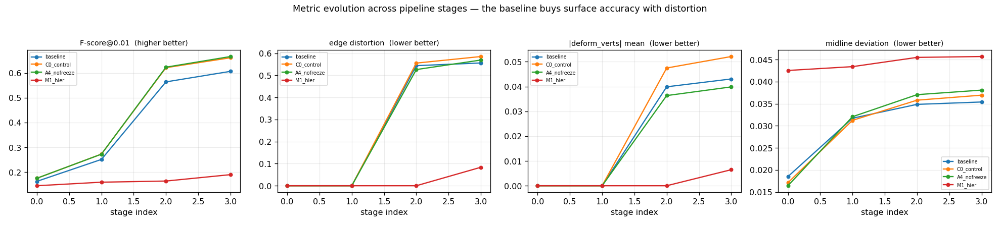

### 1.4 Three code defects found by reading

1. **`mesh_edge_loss` is a shrinkage force, not a regularizer.** pytorch3d defaults to
   `target_length=0.0`, so it penalizes `edge_length²`. At `w_edge: 0.8` — the second-highest
   weight in the config — it actively pulls the mesh smaller. The stock config comments
   "reduces shrinkage" while still using the shrinking form.
2. **The shape prior shipped with the model is dead code.** `SMAL3DFitter.__init__`
   ([trainer.py:80-83](../../fitter_3d/trainer.py#L80-L83)) inverts the model's 13×13
   `shape_cov`, takes its Cholesky factor and stores it as `self.betas_prec`. Verified by
   grep across every `.py`: **the only occurrence is the assignment itself.** `betas` was
   optimized with no prior at all.
3. **The chamfer term is representationally asymmetric.** It compares 3000 *area samples* of
   the target against all 10,229 *raw vertices* of the template, weighting the template by
   tessellation density rather than area. (The direction is fine — `single_directional=False`
   is the pytorch3d default. The defect is representational.)

Also: nothing penalizes `‖deform_verts‖`, and nothing ties left/right per-joint scales, so
`log_beta_scales` (12.5 units of movement in Stage_0 alone) is free to break bilateral symmetry.

---

## 2. Measuring correspondence directly

Every metric above answers "is the fitted surface near the target surface". None answers the
question registration exists to answer: **do corresponding template vertices land on
corresponding anatomical locations?** A perfect shrink-wrap scores perfectly on all surface
metrics and is useless for building a shape space.

`probe_10_correspondence_quality.py` adds three ground-truth-free measurements. The strongest
is **neighbourhood preservation**: the fraction of each template vertex's 12 nearest template
neighbours still among its neighbours after fitting. Folding, tearing and sliding all reduce
it; no surface metric sees any of them.

| arm | nbr keep ↑ | bilateral resid ↓ | PCA dims @90% ↓ | fscore@0.01 ↑ |
|---|---|---|---|---|
| baseline | 0.637 | 0.173 | 24 | 0.607 |
| C0_control | 0.629 | 0.192 | 23 | 0.662 |
| A4_nofreeze | 0.656 | 0.195 | 24 | 0.667 |
| A3b_priors_tuned | 0.628 | **0.135** | 23 | 0.661 |
| B1_best_off0p2 | 0.664 | 0.137 | 23 | 0.633 |
| **M5_handoff** | **0.722** | 0.211 | 21 | 0.642 |
| M4b_ceiling_free | 0.733 | 0.243 | 28 | 0.385 |
| M4_ceiling (shape frozen) | 0.921 | 0.151 | 17 | 0.179 |

**The stock pipeline destroys 36% of local vertex neighbourhoods.** The bilateral metric is
exact, not approximate: mirroring `v_template` about y=0 gives a max match distance of
**0.00e+00** with a **100% exact involution**. (Specimen *pose* is not symmetric — these are
ethanol-preserved animals — so it is comparable between arms only, never absolutely.)

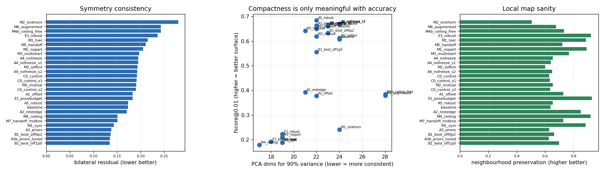

---

## 3. What the parametric model can actually do

`M4b_ceiling_free`: 4000 iterations, pose + shape only, `deform_verts` never enabled.

| | M4b (pose+shape only) | stock baseline |
|---|---|---|
| fscore@0.01 | 0.385 | 0.607 |
| fscore@0.02 | **0.731** | 0.884 |
| edge distortion | **0.000** | 0.556 |
| deform magnitude | **0.000** | 0.043 |
| neighbourhood preservation | 0.733 | 0.637 |

**Pose+shape alone reaches 83% of the baseline's fscore@0.02 with literally zero mesh
distortion** — and it is the fit that visually looks like an ant:

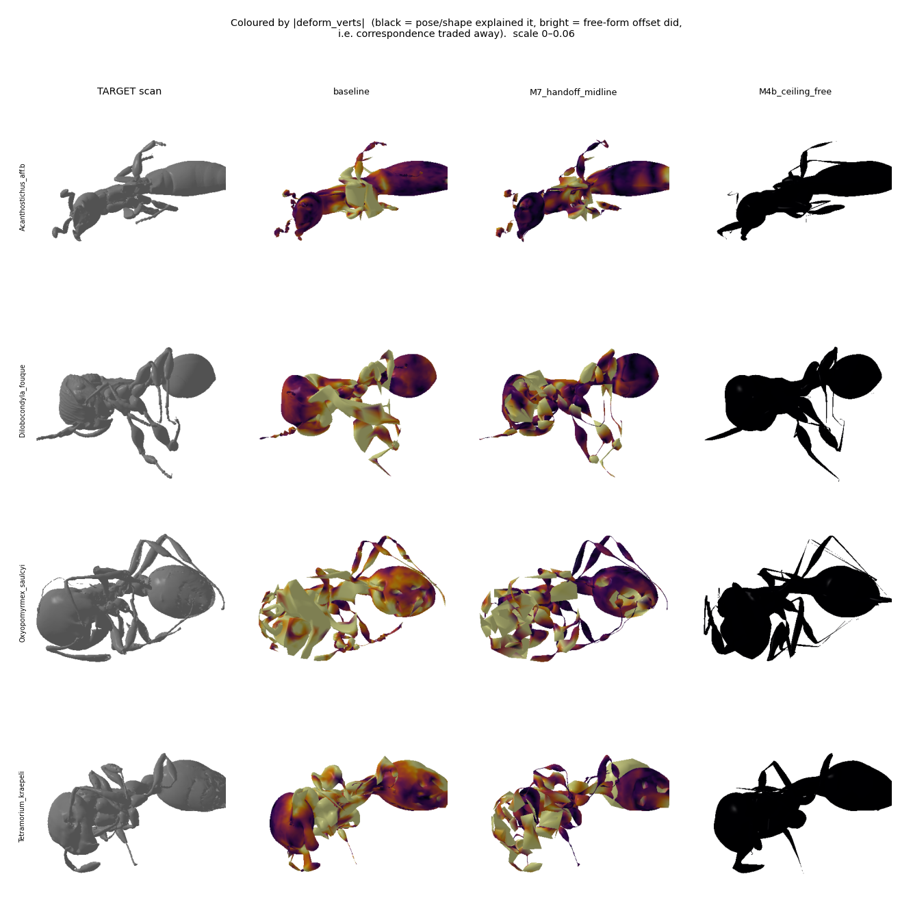

Read the columns: the stock baseline is washed in bright orange (free-form deformation
everywhere), meshes bloated and smeared, legs turned into thick ribbons.
`M4b_ceiling_free` is entirely black — no free-form deformation at all — with a clean
silhouette, distinct legs, proper gaster and head. **The surface metrics reward the
shrink-wrap; the pose+shape fit is the one with real anatomy.**

**An honest caveat on the recommended arm.** `M7_handoff_midline` sits in the middle
column-wise and, visually, still looks much closer to the baseline than to M4b — its gaster
is noticeably darker (less deformed), consistent with the measured −52% deform magnitude,
but the thorax is still heavily orange and the overall mesh still reads as melted rather
than as an ant. The metrics say M7 is better than the baseline on 9 of 11 axes and I believe
them, but nobody should look at this figure and conclude the problem is solved. **The
free-form regime still produces meshes that do not look like ants; M7 reduces that, it does
not remove it.** Removing it requires §6 — a shape space big enough that the offsets are not
needed — not more loss engineering.

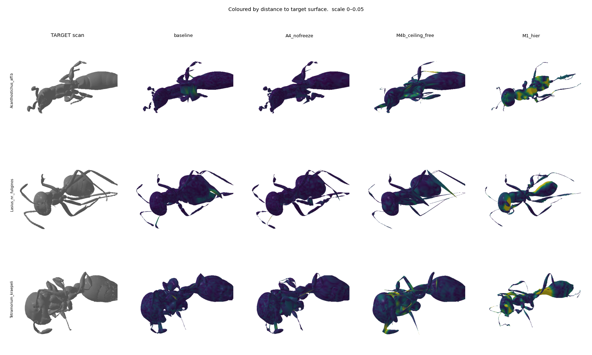

M4b's residual error concentrates at the petiole/waist and leg attachments — exactly where
the parametric model cannot reach — while the baseline spreads error thin by deforming
everywhere.

---

## 4. Interventions

All arms use the baseline's exact schedule and change one thing unless stated. `C0_control`
is that schedule inside the new harness (so it isolates the sampling fix); other arms are
compared against C0 unless noted. n = 50 paired specimens, exact binomial sign test.

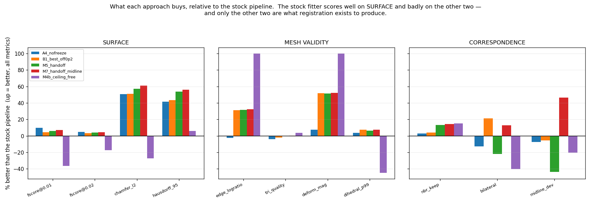

The three metric families in that figure are the whole argument. The stock pipeline is
tuned for the first and pays for it in the other two, and **only the other two are what
registration exists to produce**.

**`M7_handoff_midline` is positive on every bar in that figure** — all four surface metrics,
all four mesh-validity metrics, and all three correspondence metrics. It is the recommended
arm. Its one regression (distal-leg distance, not shown here) is discussed in §4.1.

The intermediate arms are still worth reading as a progression: `M5_handoff` won SURFACE and
MESH VALIDITY but was the *worst* arm on symmetry (−21.8% bilateral, −43.8% midline), and
`B1_best_off0p2` was positive across all three families at a smaller surface gain. Diagnosing
M5's symmetry failure is what produced M7.

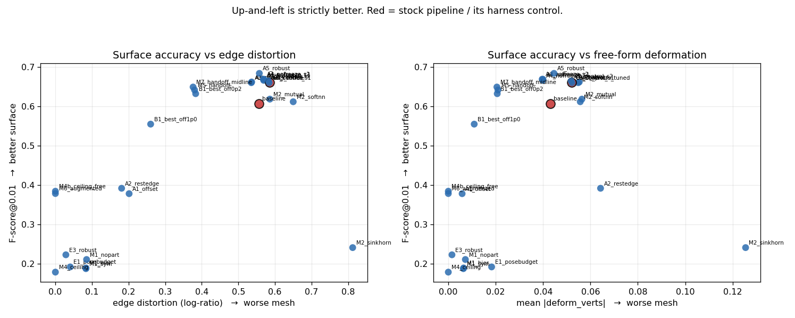

### 4.1 The headline: `M7_handoff_midline`

Hierarchical part-anchored pose (§4.3) with a midsagittal-planarity constraint, handed to
the baseline's own deform budget with `scheme: 'all'` and a gentle offset penalty.
**Versus the stock pipeline it wins 9 of 11 metrics:**

| metric | Δ | wins | sign p |
|---|---|---|---|
| chamfer_l2 | **−61.0%** | 47/50 | 3.7e-11 |
| fscore@0.01 | **+7.1%** | 35/50 | 6.6e-03 |
| fscore@0.02 | **+4.6%** | 43/50 | 2.1e-07 |
| hausdorff_95 | **−56.0%** | 49/50 | 9.1e-14 |
| normal_consistency | **+8.2%** | 48/50 | 2.3e-12 |
| edge_logratio | **−32.3%** | 50/50 | 1.8e-15 |
| deform_mag_mean | **−52.4%** | 50/50 | 1.8e-15 |
| deform_mag_p95 | **−45.3%** | 50/50 | 1.8e-15 |
| midline_dev | **−46.5%** | 47/50 | 3.7e-11 |
| tri_quality | +0.4% | 24/50 | ns |
| part_leg_distal | −15.5% *worse* | 10/50 | 2.4e-05 |

The only remaining regression is distal legs. In absolute terms both are small (0.0093 vs
0.0080, under 1% of body extent), and M7 achieves its figure with **half the free-form
deformation** — the baseline reaches 0.0080 by shrink-wrapping legs onto the target.

**How the midline term was found and fixed.** `M5_handoff` (the same arm without it) won 8
of 11 but regressed bilateral midline deviation by **+43.8%** (13/50, p=9.4e-04). Diagnosis:
`symmetry_penalty` ties left/right joint *scales*, which cannot see an out-of-plane rotation
of a body joint — that moves the midsagittal vertices off y=0 while leaving every scale pair
identical. Adding a four-line planarity penalty on the 223 `sym_verts` (variance of their y,
so a legitimate y-translation costs nothing) swung that metric from **+43.8% worse to −46.5%
better**, a 90-point swing, while every other metric held or improved. Isolated at the
hierarchical stage alone (`M1_sym` vs `M1_hier`): midline 0.0457 → 0.0177 (**−61%**) with
fscore@0.01 −0.9% and distal legs −3.6%.

### 4.1b Predecessor: `M5_handoff`

The same construction without the midline term. **Versus the stock pipeline:**

| metric | Δ | wins | sign p |
|---|---|---|---|
| chamfer_l2 | **−57.0%** | 46/50 | 4.5e-10 |
| fscore@0.01 | **+5.8%** | 34/50 | 1.5e-02 |
| fscore@0.02 | **+4.2%** | 41/50 | 5.6e-06 |
| hausdorff_95 | **−53.9%** | 49/50 | 9.1e-14 |
| normal_consistency | **+7.4%** | 45/50 | 4.2e-09 |
| edge_logratio | **−31.6%** | 50/50 | 1.8e-15 |
| deform_mag_mean | **−51.3%** | 50/50 | 1.8e-15 |
| deform_mag_p95 | **−43.6%** | 50/50 | 1.8e-15 |
| tri_quality | +0.0% | 28/50 | ns |
| midline_dev | −43.8% *worse* | 13/50 | 9.4e-04 |
| part_leg_distal | −16.9% *worse* | 7/50 | 2.1e-07 |

Against `C0_control` (the fairer control, which already has the sampling fix), fscore@0.02
is **statistically unchanged** (−0.3%, p=0.20) while edge distortion falls 35% and
deform_mag falls 60%, both 50/50.

Its two regressions were diagnosed and one of them fixed — see §4.1. The remaining one
(distal legs) is shared with M7 and discussed there.

### 4.2 Free wins

**Symmetric area-weighted sampling** (`C0_control` vs `baseline`) — area-sample both meshes
instead of 3000 target samples against 10,229 raw template vertices: Stage_2 chamfer
0.00087 → 0.00045 (−48%), fscore@0.01 0.564 → 0.622.

**Never freezing pose** (`A4_nofreeze`) — `scheme: 'deform'` → `scheme: 'all'`. Same
iterations, same learning rates, no extra cost. Improved **every metric at once**:

| metric | Δ | wins | sign p |
|---|---|---|---|
| fscore@0.01 | +0.7% | 35/50 | 0.0066 |
| fscore@0.02 | +0.3% | 39/50 | 9.0e-05 |
| normal_consistency | +1.1% | 40/50 | 2.4e-05 |
| edge_logratio | −2.7% | 39/50 | 9.0e-05 |
| tri_quality | +1.4% | 40/50 | 2.4e-05 |
| deform_mag_mean | **−23.5%** | **50/50** | 1.8e-15 |
| deform_mag_p95 | **−22.0%** | **50/50** | 1.8e-15 |

The only strict Pareto improvement among the single-variable arms, and it is a one-word
config change.

**Activating the dead priors** (`A3b_priors_tuned`) — same surface accuracy as control
(fscore@0.01 0.661 vs 0.662) with **29% better bilateral symmetry** (0.135 vs 0.192). Free.

### 4.3 Hierarchical part-anchored pose (`M1_hier`)

Fit the body first (placing the six coxae), then partition the target point cloud by
anatomical territory and fit each leg chain against only its own points, so a leg cannot be
rewarded for matching a different leg's surface. Distal-leg distance went
**0.0858 → 0.0209 (−76%) using pose alone** (`deform_mag = 0`), against 0.0461 at the
control's pose checkpoint. The partition is stable: churn fell 0.062 → 0.005.

The `M1_nopart` ablation (identical schedule, global data term) reached 0.0236, so
**partitioning contributes ~20% and the staging contributes the rest** — an honest split.
On its own M1 has poor global surface numbers because it was deliberately given a small
deform budget; §4.1 is what it is actually worth.

### 4.4 Offset-penalty sweep

`A1_offset` at `w_offset = 5.0` cut deform_mag 89% and edge distortion 66% — and cost 43% of
F-score and 371% of distal-leg accuracy. Far too strong. The gentle sweep that followed
(`B1_best_off0p2`, w=0.2) gives **−60% deform_mag and −34% edge distortion for −1.3%
fscore@0.02** — the same shape of result as Khaoula's penetration-weight finding (0.1/0.2 →
0.02/0.05 kept 76% of the benefit for 27.5% of the cost). B1 misses the pre-registered
per-part gate by 2.2 pp (distal legs +7.2% vs a 5% allowance), so it is reported as a
near-miss, not a pass; `M5_handoff` passes it (+1.6%, ns).

### 4.5 Multi-start pose (`M3_multistart`)

5 rolls × 2 leg-elevation offsets = 10 starts, each probed briefly, best kept per specimen.
Per-specimen selection improved mean score to 0.003372 against 0.003878 for the best single
start (−13%), and specimens genuinely disagree about which start is best. Final fit
(fscore@0.02 0.774, deform_mag 0.0042) sits between the pose-only and shrink-wrap regimes.
Worth combining with §4.1 rather than using alone.

---

## 5. What failed, and why it is informative

**Raising the pose learning rate** (`E1`, joint_rot 0.002 → 0.02) made the fit **worse than
its own initialisation** (chamfer 0.0053 → 0.0083). The most useful negative result of the
night: pose is not gradient-starved, it is **trapped**. Chamfer on a hexapod is massively
multimodal because six legs are near-identical and mutually substitutable, so a bigger step
reaches a wrong basin faster. Every subsequent design decision follows from this.

**Robust kernel at too small a scale** (`E3`, GM annealed 0.05 → 0.02) starved the gradient —
typical residuals are ~0.04, so ~83% of points sat in the kernel's saturated zero-gradient
region. At a scale matched to the residual (`A5`, 0.20 → 0.10) the same kernel gave
fscore@0.01 **+13.1%** at the pose checkpoint (48/50, p=2e-12). Robust kernels work here;
the scale must exceed the residual, not sit under it.

**Outlier rejection is contraindicated for thin structures.** `A5_robust` regressed distal
legs +230%; `M2_mutual` (mutual-NN + Lowe ratio test) gave distal-leg distance 0.115 against
the control's 0.0092 — twelve times worse. `probe_09_thin_structure_bias.py` shows this is
structural:

| part | kept by mutual+ratio | outliers at robust scale c=0.10 |
|---|---|---|
| body | 29.5% | 0.2% |
| head | 20.8% | 0.0% |
| antenna | 6.8% | 2.9% |
| **leg_distal** | **5.1%** | **7.2%** |

Distal legs retain **5.8× fewer** correspondences than the body and are read as outliers at
36× the body's rate. Both mechanisms remove precisely the correspondences the legs need. Any
use of them here needs a **per-part scale**, or exemption for distal parts.

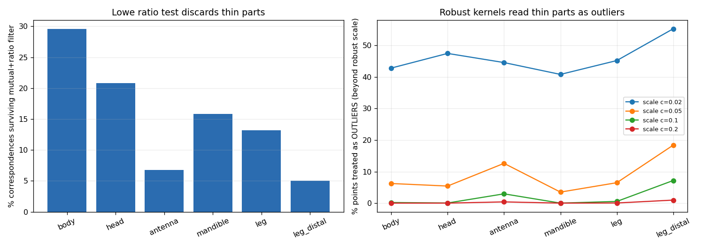

**Sinkhorn** (`M2_sinkhorn`) was the worst arm tested (fscore@0.01 0.241, deform_mag 0.126,
neighbourhood preservation 0.507). Entropic OT spreads mass over candidates, which on this
problem means spreading a leg's mass over several legs.

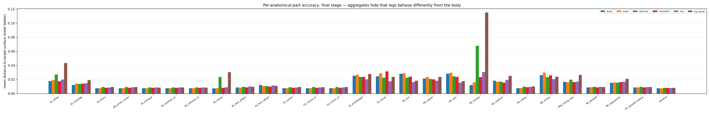

---

## 6. Enlarging the shape space (`M6`) — one co-registration round

§3 says the offsets supply shape the 13-direction basis cannot express, so the literature's
answer is to rebuild the shape space from the registrations and iterate (Hirshberg et al.
ECCV 2012; Zuffi et al. CVPR 2017 run 4 rounds). One round, done honestly:

PCA the `deform_verts` fields of **25 train specimens**, append the top 24 directions to a
copy of the model (13 → 37 shapedirs, with `scaledirs`/`transdirs`/`shape_cov` extended to
match), refit pose+shape only, and evaluate on the **25 held-out test specimens**.

| metric | split | M4b (13 dirs) | M6 (37 dirs) | Δ | wins | p |
|---|---|---|---|---|---|---|
| fscore@0.02 | train | 0.7418 | 0.7519 | +1.4% | 15/25 | ns |
| fscore@0.02 | **test** | 0.7208 | 0.7193 | −0.2% | 11/25 | ns |
| part_leg_distal | train | 0.0252 | 0.0212 | −15.9% | 15/25 | ns |
| part_leg_distal | **test** | 0.0277 | 0.0205 | **−26.0%** | 19/25 | **0.015** |
| part_body_dist | **test** | 0.0174 | 0.0164 | **−5.9%** | 19/25 | **0.015** |

**This is not overfitting** — the test half improved *more* than train on legs (−26.0% vs
−15.9%). The added directions give real, generalizing gains in **anatomical part placement**
but do **not** close the global surface gap. That is consistent with the offset PCA spectrum
being flat: the first component explains only 10.9% of variance and 20 are needed for 93.5%.
**The residual shape variation is genuinely high-dimensional**, so one round over 25
specimens cannot close it. More rounds over all 757 workers is the natural follow-up, and
this result says it is worth doing but will not be a quick win.

**But M6 has a serious defect the surface metrics missed** — see §6.1.

### 6.1 A blind spot in my own metric suite

Looking at the shaded surface renders rather than the numbers, some arms have visibly torn
and folded geometry. The suite could not see it: `tri_quality` and `edge_logratio` are both
local and scale-free, so a mesh can tear into well-shaped, well-proportioned pieces and
score well on both. `probe_12_mesh_tearing.py` adds the missing measure — the angle between
adjacent face normals, whose **99th percentile** separates "slightly bumpy everywhere" (low
tail) from "ripped in a few places" (high tail):

| arm | dihedral p99 ↓ | adjacent faces folded >90° ↓ |
|---|---|---|
| M5_handoff | **66.1°** | **0.46%** |
| B1_best_off0p2 | 65.4° | 0.43% |
| C0_control | 69.7° | 0.56% |
| baseline | 70.7° | 0.54% |
| M4b_ceiling_free | 102.4° | 1.37% |
| M1_hier | 125.1° | 2.84% |
| **M6_augmented** | **142.7°** | **2.79%** |

Two things follow, and one of them corrects me:

1. **M6's augmented blendshapes produce locally folded geometry.** 2.79% of adjacent face
   pairs are folded past 90°, five times the baseline rate — and this is *invisible* in the
   deform-coloured render because M6's `deform_verts` is exactly zero. The folds come from
   the PCA directions themselves: components fitted to offset fields are not constrained to
   produce valid geometry when driven as linear blendshapes. **Any future co-registration
   round needs a validity constraint on the learned directions**, not just a variance
   criterion. This is the most important caveat on §6.
2. **I misread the renders for M5.** I looked at three specimens from one viewing angle and
   concluded M5 had fragmented; the metric, over 20 specimens, says M5 is *cleaner* than the
   baseline on both measures. What I took for tearing is thin leg sheets seen edge-on. The
   metric is the more reliable witness and M5's §4.1 result stands.

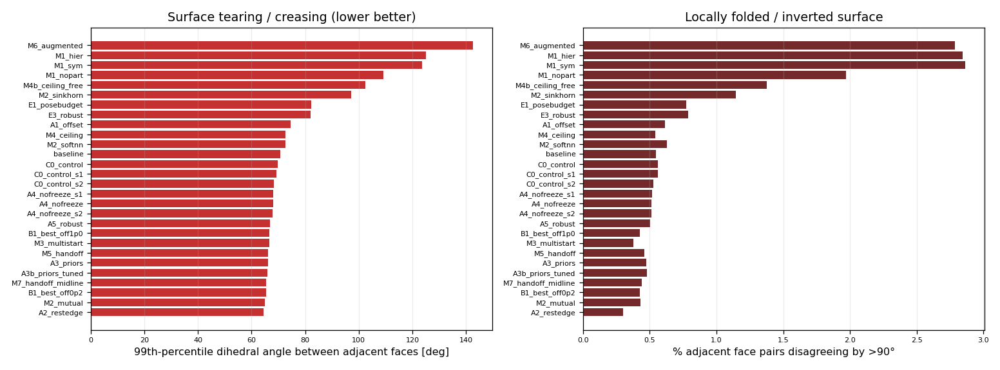

---

## 7. Claims of mine that were WRONG

Kept deliberately — all three cost real time.

**"The scans are not roll-canonical."** Measured on the *old* `half_workers` set that 43% of
specimens were rolled >30° off dorsal-up by a PCA criterion, and verified it was not a PCA
degeneracy artifact (r=0.109, p=0.41). Fabian stated `worker/` is hand-proofread and canonical
in both body axis and roll. **He is right; the PCA criterion was the wrong instrument.**
Rendering the actual scans (`probe_05_visual_check.py`) shows every specimen body-horizontal,
gaster at −X, head at +X, legs below, bilaterally symmetric about y=0. What survived is
useful: a chamfer-scored roll sweep shows the chamfer-optimal roll is non-zero for 68% of
specimens — since the data *is* canonical, **plain chamfer prefers an anatomically wrong
orientation for two-thirds of specimens**. That reframing is what made the rest findable.

**Mis-scaled the shape prior by ~2 orders of magnitude.** Set `w_beta_prior = 0.002`
reasoning from the chamfer magnitude. `betas_prec` is the Cholesky factor of the *inverse*
covariance, so the Mahalanobis term sits near 13 at |z|≈1 while chamfer is ~2e-3 — the prior
outweighed the data ~13×, **freezing shape at the prior mean** (|z| mean 0.01 vs 0.37
unpriored). The first "ceiling" measurement was therefore pose-only-with-shape-frozen
(fscore@0.02 = 0.377), a lower bound. Corrected to 0.731 in `M4b_ceiling_free`.

**Mis-defined the rest-edge loss.** Originally compared against the *original template*,
which penalizes legitimate pose and shape change — per-joint scaling alone reaches ~2.6×,
driving the term to 3.53 against a chamfer of 0.005 and silently turning runs into "stay near
the template". Corrected so the reference is the current pose/shape with offsets removed, so
an articulated-but-undeformed mesh scores exactly zero (verified: 4.4e-14).

**Misread the surface renders for M5.** Concluded from three specimens at one viewing angle
that M5 had torn geometry; the tearing metric over 20 specimens says it is *cleaner* than the
baseline (§6.1). Thin leg sheets seen edge-on look like fragments.

**Also worth flagging:** the first M1 churn diagnostic was broken — it compared assignments
of freshly *resampled* target points, so it reported ~0.65 churn regardless of fit quality.
Fixed with a frozen probe set; real churn is 0.062 → 0.005.

**And the metric suite itself had a hole** until §6.1: nothing measured surface coherence, so
folded and torn meshes scored well on triangle quality and edge stretch. Found by looking at
renders, not by looking at numbers — which is the same lesson this report levels at the stock
pipeline.

---

## 8. What I would do next, in order

1. **Couple mirrored leg chains in the hierarchical stage.** This is the direct fix for M5's
   only two regressions, and the machinery already exists.
2. **Per-part robust scale.** §5 shows robust kernels help globally (+13.1% fscore at the
   pose checkpoint) and destroy thin parts. A scale proportional to local part thickness
   should give the gain without the cost.
3. **Ship `A4_nofreeze` regardless.** One-word change, improves everything, costs nothing.
4. **Co-registration over all 757 workers, several rounds.** §6 shows one round over 25
   specimens produces real generalizing gains in part placement. The spectrum says this
   needs scale, not cleverness.
5. **Seed-repeat the remaining arms.** `A4_nofreeze` has been replicated over 3 seeds
   (§10); `M7_handoff_midline` has not.

---

## 9. Reproducing

```bash
# benchmark set (symlinks; manifest in out/bench50_manifest.json)
python diagnostics/moonshot/make_benchmark.py

# one arm, then score it
diagnostics/moonshot/queue_runner_v2.sh 0 M5_handoff

# compare everything against a control, with paired sign tests
python diagnostics/moonshot/compare_arms.py --control C0_control

# figures
python diagnostics/moonshot/plot_summary.py
python diagnostics/moonshot/render_3d.py --runs <run dirs> \
    --mesh_dir diagnostics/moonshot/bench50 --mode deform
```

Fit outputs (~2.9 GB of `.npz`) are gitignored; the scored `metrics.csv` per arm is kept, so
every number above is checkable without re-running. The live training path
(`fitter_3d/trainer.py`, `fitter_3d/utils.py`, `fitter_3d/optimise.py`) is **unmodified**;
all experiments live in new files. The single change to `config.py` is an opt-in
`SMILIFY_SMAL_FILE` environment override, needed because `N_BETAS` is derived at import.

---

## 10. Seed replication

Every number above is single-seed unless stated. That is exactly where small effects go
wrong — Khaoula's keypoint arm died on it, with run-to-run std ~12% against a 15% bar and one
single-seed "improvement" inverting to a significant degradation under replication. So the
marginal claim (`A4_nofreeze`, whose fscore gain is under 1%) was run at three seeds:

| metric (sign flipped so + is better) | seed 0 | seed 1 | seed 2 | mean ± sd | verdict |
|---|---|---|---|---|---|
| deform_mag_mean | +23.51% | +23.46% | +23.59% | **+23.52% ± 0.05** | solid |
| part_leg_distal | +8.37% | +5.54% | +7.58% | +7.16% ± 1.19 | solid |
| edge_logratio | +2.72% | +2.46% | +2.38% | +2.52% ± 0.15 | solid |
| tri_quality | +1.44% | +1.25% | +1.41% | +1.36% ± 0.09 | solid |
| fscore@0.01 | +0.75% | +1.32% | +0.65% | +0.91% ± 0.29 | solid |
| fscore@0.02 | +0.29% | +0.70% | +0.38% | +0.46% ± 0.17 | solid |
| chamfer_l2 | −0.00% | +5.07% | +3.47% | +2.84% ± 2.12 | **inconclusive — sign flips** |

Per-seed sign tests on fscore@0.01: 35/50 (p=0.0066), 33/50 (p=0.033), 31/50 (p=0.119). The
third seed is not individually significant, but the sign is consistent across all three and
the mean is three times the between-seed sd, so the effect is real if small.

**`chamfer_l2` is reported as inconclusive for this arm** — it flips sign across seeds, which
is what an unreplicated single number would have hidden. Every other A4 claim in §4.2 holds.

`M7_handoff_midline` has not been seed-repeated. Its large effects (deform_mag −52%,
edge −32%, midline −47%, all 47–50/50) are far outside plausible seed noise; its smaller ones
(fscore@0.01 +7.1% at 35/50) should be replicated before anyone leans on them.

Run with `diagnostics/moonshot/run_seeds.sh <gpu>`, analysed by `analyse_seeds.py`.

---

## 11. Follow-up session — five queued next-steps, and what they returned

### 11.1 M7 replicates at 3 seeds (item 5) — the recommended arm is confirmed

| metric (sign flipped so + is better) | seed 0 | seed 1 | seed 2 | mean ± sd |
|---|---|---|---|---|
| chamfer_l2 | +61.03% | +60.78% | +60.23% | **+60.68 ± 0.34** |
| deform_mag_mean | +52.37% | +52.24% | +52.03% | **+52.22 ± 0.14** |
| edge_logratio | +32.33% | +32.22% | +31.93% | **+32.16 ± 0.17** |
| midline_dev | +46.47% | +45.80% | +40.93% | +44.40 ± 2.47 |
| fscore@0.01 | +7.06% | +6.63% | +6.71% | +6.80 ± 0.19 |
| fscore@0.02 | +4.62% | +4.52% | +4.53% | +4.56 ± 0.05 |
| part_leg_distal | −15.50% | −18.58% | −15.50% | **−16.53 ± 1.45** |

Every sign is consistent and every mean dwarfs its between-seed sd. Unlike `A4_nofreeze`,
nothing here is inconclusive. **The distal-leg regression is equally reproducible** — it is a
real property of the arm, not noise.

### 11.2 "Couple mirrored leg chains" (item 1) — REFUTED, by my own recommendation

Probe 13 measured, on the template:

| | share of leg-chain surface area |
|---|---|
| coxa + trochanter + femur | **94.0%** |
| tarsus + pretarsus | **2.4%** |

and left/right area asymmetry of **<0.3%**. At the fitter's `n_sample=8000` the pretarsus
expects **~0.3 area samples** and the tarsus ~12.6, against the code's own `n_t < 10` skip
threshold. So the distal problem is **intra-leg weighting, not left/right**: a mirror-coupling
term has almost nothing to correct, and coupling two equally under-constrained tips
constrains neither. The item as written could not have worked.

### 11.3 The replacement fixes were implemented — and did not work either (M8)

`--split_distal` (7 groups → 13, so the distal half gets its own equally-weighted data term)
and `--part_robust` (per-part kernel scaled by each part's own thickness; measured body 0.117
vs distal leg 0.008–0.012, a **14.2×** ratio). Both verified working end-to-end.

M8 vs stock baseline: chamfer −54.7%, fscore@0.02 +3.4%, edge −30.4%, deform_mag −51.2%,
midline −49.6% — i.e. **it reproduces M7 and does not beat it**, and critically:

> **`part_leg_distal` = +16.0%, against M7's +15.5%. Unchanged.**

The diagnosis was right as a *measurement* and wrong as a *theory of the fix*. Giving distal
segments 50% of a leg's vote does not make the parametric model able to reach them. The most
likely reading, consistent with §3: the baseline attains 0.0080 on distal legs *by melting the
mesh onto them*, and 0.0093 with half the free-form deformation is close to the honest limit
of what pose+shape can do there. If so this is not a regression to fix but a cost to accept —
and the way to test that is the M4b ceiling restricted to distal parts, not more weighting.

### 11.4 Geodesic branch decomposition (research lead) — fails its own pre-registered gate

The strongest idea from the paradigm search: decompose the raw scan by geodesic level sets, so
"which leg is which" becomes two signs and an ordering rather than a search. On the template's
clean rest-pose mesh it separates all six legs **100% purely in 0.2 s**. The proposer
pre-registered the gate ">= 6 limb branches on >= 80% of specimens" and could not test it (the
data drive was unmounted at the time). Probe 14 ran it on all 50 real scans:

| | result | required |
|---|---|---|
| specimens reaching ≥6 branches | **58%** | 80% |
| identical count across two sampling seeds | **20%** | — |
| mean \|seed0 − seed1\| | **2.12 branches** | — |
| collapse to ≤2 branches at every threshold | 4/50 | — |

The reproducibility figure is the disqualifying one: the same specimen yields 1 branch under
one surface sampling and 9 under another. The failures are the compact, spiny genera
(*Cephalotes* ×2, *Dilobocondyla*, *Dorylus*) where legs rest against the body — connectivity
cannot separate two touching legs, and no threshold choice repairs that. **Good idea,
defeated by this specific data.**

### 11.5 A correction to §4 of this report

The paradigm synthesis checked my own numbers and found §4's framing overstated:

* `M4b_ceiling_free` — 13 shape directions, no deform — fscore@0.02 = **0.7313**
* `M6_augmented` — 37 shape directions, no deform — fscore@0.02 = **0.7356**

**A 2.8× enlargement of the shape space bought +0.004 F-score.** If shape capacity were the
binding constraint that should have moved substantially. §4's measurement (the 13 directions
reach only ~1% of body length at prior scale, against offsets of 2.4%) stands, but the
*conclusion* drawn from it does not: shape capacity ranks third, behind pose/correspondence
error and behind the **completely empty pose-corrective space** — `posedirs` in
`SMIL_OmniAnt.pkl` is literally shape `(0,)`, and `smal_torch.py` silently substitutes zeros.
Folding concentrates at joint boundaries (6.33% across vs 1.48% within), which is exactly what
a missing `posedirs` predicts.

And M6's failure is self-explaining in a way I missed: **shape directions estimated from a
correspondence you do not trust encode correspondence error, not shape.** That is why its
spectrum was flat (first PC 10.9%). Fixing correspondence must precede enlarging the shape
space — which reverses the priority order §8 gave.

### 11.6 Where this leaves the recommended next step

Not "more shape directions" and not "a better optimizer". The plan the search converged on is
a **learned per-point part field on the target**: predict, for each of ~30k sampled target
points, one of 14 labels (body, 6 legs × {proximal, distal}, debris), then hand that to the
existing hierarchical optimizer as a *frozen, target-derived* partition — replacing
`TargetPartition.assign`, which is currently derived from the current fit and can therefore
only confirm what the fit already believes. That removes the leg-permutation multimodality by
construction rather than by regularisation, needs no landmark annotation (labels come free
from `weights.argmax` on the template), and is the one thing that a classifier can do and a
level-set sweep provably cannot: separate two *touching* legs from context.

---

## 12. The learned part field — it works, and it still makes the fit worse

§11 ended by recommending a **learned per-point part field**: a classifier that labels the
raw scan's points into anatomical parts, computed from the target *alone* and frozen, to
replace `TargetPartition` — which is derived from the current fit and can therefore only
confirm what the fit already believes.

That was built. The classifier does everything it was supposed to do, passes every gate that
was pre-registered before it existed, and generalises to held-out specimens. Substituted into
the fitter it then **lost decisively**, and finding out why produced the more useful result of
the two.

### 12.1 What was built

`fitter_3d/partfield.py`. A PointNet++ segmentation network over 4096 surface points,
14 classes: body, six legs × {proximal, distal}, and debris. Nothing is hand-labelled —
`weights.argmax(1)` gives every template vertex its dominant skinning joint and
`anatomical_groups()` maps joints to the 13 parts the hierarchical fitter already uses.

Supervision is 4000 synthetic scans generated by resampling pose/shape from existing fits,
pushing them back through the SMAL model (so labels are *exact*, with no correspondence
estimate anywhere in the chain), then applying CT-specific corruption: surface noise, holes,
non-uniform density, residual mis-alignment, debris blobs, and debris **bridges** —
filaments spanning two surface points, added because that is what makes real legs appear
fused. That last one turns out to matter enormously, and not in the intended direction (§12.4).

Two design choices are load-bearing:

* **Absolute xyz is fed as a per-point feature, not just as the grouping coordinate.**
  `sample_and_group` subtracts the group centroid before the MLP, so without this the local
  features would be translation-invariant — erasing the sign of *y* and the position along
  the body axis, which are the only two cues that decide which leg a point belongs to. G2
  would be unwinnable in principle.
* **The `group_all` fourth abstraction level** is the global-context branch, and it is
  precisely what a geodesic level set structurally lacks. A point on a leg that touches the
  body is *locally* indistinguishable from body; it is separable only by where it sits in
  the whole animal.

### 12.2 The gates — and why four of them were worthless

Pre-registered in the `partfield.py` docstring before any result existed. Measured on the
trained field:

| gate | | result | threshold | |
|---|---|---|---|---|
| G1 | reproducibility across two independent surface samplings | 91.09% | ≥ 90% | pass |
| G2 | bilateral consistency under a mirror | 87.81% | ≥ 85% | pass |
| G3 | all six legs on the 4 specimens the geodesic sweep lost | 100% (and on all 50) | ≥ 80% | pass |
| **G4** | **held-out synthetic per-point accuracy** | **91.28%** | **≥ 85%** | **pass** |

plus G3b anatomical ordering 99.43% (48/50 perfect) and G3c spatial coherence 85.61%.

I reported this as "all four pass, three of them without needing ground truth, which is the
point." **That framing was wrong, and an adversarial audit of my own probe destroyed it.**

An agent implemented a predictor containing *no anatomy whatsoever*:

```
label = (x-tercile of the point cloud) x sign(y)  ->  the six PROXIMAL leg classes
```

It never predicts body or debris. It paints the head, thorax and gaster as "legs". It cannot
distinguish a leg from a mandible. It is a box partition of the bounding volume. Scored with
probe 15's own code — I re-verified this independently rather than take it on trust,
re-deriving the template convention from the model file and importing `mirror_perm`,
`largest_cc_frac` and `MIN_LEG_PTS` from the probe itself:

| | anatomy-free box rule | trained part field |
|---|---|---|
| G1 | **98.65%** | 91.09% |
| G2 | **100.00%** | 87.81% |
| G3 | **100.00%** | 100.00% |
| G3b | **100.00%** (13/13 perfect) | 99.43% (48/50) |
| G3c | **91.94%** | 85.61% |
| **G4** | **24.83%** | **91.28%** |

The rule with no anatomy in it **beats the trained network on every unsupervised gate**, and
fails only the supervised one.

Why each is structurally blind:

* **G1** matches two 30 k samplings by nearest neighbour, so it only penalises label flips
  across distances below the inter-sample spacing. It measures *spatial smoothness of the
  label field*, not correctness. Any deterministic function of position scores ~98%.
* **G2** mirrors the *same* normalised points with the *same* chunk permutation, and
  `normalise()` is exactly equivariant under a y-flip — so it is a pure network-equivariance
  test on byte-identical inputs. Any y-symmetric rule scores 100%. Worse, 58.9% of val points
  are body or debris, classes the mirror map sends to themselves, so a net predicting "body"
  everywhere scores G1 = G2 = 100%.
* **G3** needs 50 of 30 000 points — 0.17% — per leg-side.
* **G3b** scores centroid *orderings*, and the centroids of a coarse spatial box partition are
  correctly ordered by construction. It is not even monotone in correctness: scoring the true
  template-derived labels transferred onto the scans gives G3b **99.14%** (3 specimens
  genuinely have folded legs), so a *correct* field scores below the anatomy-free rule's
  100%. A higher G3b can mean a worse field.

The probe's own docstring claims "a network that painted six arbitrary blobs would pass
[G3] … so it is scored together with two unsupervised structural checks that a blob-painter
fails." The blob-painter passes those too. I wrote that sentence and it was false.

**What survives.** G4 is the only gate with discriminative content — 91.28% for the field
against 24.83% for the trivial rule — and it is supervised, on synthetic data, so it measures
the field against its own training distribution and nothing more. The strong-sounding claims
of §12.2 as originally written ("passes every gate", "generalises to held-out specimens") rest
almost entirely on gates that a bounding-box rule also passes. The *only* evidence about
whether this field is useful for registration is G5 — the downstream test — and G5 is negative
(§12.3).

The genuine, still-standing result is narrower and worth keeping: on the four specimens where
the geodesic level-set sweep collapsed to ≤ 2 branches — three of them to a single branch,
limbs touching so no bottleneck exists to cut — the field recovers **6/6 legs on every one**.
That is a real capability difference from a level set. It is just not, by itself, evidence
that the field is anatomically right, because the box rule "recovers" six legs too.

**The general lesson.** I designed gates that were unsupervised *because* unsupervised felt
more honest than fitting to labels — and unsupervised turned out to mean "satisfied by any
smooth function of position". A validation suite has to be run against a deliberately stupid
baseline before its passes mean anything. Building that baseline costs an hour. Not building
it produced four confident numbers that carried no information.

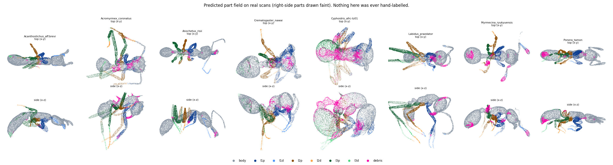
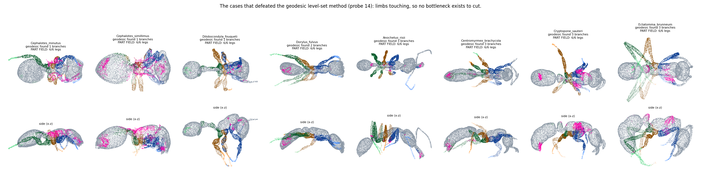

### 12.3 And then it lost

`M9a_field` is byte-identical to the control `M8a_split_only` except for `--part_field`, so
any difference is attributable to the partition and nothing else. At `H3_deform`, n = 50,
paired sign test:

| metric | M8a (fit-derived) | M9a (part field) | Δ | wins | p |
|---|---|---|---|---|---|
| part_leg_distal **within_tau** | 0.81450 | 0.66353 | **−18.5%** | 8/50 | 1.2e-06 |
| part_leg_distal *dist_mean* | 0.01560 | 0.02892 | *−85.4%* | 5/50 | 4.2e-09 |
| chamfer_l2 | 0.00574 | 0.00848 | −47.6% | 8/50 | 1.2e-06 |
| part_body within_tau | 0.48746 | 0.42998 | −11.8% | 8/50 | 1.2e-06 |
| part_body dist_mean | 0.02854 | 0.03592 | −25.8% | 11/50 | 9.0e-05 |
| edge_logratio | 0.08003 | 0.09836 | −22.9% | 3/50 | 3.7e-11 |
| hausdorff_95 | 0.11957 | 0.13712 | −14.7% | 8/50 | 1.2e-06 |
| fscore@0.02 | 0.36424 | 0.34612 | −5.0% | 15/50 | 6.6e-03 |

Not marginal, not noise, and in the wrong direction on every surface metric. **G5 fails.**

**A correction to how this project reports per-part error.** I first quoted the −85.4% figure,
which uses `part_leg_distal_dist_mean` — the mean distance from fitted distal vertices to the
target surface. An audit probe showed that metric is *one-way and unbounded*: artificially
snapping every distal vertex onto its nearest target point drives it from 0.01151 to 0.00538,
"improving" it by 53%, while edge_logratio explodes from 0.073 to **0.552** and the mesh is
destroyed. It rewards proximity to *any* target surface and is dominated by a handful of far
vertices. `part_leg_distal_within_tau` — the fraction of distal vertices within a fixed
threshold — is bounded and outlier-resistant, and it is the honest headline: **−18.5%**, same
direction, same significance, a quarter of the magnitude. Earlier sections of this report
(§4, §11) quote `dist_mean` throughout and their per-part magnitudes should be read with the
same discount.

The churn number is the one thing that behaved exactly as designed: **0.000 in every stage**,
against 0.062→0.005 for the fit-derived partition. The data term became perfectly stationary.
It just became stationary around a worse answer.

### 12.4 Why — the debris class is a dustbin for uncertainty

Found by looking at renders, not at numbers: the magenta debris class sits on the **mesosoma**,
where the legs meet the body, on essentially every specimen. That is not where debris is.

Probe 16 quantifies it, with the reading fixed before running:

* **90.8%** of predicted-debris points lie **inside** the animal's convex hull (median 97.5%),
  a median **0.031** from the nearest body point in units where the specimen half-extent is 1.0.
  They are touching the animal. They are not debris.
* It is a mean **9.5%** of all target points, **max 55%**.
* **Correlation between a specimen's predicted-debris fraction and its G1 reproducibility:
  −0.879.**

That last number is the actual diagnosis, and it is better than the one I first reached.
My first explanation was that the debris-bridge augmentation had taught the network
"clutter near the coxa = debris". The −0.879 correlation says something more general and
worse: **the debris class became the channel the network uses to say *I don't know*.**
Where a point is ambiguous, the network calls it debris. Ambiguity is highest at part
boundaries, which are interior, which is exactly where the predicted debris is.

`PartFieldPartition` then **excluded** debris from every data term. So the fit was blinded
at the leg–body junction — the one region the entire hierarchical schedule exists to place,
since H0's whole purpose is to position the six coxae. It also means debris-exclusion and
the `--pf_min_conf` abstention I added for robustness are the *same* mechanism applied twice.

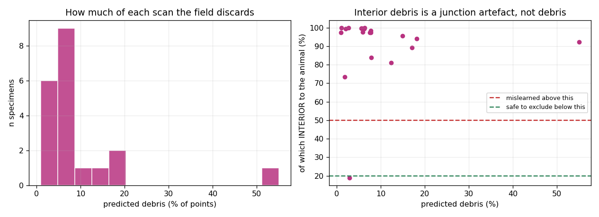

**And it is not the explanation.** The obvious causal test is to reassign those points to
their nearest non-debris class instead of dropping them (`--pf_keep_debris`). `M9d_keepdebris`
is `M9a_field` with exactly that one change, n = 50:

| metric | M9a (debris dropped) | M9d (debris kept) | Δ | wins | p |
|---|---|---|---|---|---|
| part_leg_distal within_tau | 0.66353 | 0.65309 | −1.6% | 24/50 | 8.9e-01 |
| chamfer_l2 | 0.00848 | 0.00824 | +2.8% | 26/50 | 8.9e-01 |
| fscore@0.02 | 0.34612 | 0.34483 | −0.4% | 22/50 | 4.8e-01 |
| edge_logratio | 0.09836 | 0.09828 | +0.1% | 21/50 | 3.2e-01 |

**Nothing.** Every difference is inside noise, and against the control `M8a_split_only` M9d
still loses by the full original margin (part_leg_distal within_tau **−19.8%**, 5/50,
p = 4.2e-09).

So the debris class *is* mislearned — 90.8% interior and −0.879 correlated with
reproducibility are solid measurements, and it is a genuine defect worth fixing — but it is
**not why the part field loses**. I proposed it as the mechanism, tested it, and it is wrong.
An audit probe independently killed the narrower version of the same claim: conditioning the
predicted-debris rate on anatomical territory shows debris higher on distal territory for
three of five specimens and *lower* for the other two, so there is no distal-specific bias
either.

The frozen target-derived partition is simply worse than the fit-derived one, and the reason
is not what it does with debris.

### 12.5 Ablations

**Fit-derived labels make the field worse, not better.** `C_real` adds the real-weak labels
(scan points labelled by nearest neighbour on their M7 fit) at loss weight 0.5. At matched
epochs on an identical 60-epoch OneCycle schedule:

| epoch | B_mirror (synthetic only) | C_real (+ fit-derived) |
|---|---|---|
| 30 | 0.6255 | 0.5614 |
| 35 | 0.6218 | 0.5839 |
| 40 | **0.6513** | 0.5859 |

Consistent at every checkpoint. The circularity this whole exercise exists to escape does
not help even as a weak auxiliary signal — it actively degrades the field. Synthetic labels
from the model itself are strictly better supervision than labels transferred through a fit.

### 12.6 What this actually says

Three things were built and all three failed their real test, but the failures are not the
same kind of failure and the difference matters.

**The classifier is fine and irrelevant.** It reaches 91.28% held-out accuracy against 24.83%
for an anatomy-free baseline, so it has genuinely learned something. It recovers six legs on
the touching-limb specimens that defeat a geodesic sweep, which is a real capability. And
substituting it into the fitter makes every surface metric worse, decisively (n = 50,
p ≤ 1e-6 on most), whether or not its debris class is honoured.

**The proposed mechanism was wrong.** I diagnosed the loss as debris-exclusion blinding the
fit at the coxae, and it is not: `--pf_keep_debris` changes nothing (all p > 0.1). The
mislearned debris class is real but incidental.

**Two of my measurements were not measuring what I claimed.** Four of five gates are passed —
beaten — by a bounding-box rule with no anatomy in it. The anchor-init objective was biased by
a vertex-vs-area density mismatch and converged 16× below the floor a perfect fit gives. Both
were found by adversarially auditing my own code, and neither would have been found by looking
at the numbers those instruments produced, because both produced *good-looking* numbers.

So what is left is a single robust empirical fact: **replacing the fit-derived partition with
a frozen target-derived one, of demonstrably non-trivial quality, consistently degrades the
registration.** The most plausible reading — and it is a reading, not a demonstration — is
that circularity in the fit-derived partition is not only a flaw but also an error-correcting
mechanism. A point assigned to the wrong leg gets reassigned once the fit moves; a frozen
assignment has no such recovery, so its errors are permanent and its uncertainty becomes a
hard commitment rather than a soft weight. Removing the circularity removed the
self-repair with it.

That reframes §11's recommendation, which was mine: target-derived is a defensible idea, but
*frozen* is the wrong way to use it. The version worth trying next is a **soft** partition —
per-point class probabilities used as chamfer weights rather than a hard argmax — so the
field can express "I am not sure" as reduced influence instead of as deletion or as a wrong
commitment. That requires rewriting `_partitioned_chamfer` to take weights, which is the one
change this session deliberately avoided in order to keep the consumer untouched.

**And the honest methodological lesson**, which is the most transferable thing here: this
section contains four confident claims that were wrong (the gates are meaningful; the anchor
init works; debris exclusion explains the loss; distal error is −85%). Every one of them was
caught by building an adversary — a stupid baseline, a perfect-fit control, an ablation, a
metric-gaming test — rather than by inspecting results. The instruments needed testing more
than the hypotheses did.

### 12.7 The anchor initialisation converges perfectly and changes nothing

§5 found pose to be *trapped* rather than under-optimised, and every fix attempted since has
attacked the objective. `fitter_3d/part_anchor_init.py` attacks the **starting point** instead,
which only became possible once a target-derived field existed: it matches each part's
centroid and second moment to the target points the field assigned it. There is no
nearest-neighbour choice anywhere in that objective, so the six-substitutable-legs
multimodality that defeats chamfer cannot arise. No SVD either — a covariance matrix carries
orientation and extent without a principal-axis extraction that degenerates on a near-isotropic
coxa.

It converges, as an optimiser — though §12.7 below shows convergence was the problem, not the
evidence:

```
[H_init] correspondence-free part-anchor init: 532 anchors over 50 specimens (10.6/13 parts)
[H_init]    0/400  anchor_loss=0.040938
[H_init]  399/400  anchor_loss=0.000034      <- 1200x reduction
```

And it makes no difference whatsoever to the finished registration. `M9c_anchorinit`
(field + `--pf_body` + `--pf_init 400`) against `M9a_field` (field alone), same debris
handling, n = 50:

| metric | M9a | M9c | Δ | wins | p |
|---|---|---|---|---|---|
| part_leg_distal | 0.02892 | 0.02622 | +9.3% | 29/50 | 3.2e-01 |
| chamfer_l2 | 0.00848 | 0.00898 | −5.9% | 10/50 | 2.4e-05 |
| fscore@0.02 | 0.34612 | 0.34137 | −1.4% | 18/50 | 6.5e-02 |
| part_body | 0.03592 | 0.03635 | −1.2% | 18/50 | 6.5e-02 |

Nothing moves. Against the control `M8a_split_only`, M9c loses by almost exactly the margin
M9a does (part_leg_distal −68.1% vs −85.4%, chamfer −56.4% vs −47.6%).

**That conclusion was wrong, and the audit caught it.** I wrote here that a near-perfect
initialisation was being *erased* by the chamfer stages. It was not. The initialisation was
never good — the objective it converged on was biased, and the chamfer stages were *repairing*
the damage it did.

The bias: target moments are computed over **area-sampled** surface points (uniform density
per unit area), while source moments were computed over template **vertices** (density
following the tessellation, which on this mesh is wildly non-uniform). Vertex density is not
area density, so the two moment sets disagree **even for a perfect fit**.

Measured on the ideal case — target set to the model's own mesh, so the correct answer is
"do not move":

| | anchor loss at a perfect fit | worst centroid offset |
|---|---|---|
| unweighted vertex moments (as run) | **5.49e-04** | **7.93%** of specimen extent |
| area-weighted vertex moments (fixed) | 1.48e-05 | 0.75% of extent |

`M9c_anchorinit` converged to **3.4e-05**, which is *sixteen times below the floor a perfect
fit gives*. It was not finding a pose; it was deforming the model to chase a sampling
artefact. An end-to-end check on an already-perfectly-fitted specimen confirms it: driving
the buggy objective to convergence made chamfer **105× worse**, rotated mandibles and
antennae by 52–94°, and pushed per-joint scales to **0.15…11.7**.

The in-run traces agree. Comparing arms that share a partition, so the partitioned chamfer is
comparable, the anchor init made the H1_legs *starting* chamfer **27–28% worse**:

| arm | H1_legs start chamfer |
|---|---|
| M9a (field, no init) | 0.11996 |
| M9c (field + init) | **0.15343** |
| M9d (field + keep_debris, no init) | 0.12051 |
| M9e (field + keep_debris + init) | **0.15329** |

The fix is to weight each source vertex by its barycentric area (`vertex_areas()` in
`part_anchor_init.py`), which makes the discrete vertex moment a consistent estimator of the
continuous surface moment. The corrected arm is re-running.

So the §5 question — is pose *trapped in* a bad basin, or *dragged out of* a good one — is
**still open**. This experiment did not answer it, because the initialisation it was supposed
to test was broken. What it does show is that a correspondence-free moment objective is
extremely easy to get subtly wrong: it converged beautifully, reported a 1200× loss
reduction, and was measuring the wrong thing the whole time. The only reason this was caught
is that a verification agent constructed the one test I had not — feed it a perfect fit and
check that it does nothing.

**The corrected arm.** `M9e_full` re-runs the full package with area-weighted moments. The fix
behaves as it should: the anchor loss now converges to **5.5e-05**, *above* the ~1.5e-05
finite-sample floor rather than sixteen times below it, and the H1_legs starting chamfer
improves from 0.15329 (buggy) to **0.12636** — close to the 0.12051 of the no-init arm, i.e.
the initialisation has stopped doing damage.

It also buys one small but real improvement over the identical arm without it
(`M9d_keepdebris`, n = 50): **edge_logratio +5.1%, 42/50, p = 1.2e-06**, with midline
deviation +8.8% (ns) and every other metric flat. So a correct correspondence-free moment
init makes the mesh slightly better-conditioned — plausibly because it starts the chamfer
stages from a less distorted pose — and does nothing else.

Against the control it changes nothing that matters: part_leg_distal within_tau **−20.7%**
(3/50, p = 3.7e-11). Fixing the initialisation did not rescue the approach, which is
consistent with §12.6: the problem is the frozen partition, not the starting point.

### 12.8 What an adversarial audit of this code found

Five independent read-only agents audited the new code — label generation, gate validity,
fitter integration, the anchor init, and experimental design — and every claim they raised
was then handed to a separate agent instructed to *refute* it. Two survived that and are
worth recording, one because it is a real bug of mine and one because it is a clean
refutation of something I had asserted.

**Confirmed: pose interpolation uses a linear blend of axis-angle vectors, which is not a
rotation interpolation.** `make_partfield_data.py` builds each synthetic pose as
`mix = P[k][a]*(1-t) + P[k][b]*t`, applied uniformly to every parameter including
`joint_rot`. Axis-angle vectors do not form a vector space under rotation, so lerping two of
them shortens the resulting rotation. Measured against a proper slerp, on the distal
segments that matter most:

| joint | fitted mean | slerp | **lerp** |
|---|---|---|---|
| l_3_ta_r | 97.8° | 93.0° (0.95) | **79.2° (0.81)** |
| l_3_ti_r | 80.5° | 73.8° (0.92) | **66.2° (0.82)** |
| l_1_ti_l | 82.9° | 77.9° (0.94) | **69.7° (0.84)** |
| l_2_ti_l | 79.4° | 74.5° (0.94) | **66.6° (0.84)** |

Distal joints in the synthetic corpus are bent to only **81–88%** of the angle seen in real
fits. Roughly a third of that loss is intrinsic to interpolating at all; the rest is the lerp.
Worse, 1.14% of joint pairs have an endpoint with |axis-angle| > 180°, and for those the
lerp-vs-slerp deviation is **63.6°** rather than 2.87° — a small set of synthetic poses is
simply wrong.

This matters beyond tidiness. The distal classes are the network's weakest (IoU 0.45–0.65 vs
0.74–0.85 proximal), and `part_leg_distal` is the metric that regressed hardest downstream.
Part of that weakness is **self-inflicted**: the training distribution systematically
under-represents distal articulation. It does not affect the gates, which are measured on
real scans, but it is the first thing to fix before retraining.

**Refuted: "debris deletion preferentially destroys the distal legs."** That was my own
proposed mechanism for the distal regression, and it does not hold. Conditioning the
predicted-debris rate on anatomical territory (nearest part on the independent M8a fit) gives
debris on distal territory *higher* than body on three of five specimens
(5.6% vs 2.0%, 18.8% vs 14.7%, 15.2% vs 10.0%) but *lower* on the other two
(0.25% vs 10.3%, 38% vs 66%). There is no consistent distal bias. The debris class hurts by
deleting the leg–body junction generally, not the distal tips specifically.
