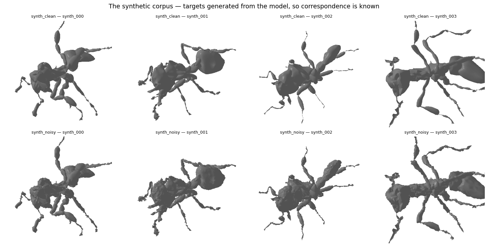
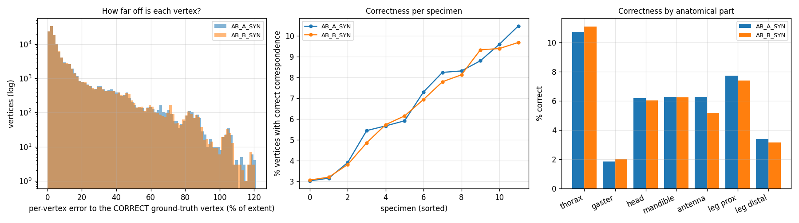
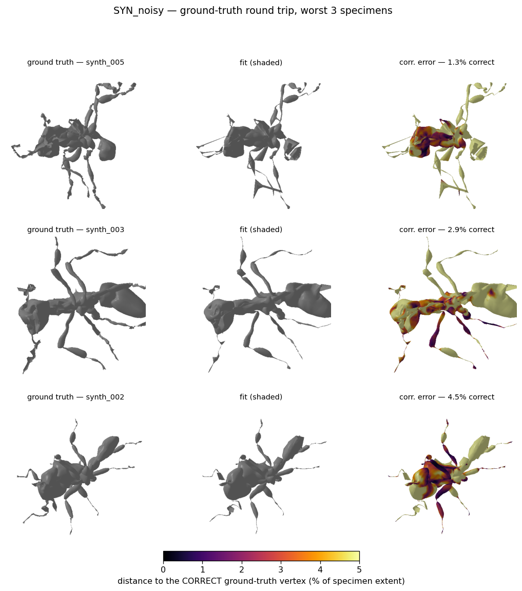
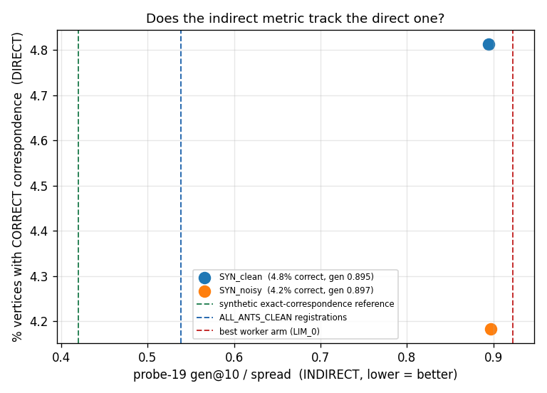

# The ground-truth round trip — does this pipeline establish correspondence at all?

**E6.** Branch `feature/registration_moonshot`, model `3D_model_prep/OmniAnt_25PCs_joint_limited.pkl`,
2× RTX 4090. Reproduce with `diagnostics/moonshot/run_e6_synth.sh`.

---

## Why this experiment exists

Every correspondence number in [REPORT.md](REPORT.md) is **indirect**. probe-19 measures whether
the fit's vertex placement is *consistent* across a population — never whether it is *correct*.
A systematically wrong but reproducible correspondence scores perfectly on it. Its synthetic
control validated the **metric** (shapes drawn straight from the shape space); it never
validated the **pipeline**.

Five pre-registered interventions were ranked by that metric and all returned null. Before
running a sixth, the question underneath needed answering directly: *does the pipeline
establish correspondence at all, or has every arm been comparing degrees of wrongness?*

Here the targets are **generated from the model**, so ground-truth correspondence is known
exactly — fitted vertex *i* is supposed to land on generated vertex *i*. No population
inference, no proxy. `fitter_3d/pointcloud2smil/sample_smil_model.py` supplies the generation.

This is a **ceiling test**. The targets are the model's own geometry, in canonical alignment,
with no debris, no holes and no preservation artefacts. If the pipeline cannot establish
correspondence here, it cannot on ethanol-preserved worker scans.

## The corpus

12 specimens, random pose (`pose_scale` 0.25), shape (`shape_scale` 1.0) and per-joint scale
(sd 0.10), exported as `.obj` and consumed exactly as a scan would be. A second corpus adds
per-vertex Gaussian noise at sd **0.25% of extent**, to stop the test being trivially easy and
to bracket real scan roughness (§6: worker median dihedral 10.54° and edge-length CV 0.43,
against the reference corpus's 8.20° / 0.30).



## Result

| | SYN_clean | SYN_noisy |
|---|---|---|
| **vertices with correct correspondence** | **4.81%** | **4.18%** |
| per-vertex error to the correct vertex, median | 3.48% of extent | 3.57% |
| p90 | 19.18% | 21.50% |
| **error in units of local vertex spacing** | **3.8×** | 3.9× |

Noise barely matters — 4.81% → 4.18%. The failure is not driven by scan quality.



### Read the headline correctly

"4.81% correct" is a *strict* test — with 10,235 vertices the median spacing between
neighbouring vertices is only **0.907% of extent**, so small errors move you to a neighbour.
Calibrated against a control of perfect correspondence perturbed by isotropic noise:

| noise sd | "correct" under the same metric |
|---|---|
| 0.10% of extent | 97.86% |
| 0.50% | 57.29% |
| 1.00% | 25.21% |
| 2.00% | 7.94% |
| **3.48%** (the observed error magnitude) | **3.03%** |

The fit's 4.81% is barely above the 3.03% that pure noise of the same magnitude achieves. So
the nearest-vertex framing adds little beyond the error magnitude, and **the defensible
headline is the ratio: vertices land ~3.8 vertex-spacings from where they belong.** Widening
the tolerance does not rescue it — the correct vertex is within the 8 nearest for only 24.4%
of vertices, and within the **64** nearest for 66.5%.

## What it looks like

The fits are visually near-perfect. The correspondence error is not.


Left is ground truth, centre the fit, right the fit coloured by distance to the vertex it
*should* have landed on. The silhouettes are essentially indistinguishable while the gaster,
antennae and head are saturated past the 5%-of-extent ceiling. **This is §3's argument made
visible: surface accuracy and correspondence are close to independent, and every surface metric
in the suite reports the middle panel.**



### By anatomical part

| part | correct % (clean) | median error (clean) |
|---|---|---|
| thorax | 5.8% | 2.83% |
| **gaster** | **1.5%** | **10.41%** |
| head | 4.3% | 3.60% |
| mandible | 4.8% | 6.01% |
| antenna | 3.0% | 5.00% |
| leg proximal | 6.3% | 2.72% |
| leg distal | 3.2% | 3.25% |

The gaster is the worst by a wide margin — 10.4% median error, 7× the vertex spacing. It is a
large, smooth, nearly featureless ellipsoid, so chamfer has almost no positional information to
work with along its surface: many correspondences give the same surface error. That the *legs*
are among the better parts is the opposite of what §4's thin-structure reasoning predicts, and
is worth noting as a genuine surprise.

Per-part variation also rules out a trivial explanation: a global misalignment would raise the
error uniformly, not put the gaster 4× above the thorax.

## Calibrating probe-19 — the important secondary result

Both corpora were scored with probe-19 on the same fits, so the indirect metric can be anchored
against a known correctness for the first time.



| | direct correctness | probe-19 gen@10/spread |
|---|---|---|
| SYN_clean | 4.81% | **0.8946** |
| SYN_noisy | 4.18% | 0.8969 |
| *worker arms (LIM_0 … baseline)* | *unknown* | *0.9221 – 0.9603* |
| *ALL_ANTS_CLEAN registrations* | *unknown* | *0.5383* |
| *synthetic, exact correspondence by construction* | *100%* | *0.42* |

**This anchors the scale.** A fit with ~5% correspondence correctness reads **0.89** on
probe-19. Every worker arm in this investigation reads **0.92–0.96** — at or beyond that point.
So the worker registrations have essentially no vertex-level correspondence, now established
against a calibrated reference rather than inferred.

It also bounds how much probe-19 could ever have separated those arms. The entire worker range
0.9221–0.9603 sits inside a regime the calibration shows to be "no correspondence". **Five
pre-registered nulls were ranked on a metric with almost no resolution in the region where all
the arms live.** The nulls are still nulls, but the metric was never capable of detecting a
small real improvement, and the report should not have leaned on it as hard as it did.

The clean corpus at 0.5383 remains meaningfully separated from all of this, which is consistent
with §6.4.1's finding that the pipeline does register clean scans.

## What this establishes

1. **The pipeline does not establish vertex-level correspondence, even on its own noise-free
   geometry.** ~3.8 vertex-spacings of error, 4.81% strict correctness, essentially unchanged
   by noise. This is the first *direct* measurement in the investigation.
2. **Surface accuracy is nearly uninformative about correspondence.** The renders show
   near-perfect silhouettes over saturated correspondence error.
3. **probe-19 lacks resolution in the regime the worker arms occupy**, so the five nulls should
   be read as "no detectable improvement on an instrument with little detection power", not as
   "these mechanisms are definitively inert".
4. The failure is **not** concentrated where §4 predicted. The gaster — large, smooth, feature-
   poor — is far worse than the distal legs.

## What it does not establish

- Whether a *different* objective could establish correspondence. This measures the current
  pipeline, not the ceiling of the approach.
- Whether the errors are locally coherent (a smooth wrong mapping) or scrambled. The top-k
  curve — 66.5% within the 64 nearest — hints at local coherence, but a proper geodesic or
  patch-consistency analysis was not run.
- Anything about real scans directly. This is a ceiling; workers can only be worse.

## Next

The obvious follow-up is that a smooth-but-wrong mapping and a scrambled one need entirely
different fixes, and the top-k curve does not separate them. Measuring whether neighbouring
template vertices land on neighbouring target locations — correspondence *smoothness* rather
than correctness — would, and it is cheap on this corpus now that ground truth exists.

## Reproducing

```bash
python diagnostics/moonshot/make_synth_corpus.py --n 12 --noise 0.0   --out synth_clean
python diagnostics/moonshot/make_synth_corpus.py --n 12 --noise 0.005 --out synth_noisy
bash   diagnostics/moonshot/run_e6_synth.sh
python diagnostics/moonshot/score_synth_roundtrip.py
python diagnostics/moonshot/build_synth_report.py
```
