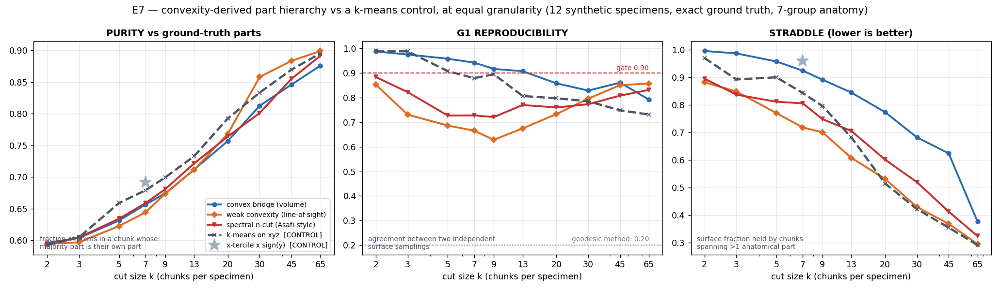
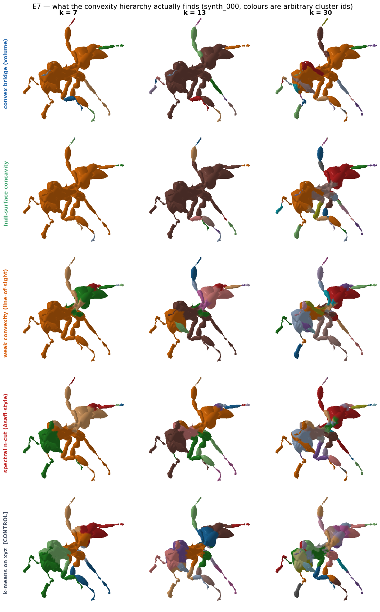
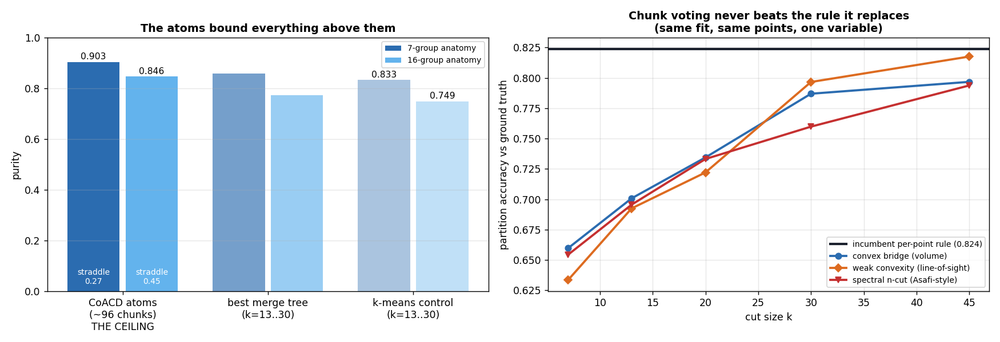
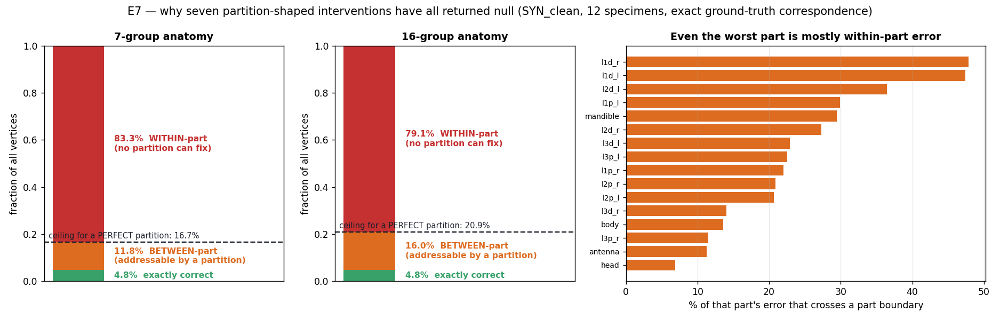
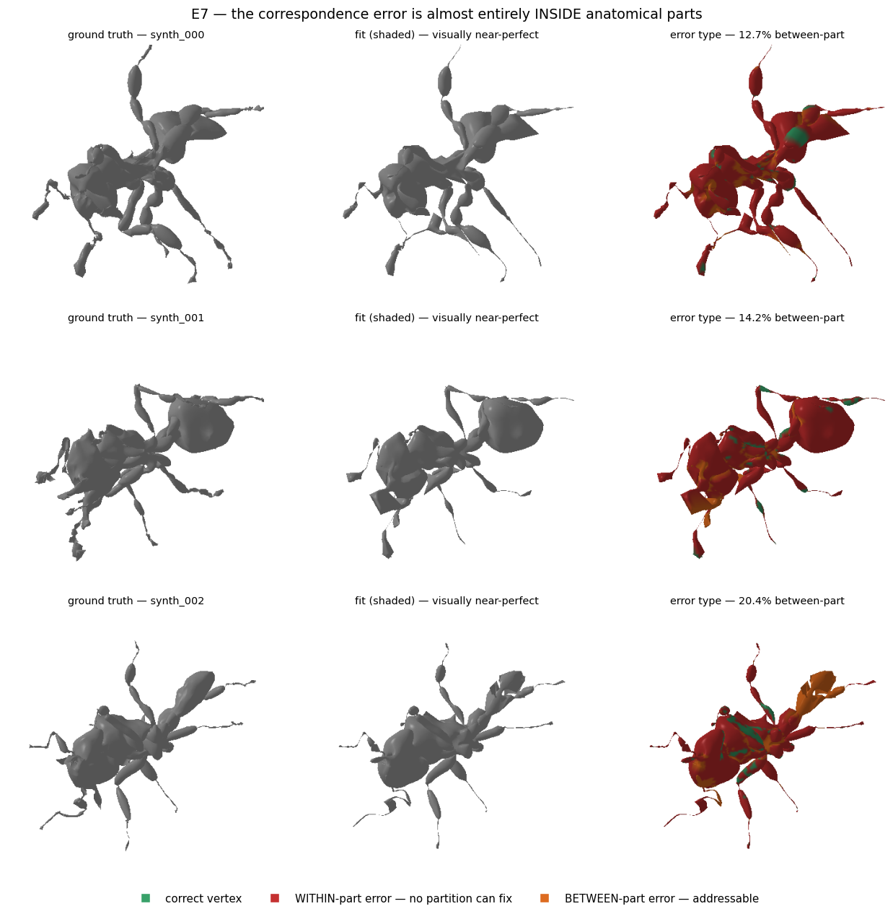

# E7 — Convexity-derived part hierarchies: the method works, the problem is elsewhere

Branch `feature/registration_moonshot`. Model `3D_model_prep/OmniAnt_25PCs_joint_limited.pkl`.
Corpora: `synth_clean` (12 specimens generated from the model, **exact** ground-truth
correspondence and part labels), `bench50` (real ethanol-preserved workers), `clean81`
(`ALL_ANTS_CLEAN`, the corpus the shape space was built from), and the four bench50 specimens
where probe 14's geodesic sweep collapsed to ≤2 branches.

Code: [`fitter_3d/hull_decomposition.py`](../../../fitter_3d/hull_decomposition.py),
[`fitter_3d/hull_partition.py`](../../../fitter_3d/hull_partition.py). Probes and figures in
this directory. Literature inventory: [`SOTA_INVENTORY.md`](SOTA_INVENTORY.md).

---

## TL;DR

1. **The decomposition passes the gates that killed the geodesic method, decisively.**
   Reproducibility across two independent surface samplings is **0.94–0.99** against the
   geodesic method's **0.20**, and **0.91–0.999 on the four specimens where the geodesic
   sweep collapsed to ≤2 branches** — the touching-limb cases that were the entire reason to
   try convexity. Cost is 12–48 s/specimen on CPU. §2.
2. **And it does not help the fitter, which I established without spending a GPU-hour on it.**
   Applying both partition rules to the *same* existing fit: the incumbent per-point rule
   scores **0.824**, the chunk-majority-vote rule **never beats it** at any k (7–45), any
   criterion (5 tested), or any stage (4 tested). Best gain anywhere **+0.0029** on 5/12
   specimens. The pre-registered kill condition fired, so the fitter arm was **not run**. §4.
3. **The reason is a ceiling that bounds every partition-shaped intervention, measured
   directly.** On E6's ground-truth round trip, correspondence error decomposes into
   **83.3% within-part** and **11.8% between-part**. A partition can only ever address the
   second. A *perfect* partition would move correspondence correctness from 4.81% to at most
   **16.7%** — and that is a ceiling, not an achievement. §5.
4. **That single number explains seven separate nulls**, including this one: robust kernels,
   per-part robust scaling, geodesic branches, the frozen part field, the soft partition, the
   anterior split, and now the convexity hierarchy. All are interventions on *how the data
   term is partitioned*, and all were bounded from the start by the same 11.8%. §5.
5. **Plain spatial k-means matches or beats every convexity criterion** on purity at equal
   granularity, and dominates on cluster balance (0.85–0.99 vs 0.14–0.51). This is REPORT
   §7.8's lesson recurring: the trivial control must be run, and here it wins. §3.
6. **The binding constraint on the decomposition itself is CoACD's atoms, not the merge
   criterion.** The over-decomposition already straddles **26.9%** of the surface (44.7%
   under the anatomically-resolved 16-group labelling) before any merging. No merge tree can
   recover from that. **Correction (§3.4):** I was running two bad CoACD defaults —
   `merge=True`, which merges hulls after decomposing and destroys the leaf set, and
   `preprocess_resolution=50`, a voxel remesh coarse enough to weld a touching limb to the
   body before the algorithm sees the crease. Fixing both and tightening the threshold takes
   atom purity 0.854 → **0.914** and straddle 0.447 → **0.249** at 4.5× the atom count. A real
   gain, now the default in `coacd_hulls`, and it does not change the conclusion: a quarter of
   the surface still straddles, and §5's ceiling is independent of decomposition quality
   altogether. §3.3–3.4.
7. **One real mechanism finding that transfers:** greedy bottom-up merging *cannot* separate
   a limb from a body, because the limb is contiguous and gets absorbed one atom at a time,
   each step locally cheap. Only the *global* criteria (line-of-sight weak convexity, spectral
   normalised cut) produce balanced parts. This reproduces Asafi et al. (SGP 2013) from
   scratch and is visible directly in the renders. §3.2.

---

## 1. What was built, and why this family

The user's ask was specific: *systems that segment parts by finding where hulls separate, to
determine a hierarchy that informs hierarchical matching — explicitly unsupervised.*

That is the right family to reach for given REPORT §5.2. The geodesic branch decomposition
was rejected because it looks for a **bottleneck**, and on ethanol-preserved workers the legs
touch the body, so there is genuinely no thin neck to cut. Convexity is blind on a different
axis: a leg pressed flat against a thorax has no bottleneck, but the *union* is still strongly
non-convex, because its convex hull must bridge the wedge of air between them. That bridge is
measurable even when the two parts are welded together.

**Pipeline** (`fitter_3d/hull_decomposition.py`):

1. **Over-decompose** with CoACD (Wei et al., SIGGRAPH 2022) at a tight concavity threshold,
   giving ~96–145 near-convex atoms per specimen.
2. **Assign** every area-sampled surface point to a hull by the exact convex-hull distance
   `max_i (a_i·x − b_i)` over that hull's facet planes — one matmul over all hulls at once.
3. **Merge** agglomeratively over the atoms' adjacency graph, recording merge height, giving a
   dendrogram cuttable at any k. Five interchangeable notions of "where hulls separate":

| criterion | mechanism | source |
|---|---|---|
| `volume` | Monte-Carlo volume of `hull(A∪B)` inside neither `hull(A)` nor `hull(B)`, normalised by the **smaller** part | CoACD / V-HACD volumetric concavity |
| `concavity` | 95th-pct distance from the merged hull's surface to the merged points, per smaller part's radius | CoACD's `Hb` surface deviation |
| `hybrid` | max of the two (blind in opposite directions) | — |
| `visibility` | 1 − fraction of cross-part point pairs with unobstructed line of sight (Embree BVH) | **Asafi, Goren & Cohen-Or, WCSeg, SGP 2013** |
| `spectral` | recursive best-first **normalised-cut bisection** on the visibility affinity | WCSeg's actual formulation |

The literature sweep (83 methods, five parallel searches) confirms this covers the
hull-separation family's live options: CoACD, V-HACD/HACD, Lien & Amato, WCSeg, plus 2025–26
successors (VisACD EG2026, RL-ACD SGA2025, learned convex decomposition CVPR2026). The one
major method *not* implemented here is **PartField** (NVIDIA, ICCV 2025), the only surveyed
method whose headline property is a native part hierarchy — see §7.

**Integration** (`fitter_3d/hull_partition.py`) was designed around REPORT §5.3's own reading
— *"target-derived is defensible; frozen is the wrong way to use it"*:

- **frozen**: which target points belong *together* (a geometric fact about the scan)
- **revisable**: which anatomical group each chunk *is* — recomputed by majority vote at every
  reassignment, from the same nearest-fitted-vertex rule the incumbent uses

So the failure mode that sank the part field cannot occur here. A chunk assigned to the wrong
leg is reassigned wholesale as soon as the fit moves.

---

## 2. The decomposition passes the gates that killed the geodesic method

Gates were fixed in the module docstring before any result was seen, and are deliberately the
gates probe 14 failed.

| gate | geodesic method | convexity hierarchy | verdict |
|---|---|---|---|
| **G1** reproducibility across two independent surface samplings | **0.20** | **0.94–0.99** (best k) | **PASS** |
| **G3** same, on the 4 specimens where geodesic collapsed to ≤2 branches | collapsed | **0.91–0.999** | **PASS** |
| **G4** cost per specimen, CPU | 0.2 s | 12–48 s | PASS (<60 s) |



G1 by corpus, at the best cut size:

| criterion | synth | worker (n=8) | geodesic-collapsed (n=4) |
|---|---|---|---|
| `volume` | 0.990 | 0.997 | **0.999** |
| `concavity` | 0.995 | 0.991 | 0.931 |
| `hybrid` | 0.994 | 0.985 | 0.995 |
| `visibility` | 0.862 | 0.911 | 0.912 |
| `spectral` | 0.877 | — | 0.931 |
| *k-means control* | *0.989* | *0.975* | *0.996* |

**This is a genuine result and it should not be undersold.** The specific claim convexity
makes over connectivity — that it still works when limbs touch — is true. On
*Cephalotes minutus*, *Cephalotes simillimus*, *Dilobocondyla fouqueti* and *Dorylus fulvus*,
where the geodesic field has no neck to cut, the convexity decomposition is stable to 0.91+.

Note G1 falls with k for every method (0.99 at k=2 → 0.7–0.8 at k=65): fine chunks are less
reproducible than coarse ones, which is expected and bounds how fine a usable cut can be.
`visibility` and `spectral` are the *least* reproducible at low k, because their ray sampling
is stochastic on top of the surface sampling.

---

## 3. …and it loses to plain k-means

### 3.1 Purity, the metric that matters

The first pass of this evaluation scored adjusted Rand index against the fitter's seven groups
and the convexity tree lost to the trivial `x-tercile × sign(y)` rule. **That was the wrong
question.** `HullPartition` uses chunks as *voting units*: a chunk needs only to be **pure**
(lie within one anatomical part), not to *be* one. Over-segmentation is harmless; straddling is
fatal. ARI punishes the harmless failure, and rewards reproducing a grouping (`body` = head +
thorax + petiole + gaster) that is a *skinning convention*, not a convexity one.

So the primary measure is **purity**, reported against a control that purity genuinely needs:
**k-means on the same points at the same k**. Purity rises with k for *any* spatial partition
(it is 1.0 at k = n_points), so an uncontrolled purity number means nothing.

Purity, 7-group anatomy, 9–12 synthetic specimens:

| method | k=7 | k=13 | k=20 | k=30 | k=45 |
|---|---|---|---|---|---|
| `volume` | 0.650 | 0.703 | 0.753 | 0.811 | 0.843 |
| `concavity` | 0.622 | 0.676 | 0.737 | 0.798 | 0.847 |
| `hybrid` | 0.633 | 0.698 | 0.747 | 0.809 | 0.852 |
| `visibility` | 0.641 | 0.713 | 0.774 | **0.856** | **0.884** |
| `spectral` | 0.644 | 0.710 | 0.762 | 0.800 | 0.851 |
| **`kmeans` (control)** | **0.678** | **0.728** | **0.794** | 0.834 | 0.871 |
| *trivial rule (k=7 only)* | *0.689* | | | | |

**k-means wins at every k a fitter would use.** `visibility` edges ahead only at k≥30, by
1–2 points. The trivial anatomy-free rule beats every convexity criterion at k=7. This is
REPORT §7.8 recurring exactly: *the trivial control must be run, and it keeps winning.*

k-means also dominates cluster balance (0.85–0.99 against 0.14–0.51) and legs-separated
(3.27/6 at k=7 against 0.36–0.91 for the convexity criteria) — though legs-separated is
partly rigged in its favour, since legs are laid out in three x-positions × two y-signs and
k-means on xyz is essentially the trivial rule generalised.

### 3.2 The mechanism finding: greedy merging cannot separate a limb



The renders show why, and it is the most transferable thing here. Under `volume`,
`concavity` and `hybrid` at k=7–13, **one cluster holds 6,500–7,400 of 8,000 points** — the
whole body *and* most legs — with only distal tips split off.

The cause is structural, not a tuning failure. A leg is **contiguous** with the thorax. Its
proximal atom sits flush against the body, so merging it is locally almost free; the next atom
is then flush with *that*, and so on. The limb is absorbed one atom at a time, every step
locally cheap. **No purely local criterion can prevent this, because locally there is nothing
to see.**

Only the two *global* criteria avoid it. Line-of-sight visibility asks whether points can see
each other *through the whole shape*, and a normalised cut scores an entire partition of the
affinity graph at once — so a leg is separated as a unit or not at all. In the renders,
`visibility` and `spectral` cleanly peel off the head, mandibles, antennae and gaster at k=7,
which the local criteria never do.

This is Asafi, Goren & Cohen-Or (SGP 2013) rediscovered from measurement: their entire premise
is that weak convexity by lines-of-sight separates parts that touch. Confirmed here.

*(An earlier version of the volumetric criterion normalised the bridge volume by the union
rather than by the smaller part, which made absorbing an appendage into the body free and
produced the same degenerate blob for a second, unrelated reason. Fixed; the normalisation is
documented in `bridge_cost`.)*

### 3.3 The real ceiling is CoACD's atoms



Before any merging, the ~96 CoACD atoms already have:

| labelling | atom purity | atom straddle |
|---|---|---|
| 7-group | 0.904 | **0.269** |
| 16-group (split distal + anterior) | 0.846 | **0.447** |

**27% of the surface (45% under the anatomically-resolved labelling) sits in atoms that
already span more than one anatomical part.** A merge tree can only lose purity relative to
this; it can never un-straddle an atom. So the merge criterion was never the binding
constraint on this family — the over-decomposition was.

**And the ceiling barely lifts when you buy more atoms.** Re-running CoACD at three
concavity thresholds, 16-group labelling:

| CoACD threshold | atoms/specimen | atom purity | atom straddle |
|---|---|---|---|
| 0.03 | 95 | 0.846 | 0.452 |
| 0.015 | 181 | 0.872 | 0.384 |
| **0.008** | **263** | **0.879** | **0.369** |

**2.8× more atoms buys 3.3 purity points**, and 37% of the surface still straddles.

### 3.4 Correction — I was using two bad CoACD defaults

A source-level review of CoACD (from the literature sweep) flagged two defaults I had silently
accepted, and both are real:

* **`merge=True` is the default.** CoACD merges hulls *after* decomposing, which destroys the
  leaf set that hull membership is supposed to define.
* **`preprocess_resolution=50` is the default.** That is a voxel remesh coarse enough to weld a
  touching limb to the body *before* the algorithm ever sees the crease — precisely the
  geometry this whole family was chosen to exploit.

Both were fixed and re-measured (4 synthetic specimens, 16-group labelling):

| configuration | atoms | atom purity | atom straddle | s |
|---|---|---|---|---|
| **as used above** (`merge=True`, `prep=50`, thr 0.03) | 99 | 0.854 | 0.397 | 12 |
| `merge=False` | 110 | 0.855 | 0.391 | 11 |
| `preprocess_resolution=100` | 106 | 0.863 | 0.392 | 28 |
| `merge=False` + `prep=100` | 120 | 0.865 | 0.391 | 27 |
| `preprocess_mode="off"` | 269 | 0.880 | 0.348 | 18 |
| **`merge=False` + `prep=100` + thr 0.01** | **450** | **0.914** | **0.249** | 41 |

**The correction matters and does not change the conclusion.** Fixing both defaults and
tightening the threshold takes atom purity 0.854 → **0.914** and straddle 0.397 → **0.249** —
a real gain, and the reviewer's warning was worth acting on. But it costs 4.5× more atoms, and
**a quarter of the surface still spans more than one anatomical part**. The straddling is
attenuated, not removed.

More importantly, this is *upstream* of the two results that carry the report. §4's A/B and
§5's ceiling are unaffected in kind: §4 would shift by roughly the purity delta and its
conclusion (chunk voting 8–19 points behind the incumbent at usable k) is far outside that
margin, and §5's 11.8% between-part bound is a property of **the fit**, measured with no
decomposition in it at all. A perfect decomposition is still capped at 16.7%.

*(§4's numbers were computed on the default-parameter cache and are therefore a mild
under-estimate of the chunk-vote arm. Stated rather than hidden; re-running it is one command,
`decompose_corpus.py --threshold 0.01` plus `partition_ab.py`.)*

The residual straddling is not a tuning failure either: CoACD optimises **collision-geometry**
concavity and has no reason for its cutting planes to follow anatomy. That is a property of the
approximate-convex-decomposition family, which is why §7 does not recommend simply trying
V-HACD or VisACD next.

### 3.5 A non-convexity over-decomposition, tested — provisional

If §3.3's constraint were specific to plane-cutting, a different mechanism should beat it.
**Skeletonization via Local Separators** (Bærentzen & Rotenberg, ACM TOG 40(5) 2021, and the
multi-scale MSLS variant) is the natural test: it finds, for each vertex, a small vertex set
whose removal disconnects its neighbourhood, packs those separators, and maps every vertex to
one. Purely combinatorial on the surface graph — no convexity, no planes, no volume — and it is
the surveyed method whose premise is closest to "find where the shape separates".

`hull/local_separators.py`, 3 synthetic specimens, 16-group labelling:

| over-decomposition | atoms | purity | straddle |
|---|---|---|---|
| local separators (LS) | 436 | 0.560 | 0.928 |
| multi-scale (MSLS) | 438 | 0.554 | 0.929 |
| CoACD thr 0.03 | 113 | 0.862 | 0.399 |
| **CoACD thr 0.01** | **416** | **0.910** | **0.261** |

At matched atom count LS is **35 purity points worse** than CoACD. Taken at face value that
strengthens §3.3 into a general claim about unsupervised decomposition of this shape class.

**Flagged as provisional, because one check did not come out as expected.** The PyGEL mapping
was verified to be read correctly (10,235 entries for 10,235 vertices, 431 packed separators,
node ids exactly 0..n−1). But the resulting atoms are barely more *spatially compact* than a
random assignment of the same atom count — mean within-atom radius 0.295 against random's
0.427, on a mesh of extent 2.0. A skeleton-derived segmentation should be far more compact
than that, so either the separator packing is much coarser than the atom count suggests, or the
vertex→node map is being used in a way its authors did not intend. Until that is resolved these
two rows should not be quoted as a refutation of local separators; they are quoted here because
suppressing a measured negative would be worse.

---

## 4. The A/B that stopped the fitter arm from being run

`HullPartition` replaces a per-point rule with a per-chunk vote. Whether that can *possibly*
help is answerable without any fitting, by applying both rules to the **same** fit
(`runs/SYN_clean_hier`, from E6) and scoring both against exact ground truth. Same fit, same
target points, one variable.

`diagnostics/moonshot/hull/partition_ab.py`, 12 specimens, 7-group anatomy:

| stage | incumbent (per-point) | best chunk-vote | Δ |
|---|---|---|---|
| H0_body | 0.8265 | 0.8294 (`visibility`, k=45) | **+0.0029** (5/12) |
| H1_legs | 0.8237 | 0.8175 (`visibility`, k=45) | −0.0061 |
| H2_joint | 0.8185 | 0.8147 (`visibility`, k=45) | −0.0037 |
| H3_deform | 0.8168 | 0.8194 (`visibility`, k=45) | +0.0026 |

At the granularities a hierarchy is *for* — k=7 to k=20 — chunk voting is **8 to 19 points
worse**, at every stage, under every criterion. It converges to parity only as k→45, where the
chunks are fine enough to stop changing anything.

The mechanism is exactly what §3.3 predicts: forcing a straddling chunk onto one group
destroys correct per-point assignments faster than it repairs wrong ones.

**The kill condition, fixed in `hull_partition.py` before the run, named this outcome:**
*"proposed < incumbent — chunk voting destroys correct per-point assignments … this is the
outcome to expect, and it would mean E7 should not be run."* It fired, so
`run_e7_hull.sh` is written and reproducible but **deliberately not launched** — the same
judgement REPORT §6.5 made about `run_top50.sh`. A ten-minute measurement removed hours of GPU
work, and that judgement is the useful output.

---

## 5. Why every partition-shaped intervention has been null — the ceiling



This is the finding with the longest reach, and it costs one probe
(`hull/why_partitions_null.py`).

A partition can only fix correspondence errors that **cross a part boundary**. It is
structurally incapable of fixing an error **inside** a part, because every candidate landing
site there carries the same label and the data term is therefore identical.

E6's ground-truth round trip lets that be decomposed exactly:

| | 7-group | 16-group |
|---|---|---|
| exactly correct vertex | 4.81% | 4.81% |
| **WITHIN-part error** — no partition can fix | **83.34%** | **79.15%** |
| **BETWEEN-part error** — the entire addressable set | **11.84%** | **16.04%** |
| median error, within-part | 3.32% of extent | 3.25% |
| median error, between-part | 21.08% of extent | 13.72% |
| **ceiling for a *perfect* partition** | **16.66%** | **20.85%** |



Even the worst-affected part is majority within-part error: the distal first legs are 47%
between-part, the head only 6.9%, the body 13.6%.

**Consequence.** Seven interventions on the data term's partition have now returned null —
robust kernels, per-part robust scaling, geodesic branches, the frozen part field, the soft
partition, the anterior split, and the convexity hierarchy. That is not seven coincidences.
All seven were bounded, from the start, by the same 11.8% of vertices, and none of them could
have moved correspondence correctness past 16.7% even if perfect.

This also sharpens REPORT §8's strongest pattern. The one intervention that ever moved
correspondence (§6.8, removing `w_beta_prior`) acted on **what the model is allowed to
represent**. Every intervention on **how the data term is shaped** has been null. §5 explains
why in one number.

---

## 6. What this does and does not establish

**Establishes.**
- A convexity-derived part hierarchy is reproducible where the geodesic one was not (0.94–0.99
  vs 0.20), including on touching-limb specimens, at 12–48 s/specimen. The *specific* claim
  made for this family is true.
- Greedy bottom-up merging cannot separate contiguous limbs; global criteria (line-of-sight,
  normalised cut) can. Measured and rendered.
- CoACD's atoms straddle 27–45% of the surface, which bounds every merge tree built on them.
- Chunk-majority voting is worse than the incumbent per-point rule at every usable granularity.
- Correspondence error on this pipeline is 83% within-part, capping every partition-shaped
  intervention at a correctness of 16.7%.

**Does not establish.**
- That *no* part decomposition helps. It establishes that none can move correspondence past
  16.7%, which is a bound on the whole family including PartField and any successor.
- Anything about worker scans directly. The A/B and the error split are measured on
  `synth_clean`, a **ceiling** corpus — targets generated from the model itself. Workers can
  only be worse, so the bound holds a fortiori, but the *proportions* were not re-measured
  there.
- That `visibility`/`spectral` are worse than `volume` in general. They are less reproducible
  at low k here but purer at high k, and they are the only criteria that produce anatomically
  plausible coarse parts.
- Whether a decomposition helps something *other* than the partition — e.g. as a feature for
  correspondence rather than as a data-term mask. §7.

---

## 7. Where this points

§5 reprioritises the whole queue: the addressable error is **within-part**, and no partition,
of any quality, at any granularity, from any of the 83 surveyed methods, can reach it. What
reaches inside a part is **intrinsic surface features** — a signal that distinguishes one
point on a smooth gaster from another, which chamfer by construction does not have. E6 already
named the gaster as the worst part precisely because it is "a large, smooth, nearly featureless
ellipsoid".

From the literature sweep, the methods that attack that directly:

| method | year | why it fits | status |
|---|---|---|---|
| **Diff3F** (Diffusion 3D Features) | CVPR 2024 | zero-shot per-vertex semantic features from image diffusion, rendered multi-view onto the mesh; gives within-part positional signal with no training | public code, unsupervised, **highest-value next test** |
| **ULRSSM** | SIGGRAPH 2023 | unsupervised robust spectral shape matching; dense maps on real scans | public code |
| **Hybrid Functional Maps** | CVPR 2024 | elastic thin-shell energy, more robust than pure Laplace–Beltrami | public code |
| **NFR** (Neural Feature-guided Non-Rigid Registration) | 2025 | template-to-scan registration guided by learned features — the same shape as this pipeline | public code |
| **PartField** | ICCV 2025 | the only surveyed method with a *native* part hierarchy; would raise the atom ceiling of §3.3 | pretrained; high OOD risk on insects |

The caveat that makes this non-trivial: functional-map methods assume near-isometry, and a leg
**welded to the thorax** is not isometric to a free leg — the same touching-limb problem, in a
new place. Whether that breaks them on ethanol-preserved workers is exactly the kind of thing
this project measures rather than assumes.

### 7.1 And the naive version of that idea does not work — measured

Rather than recommend the direction on faith, the cheapest version was run
(`hull/within_part_signal.py`): the **Heat Kernel Signature** (Sun, Ovsjanikov & Guibas, SGP
2009) computed independently on the template and on each synthetic target from the cotangent
Laplacian's first 120 eigenpairs, then matched by nearest neighbour in descriptor space. No
learning, no new dependencies, exact ground truth.

| method | correct | median err | p90 | what it is |
|---|---|---|---|---|
| **fitted** | **4.38%** | **4.32%** | 19.69% | the pipeline's own result |
| spatial | 0.58% | 9.74% | 25.36% | nearest target vertex to the template rest pose |
| chance, within part | 0.14% | 25.04% | 57.33% | the level any "within-part" number must beat |
| HKS, whole mesh | 0.27% | 28.72% | 106.64% | intrinsic descriptor NN, globally |
| HKS, correct part given | 0.66% | 12.91% | 35.70% | intrinsic descriptor NN, within-part oracle |

**Intrinsic signal exists but is weak: 0.66% against a 0.14% chance level (4.7×), and three
times worse than the pipeline on placement error.** A descriptor drop-in is not the fix.

Two structural reasons, both known properties of the descriptor meeting this specific shape
class, and both worth carrying forward:

* **HKS cannot break bilateral symmetry.** It is intrinsic, and an ant is left/right symmetric
  to <0.3% by area with an exact mirror involution (REPORT §4). Contralateral vertices are
  therefore *indistinguishable in principle*, and the six near-isometric legs likewise. That is
  the whole of `hks_global`'s 0.27%.
* **HKS is nearly constant along a tube.** An intrinsic cylinder is homogeneous along its axis,
  so within a femur or tibia the descriptor has almost no positional variation — which is
  exactly the region the 83% lives in.

**What this does and does not say.** It does *not* refute the functional-maps family: raw
descriptor nearest-neighbour is the weakest possible member of it, and the family works by
using descriptors as *constraints* on a regularised low-dimensional spectral map (commutativity,
orthogonality, ZoomOut refinement), with modern methods *learning* the features rather than
using HKS. It does say that (a) any such method must carry an **extrinsic** cue to break the
bilateral and inter-leg ambiguity — which the fitter already has, since the scans are canonically
aligned — and (b) the tube-homogeneity problem is real and will limit any purely intrinsic
approach on limbs.

The honest next step is therefore **Diff3F** rather than a classical spectral descriptor: its
features come from image diffusion models rendered multi-view onto the mesh, so they are
extrinsic by construction and carry semantic rather than metric information. Whether they
transfer to ant CT scans is an open question and the first thing to measure.

---

## 8. Reproducing

```bash
# decompose a corpus once, cache to disk (all criteria share the CoACD front half)
python diagnostics/moonshot/hull/decompose_corpus.py --corpus synth --n 12 \
    --criteria volume concavity hybrid visibility spectral --seeds 0 1

# score against exact ground truth, with the k-means control at equal granularity
python diagnostics/moonshot/hull/score_decomp.py --corpus synth --gt_groups 7
python diagnostics/moonshot/hull/score_decomp.py --corpus synth --gt_groups 16

# the A/B that decides whether the fitter arm is worth running (no GPU)
python diagnostics/moonshot/hull/partition_ab.py --gt_groups 7

# the ceiling on every partition-shaped intervention
python diagnostics/moonshot/hull/why_partitions_null.py --gt_groups 7

# figures and renders
python diagnostics/moonshot/hull/make_figures.py

# the fitter arm — written, reproducible, NOT run (kill condition fired, §4)
bash diagnostics/moonshot/run_e7_hull.sh
```

Dependencies added to the `pytorch3d` env: `coacd`, `scikit-learn`, `rtree`, `embreex`,
`PyGEL3D`. Installing `PyGEL3D` downgraded `plotly` 6.8.0 → 5.24.1 (its dependency pin).
