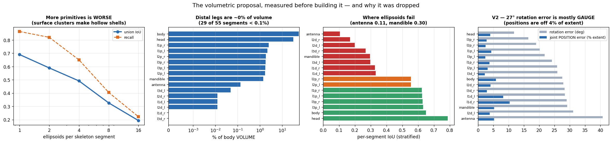
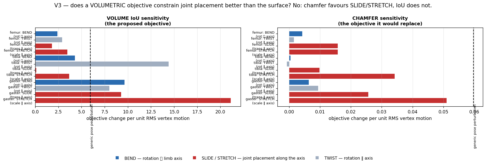

# A volumetric paradigm — what it can and cannot do, measured before building it

Proposal (Fabian, 2026-08-06): stop trying to fix vertex correspondence. Fit a low-capacity
**volumetric proxy** — one ellipsoid per skeleton segment, driven by the model's own kinematic
chain and its own parameters (`joint_rot`, `log_beta_scales`, `betas_trans`, global rot/trans),
under the authored joint limits — to maximise volume overlap with the target. Then hand the
recovered pose to the real parametric mesh and finish with a minimal vertex-deform step.

This document records what was measured *before* any optimiser was written, and what the plan
should therefore be. **Outcome: the paradigm was dropped — see §3 and §V3.** The results are
written up alongside the E8 deformation ablation in [../REPORT_E8.md](../REPORT_E8.md).

---

## 1. The case for the paradigm is stronger than it first looks

Not because volume is nicer than surface, but because of four specific things this
investigation has already established.

**It targets the failure that was actually diagnosed.** §6.9.3 found that constraining joint
rotation does not fix the fit — the compensation moves into `log_beta_scales` (+22.4%) and
`betas_trans` (+10.3%), the two parameters that determine *where a joint sits*. The domain
reading was "the skeleton is being placed wrong and the fit hides it". A volumetric objective
is a joint-*placement* objective. Surface chamfer is not.

**It fixes the specific blindness E6 measured.** The gaster is the worst part (10.4% median
correspondence error) because it is a smooth ellipsoid on which many correspondences give the
same surface error — chamfer has no positional information along it. Occupancy pins a blob's
centroid and extent exactly. The head is the best-represented part in the proxy (per-segment
IoU **0.788**, 6,228 interior points), and §6.10's domain observation — *"the head is simply
not moved forward enough"* — is precisely a placement error on a large convex blob.

**Occupancy has a far larger basin of attraction than chamfer.** Chamfer's gradient at a point
runs toward the nearest surface point, which is why six substitutable legs make it multimodal.
An occupancy field gives gradient everywhere in space, and its softness is a free parameter:
annealing the ellipsoid boundary from very soft to sharp is scale-space continuation, the same
mechanism Smooth Shells (CVPR 2020) uses to escape local minima in shape matching. **This is
the strongest single mechanism the paradigm offers against §6.9.4's measured multimodality**
(distal leg 13.9° apart across sampling seeds).

**The real reason to use a proxy is computability, not capacity.** You cannot cheaply
differentiate "is this point inside the posed mesh" — there is no fast generalised-winding-number
in this environment, and the mesh moves every iteration. Ellipsoids give closed-form
differentiable occupancy. That, not the parameter count, is why the proxy earns its place. (The
capacity argument is real but already available for free: `M4b` with zero offsets has no
shrink-wrap capacity either.)

---

## 2. What was measured, and what it kills



### V0 — the representation ceiling (`probe_ellipsoid_ceiling.py`)

One ellipsoid per segment, fitted to the template's own vertices in the rest pose — the best
possible case, exact correspondence and no pose error. Volume IoU against the true solid:

| semi-axis percentile | union IoU | precision | recall |
|---|---|---|---|
| 85 | 0.544 | 0.958 | 0.557 |
| 95 | 0.682 | 0.850 | 0.776 |
| **98** | **0.689** | 0.774 | 0.862 |
| 100 | 0.658 | 0.693 | 0.928 |

**Ceiling: IoU 0.689.** Usable, but it is a ceiling — a fit can only be worse, and a
systematically loose or tight primitive biases joint placement.

### The distal legs are not merely hard to see. They are absent.

| anatomical group | share of body **volume** |
|---|---|
| body (thorax + gaster + waist) | dominant |
| head | large |
| leg proximal (each) | 1.69 – 1.83% |
| mandible | 1.40% |
| antenna | **0.133%** |
| leg distal (each) | **0.000 – 0.048%** |

**29 of 55 segments hold under 0.1% of body volume**, and at 300,000 Monte-Carlo samples the
smallest segments receive **zero** interior points. §4 measured tibia+tarsus+pretarsus at 2.4%
of a leg chain's *surface area*; in *volume* the distal groups are 50–200× smaller still,
because volume goes as r²L and these are thin.

**A global volume IoU is not weakly informative about the distal leg. It is exactly blind to
it.** This must be designed around from the first line of code, not patched later.

### V1 — more primitives makes it worse (`probe_primitive_count.py`)

The obvious upgrade — K ellipsoids per segment via k-means on the segment's vertices, same
parameter count since all are bone-rigid — was tested and **fails**:

| K per segment | primitives | union IoU | precision | recall |
|---|---|---|---|---|
| **1** | 50 | **0.690** | 0.775 | 0.863 |
| 2 | 94 | 0.589 | 0.677 | 0.820 |
| 4 | 176 | 0.492 | 0.669 | 0.650 |
| 8 | 340 | 0.326 | 0.627 | 0.405 |
| 16 | 526 | 0.193 | 0.599 | 0.222 |

Recall collapses 0.86 → 0.22 while precision barely moves: sub-clusters of **surface** vertices
produce surface-hugging pancakes that leave the interior empty. Sphere-meshes work because they
are seeded on the **medial axis**, not on surface clusters. Raising this ceiling is therefore a
real piece of work (medial-axis seeding), not a 20-line change. **Use K = 1.**

### Per-segment IoU under stratified sampling

Sampling each segment's own bounding box gives every segment equal statistical weight
regardless of volume share — which is also exactly the form a per-part objective would take.

| group | per-segment IoU | interior pts |
|---|---|---|
| head | **0.788** | 6,228 |
| body | 0.650 | 22,945 |
| leg proximal | 0.554 – 0.632 | 3,105 – 4,494 |
| **leg distal** | **0.170 – 0.331** | 123 – 306 |
| mandible | 0.296 | 3,930 |
| **antenna** | **0.105** | 512 |

Two things follow. First, **stratification does make distal segments estimable** (123–306
interior points, not zero) — so a per-part objective is at least *computable* there. Second,
the **representation** at those segments is poor (IoU 0.17–0.33), so fitting them
volumetrically would be fitting to a bad target. Antennae (0.105) and mandibles (0.296) are the
worst-represented parts of the whole animal.

---

## 3. Verdict — SUPERSEDED by §V3 below

> **The volumetric paradigm should not be built.** Its central claim was tested and is false:
> a volume-overlap objective is *less* sensitive to joint placement than the surface objective
> it would replace, because its gradient is a boundary integral weighted by the normal
> component of boundary motion (§V3). The nearest prior art — Stoll et al., ICCV 2011,
> a 58-joint/63-Gaussian articulated body model, essentially this architecture — reports
> **44.93 mm marker error against 29.61 mm for the detailed-mesh method it replaced**, and
> justifies itself on speed alone (6 fps vs minutes per frame). This project is an offline
> batch fit of 757 static scans on two RTX 4090s; it has no reason to want that trade.
>
> What the exercise produced instead is a sharper diagnosis, and it is worth more than the
> paradigm would have been. See §V3's closing.

The analysis below is retained because the scoping argument stands on its own and because the
measurements (representation ceiling, volume shares) are reusable.

It is not a replacement for the fit. It would at best be a **trunk-and-proximal pose
initialiser**, and it should have been built and judged as one.

**Fit volumetrically:** body chain (thorax, waist, gaster), head, and the proximal leg segments
(coxa, trochanter, femur). That is >94% of volume, per-segment IoU 0.55–0.79, and it is where
both known failures live — the head not carried forward (§6.10) and the skeleton mis-placed
(§6.9.3).

**Do not fit volumetrically:** tibia, tarsus, pretarsus, antennae, mandibles. They are 1e-4 of
volume, badly represented by ellipsoids, and already known to be under-determined by *any*
objective (§4: below the data term's own sampling threshold; §6.9.4: 13.9° across seeds). Leave
them to the existing surface machinery, and be explicit that they are under-determined rather
than pretending a new objective constrains them.

### What this paradigm does NOT fix — stated plainly

- **It does not solve the six-substitutable-legs multimodality.** A leg ellipsoid overlapping
  the wrong leg's volume scores identically to the right one. The basins are unchanged. The
  mitigations remain body-first staging, plus the genuinely new one — the proxy is cheap enough
  to afford real global search, which the full mesh never was.
- **It does not fix within-part correspondence**, which E7 §5 measured at 83% of all error. It
  is aimed at *pose*, and pose is a different quantity. If the pose is right, correspondence
  may follow through the parametric model; that is a hypothesis, not a consequence.
- **It has not been shown to work on real scans at all**, because worker meshes are not
  watertight (boundary-edge fraction 0.047, median 34.5 components) and "interior" is therefore
  undefined for them. Every number above is from the watertight template.

---

## 4. The staged plan — cheapest decisive measurement first

Each stage must be able to kill the next. This project's best returns have come from
ten-minute measurements that removed hours of planned work (§6.5, E7 §4).

| # | stage | what | kill condition |
|---|---|---|---|
| **V0** | ✅ done | ellipsoid representation ceiling, volume shares | ceiling < 0.6 → wrong primitive. **Passed at 0.689** |
| **V1** | ✅ done | primitives per segment; stratified per-segment IoU | — **K=1 is best; distal/antenna representation is poor** |
| **V2** | **next** | **the pose-recovery instrument** | see below |
| V3 | | interior definition for non-watertight worker scans | no method stable on ≥80% of workers → paradigm is synthetic-only |
| V4 | | objective isolated from representation | occupancy no better than chamfer *on the same proxy* → the win was the proxy, not the volume |
| V5 | | the proxy fit: annealed softness + batched multi-start | median trunk joint-angle error not reduced vs V2 baseline → drop |
| V6 | | handoff to the parametric mesh, deform low | no improvement in probe-19 or joint error over E8's best arm → drop |

### V2 — RESULT: the skeleton really is mis-placed, but by less than it first appears

Run. `probe_pose_recovery.py`, 12 synthetic specimens, ground-truth `joint_rot` /
`log_beta_scales` / `betas` from `synth_clean/ground_truth.npz`.

**Per-joint rotation error is enormous: 26.8° median, p90 61.7°** — on the pipeline's own
noise-free geometry, at the final stage. Even the head is 11.8° and the body 27.6°.

**But rotation error is not the right instrument, and taking it at face value would have been
the §7-style mistake this project keeps making.** Axis-angle joint rotations have gauge
freedom: a rotation at joint *j* plus a compensating rotation at its child produces nearly
identical geometry, and with free per-joint scale and translation also in play the
parameterisation is badly non-identifiable. Joint **positions** are gauge-invariant, and
`J_regressor` recovers them straight from the vertices with no forward kinematics and no
assumption about `global_rot`:

| group | rotation median | **joint position median** | position p90 |
|---|---|---|---|
| head | 11.8° | **4.00%** of extent | 5.89% |
| body | 27.6° | **5.85%** | 13.54% |
| leg proximal | 16–26° | 2.39 – 4.29% | 6.5 – 14.4% |
| leg distal | 26–31° | 2.20 – 10.38% | **47 – 76%** |
| mandible | 29.2° | 5.29% | 10.78% |
| antenna | 40.8° | 5.28% | 11.04% |
| **all** | **26.8°** | **3.98%** | **28.16%** |

Also: `log_beta_scales` error 0.102, i.e. **segment lengths are wrong by ~11%**, and `betas`
error 0.545.

**Three readings, and the third is the important one.**

1. Most of the 26.8° is gauge, not misplacement. A claim that "the skeleton is 27° wrong"
   would not have survived this check.
2. The distal legs are not merely imprecise, they are *occasionally catastrophic*: median
   position error 2–10% but **p90 of 47–76% of extent**. A minority of specimens put a distal
   joint most of a body-length away from where it belongs. That is a different failure from
   the graded error everywhere else and it will not be fixed by a better objective on a
   structure worth 1e-4 of the volume.
3. **The median joint placement error (3.98% of extent) is the same size as the median vertex
   correspondence error E6 measured (3.48% of extent).** These are independent measurements of
   different quantities, and they agree to within 15%. That is the first quantitative support
   for §6.9.3's domain reading that correspondence failure *is* skeleton misplacement — and it
   is the strongest single argument for a placement-oriented objective.

**Verdict on V2's kill condition:** trunk placement is off by 4–6% of extent, not "a few
degrees equivalent". The paradigm targets a real, measured error. It is not killed — but the
error is smaller than the rotation numbers suggest, so the bar for the proxy is correspondingly
higher, and that raises a question V2 cannot answer.



### V3 — RESULT: the central claim is false. Volume does NOT constrain joint placement better than the surface.

An adversarial review raised a mathematical blocker that had to be checked rather than
believed. By the Reynolds transport theorem, for a proxy domain *A(θ)* and fixed target
interior *B*:

> d/dθ Vol(A(θ) ∩ B) = ∮<sub>∂A ∩ B</sub> (v<sub>θ</sub> · **n**) dS

The gradient of a volume-overlap objective is a **boundary integral weighted by the normal
component of boundary motion**. It therefore carries no information the surface does not
already carry, and it is *flat* wherever the induced boundary motion is tangential. (Ming et
al., CVPR 2023, separately prove 3D IoU loss "suffers from abnormal gradient with respect to
angular error and object scale" — the two families this proposal asked IoU to fix.)

Tested directly on the real parametric model (`probe_nullspace.py`), at a synthetic specimen's
ground-truth pose, measuring each objective's change per unit RMS vertex motion:

| direction | IoU sensitivity | chamfer sensitivity |
|---|---|---|
| femur BEND (rot ⟂ axis) | 2.40 | 4.26e-3 |
| femur SLIDE (`betas_trans` ‖ axis) | **1.79** | **1.57e-2** |
| femur STRETCH (`log_beta_scales` ‖ axis) | 3.48 | 1.58e-2 |
| tibia BEND | 4.29 | 4.70e-4 |
| tibia SLIDE | **0.11** | **9.81e-3** |
| gaster BEND | 9.64 | 6.37e-3 |
| gaster SLIDE | 9.28 | 2.57e-2 |
| *random `joint_rot`* | *5.95* | *5.97e-2* |

Read **within** each objective (the cross-objective ratio is meaningless — different units):

* **Chamfer is *more* sensitive to SLIDE/STRETCH than to BEND** — femur 1.57e-2 vs 4.26e-3
  (3.7×), gaster 2.57e-2 vs 6.37e-3 (4.0×).
* **IoU is *less* sensitive to SLIDE than to BEND** — tibia 0.11 vs 4.29 (39× *less*), femur
  1.79 vs 2.40.

**The proposal's central claim — "volume pins joint placement where surface chamfer cannot" —
is exactly backwards.** Of the two, the surface objective is the one that relatively favours
joint placement. The red-team's argument is empirically supported.

*Caveat, stated because it matters:* at 100k Monte-Carlo samples only 2,038 land inside the
animal (2.04%), so IoU is estimated to ~±2% relative and the smallest ΔIoU values (tibia
SLIDE, 0.0012) are near that noise floor. The **direction** of the conclusion is consistent
across femur, tibia and gaster, but the tibia figure alone should not be quoted.

### The finding that survives, and it is worth more than the paradigm

Both objectives are weakly sensitive to SLIDE relative to a generic pose perturbation: chamfer
9.8e-3 against 5.97e-2 for random `joint_rot` (6× less observable); IoU 0.11 against 5.95
(54× less). So:

> **Where a joint sits along a limb is a weakly-observable direction for *any* geometric data
> term.** The tibia SLIDE moves vertices by 0.011 RMS — a large motion — and changes chamfer by
> 1.1e-4.

That is precisely the direction §6.9.3 measured the compensation moving into when rotation was
constrained: `log_beta_scales` (= STRETCH, +22.4%) and `betas_trans` (= SLIDE, +10.3%). The fit
puts near-arbitrary values there **because the data cannot constrain them**, and V2 measured the
consequence — segment lengths wrong by 11%, joint positions off by 3.98% of extent.

**The implication is the opposite of "find a better data term".** 330 weakly-observable free
parameters (165 `log_beta_scales` + 165 `betas_trans`) are absorbing noise. §6.6 established
that `SMIL_OmniAnt.pkl` ships `scaledirs` (13, 55, 3) and `transdirs` for exactly this reason —
so that **betas drive joint scaling and placement**, keeping them in a 25-dimensional space that
transfers — and that the fitter never uses them. §6.7 tested coupling them and found it did not
fix the *shape space*, and concluded the mechanism was refuted. That conclusion was right about
the shape space and wrong about the reason to do it. The reason is now measured: those
parameters are unobservable, so they must be *removed*, not fitted.

That is a cheap, concrete next arm, and it is a better use of the GPUs than an ellipsoid
optimiser.

### V3b — and on real scans, "interior" is not well defined at all

Independently of the gradient argument, a volumetric objective needs an indicator function on
the target. `GEOMRISK_INTERIOR_PROBE.py` compares estimators on the same query points:

| corpus | single-direction vs majority-vote disagreement | per-direction volume spread |
|---|---|---|
| clean (ALL_ANTS_CLEAN) | 0.14% of interior | 16.6% |
| **worker** | **4.94% of interior** | **25.5% of the mean** |

`trimesh.contains` uses ray parity along **one hard-coded direction**, so every open boundary
loop casts a misclassified prism along it — rotate the specimen and the answer changes. Voting
over 15 directions, the points on which the directions *disagree* amount to **316–328% of the
interior volume**: the ambiguous region is three times the size of the thing being measured.

Voxelisation plus flood fill does not rescue it: at n=128 the fill adds only 4% over the shell
(ratio 1.04) and at n=256 only 2%, because the shell leaks through its holes and there is no
enclosed interior to fill.

**So on the corpus that actually matters, the target's volume is uncertain at the ~25% level,
while the error being attacked is a 3.98% joint placement error.** The objective's optimum
would be set by the choice of ray direction.

### V4 (superseded, retained for the record): is the PROXY itself accurate enough?

The proxy represents the animal at IoU 0.689. A representation that imperfect has its own
optimum, and there is no reason that optimum sits at the true pose. **If the ellipsoid fit is
biased by ~4% of extent, it cannot improve a 3.98% error — it would just substitute one bias
for another.**

That is measurable without building an optimiser worth trusting, and it must be measured
before one is:

> Take a synthetic specimen with known ground-truth pose. Initialise the ellipsoid proxy **at
> the true pose**. Optimise the volumetric objective. Measure how far the joints drift.

If they drift by ≥4% of extent, the proxy's intrinsic bias equals the error being attacked and
**the paradigm cannot work at this representation quality** — the answer would then be to fix
the primitive (medial-axis-seeded spheres) first, or to abandon it.

If they stay within ~1%, the objective's optimum is at the right answer and the only remaining
question is whether the optimiser can find it — which is what multi-start and annealing are for.

This is a one-afternoon experiment and it is the cheapest thing that can kill the paradigm.

### The original V2 framing, retained

The 12 synthetic specimens have **ground-truth `joint_rot`, `log_beta_scales` and `betas`
stored on disk** (`synth_clean/ground_truth.npz`). So pose error is measurable **directly, in
degrees**, per anatomical group — no proxy metric, no population inference.

Nobody has measured it. Every pose claim in this investigation so far is indirect.

Measure the current pipeline's joint-angle recovery error, by group. Then:

- If the current pipeline already places the **trunk and head** to within a few degrees and
  fails only distally, **the volumetric proxy has nothing to add** — it is scoped to exactly
  the region that already works — and the plan dies here, for the cost of one probe.
- If trunk placement is off by 10–20°, the proxy is aimed at a real, large, measurable error
  and everything downstream is justified.

Either way it is the right next command, and it is an afternoon.

---

## 5. Design decisions, committed

| question | choice | reason |
|---|---|---|
| primitive | one ellipsoid per segment | K>1 measured strictly worse (V1); medial-axis seeding is a separate project |
| objective | **per-part precision + global recall**, not global IoU | precision (what fraction of *this* ellipsoid is inside the animal) needs no partition of the target and weights every part equally; global recall stops everything collapsing into the body |
| scope | trunk + head + proximal legs only | distal/antenna/mandible representation IoU 0.10–0.33 and ~1e-4 of volume |
| multimodality | anneal occupancy softness high → low, plus batched random restarts | scale-space continuation; the proxy is cheap enough that hundreds of restarts are affordable, which the mesh never was |
| parameterisation | wrap `smal_torch`'s own joint transforms | the handoff must be exact in parameter space; a reimplementation will drift |
| regularisation | reuse `scale_barrier`, `trans_barrier`, `limit_hinge` | free per-joint scale otherwise collapses distal ellipsoids to zero (trivially satisfying precision) or inflates the body |
| target interior | precomputed fixed interior point cloud per specimen | resolution-free, unlike voxels — a tarsus is thinner than a 256³ voxel on a normalised ant |

---

## 6. Reproducing

```bash
python diagnostics/moonshot/volumetric/probe_ellipsoid_ceiling.py --n_mc 300000
python diagnostics/moonshot/volumetric/probe_primitive_count.py --n_mc 400000 --n_seg 15000
```

Outputs: `volumetric/out/ellipsoid_ceiling.json`, `volumetric/out/primitive_count.json`.
