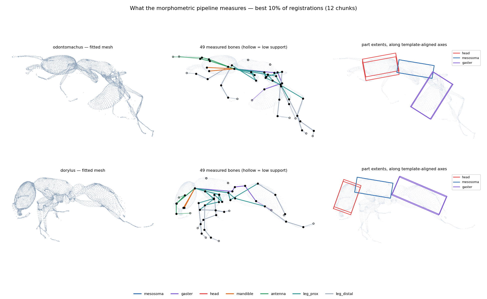
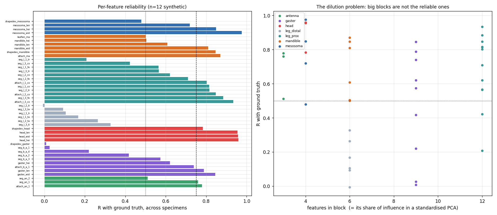
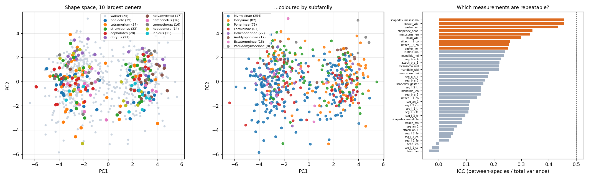
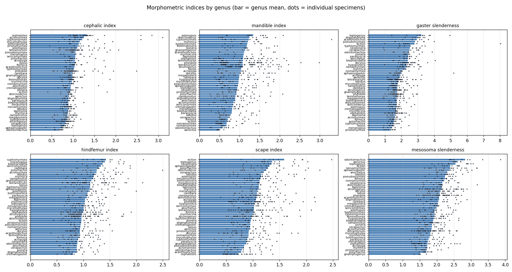
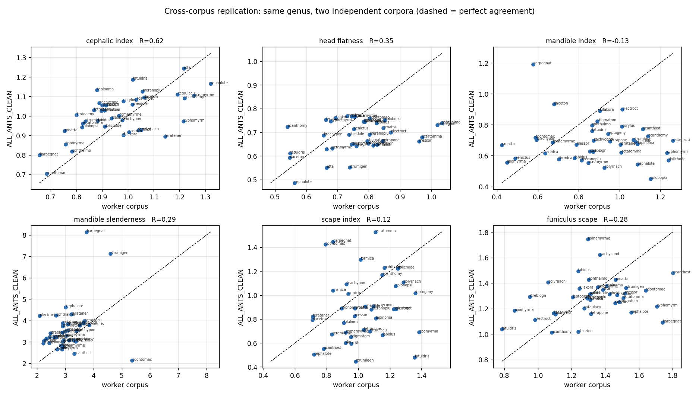
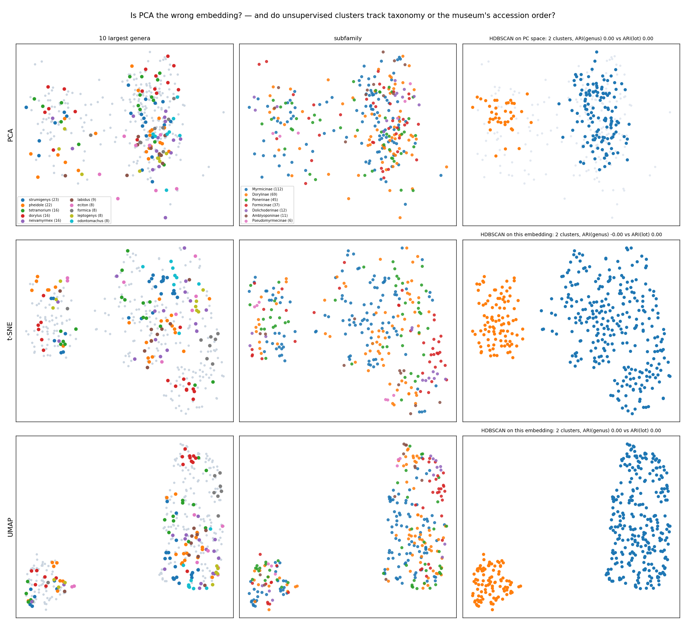
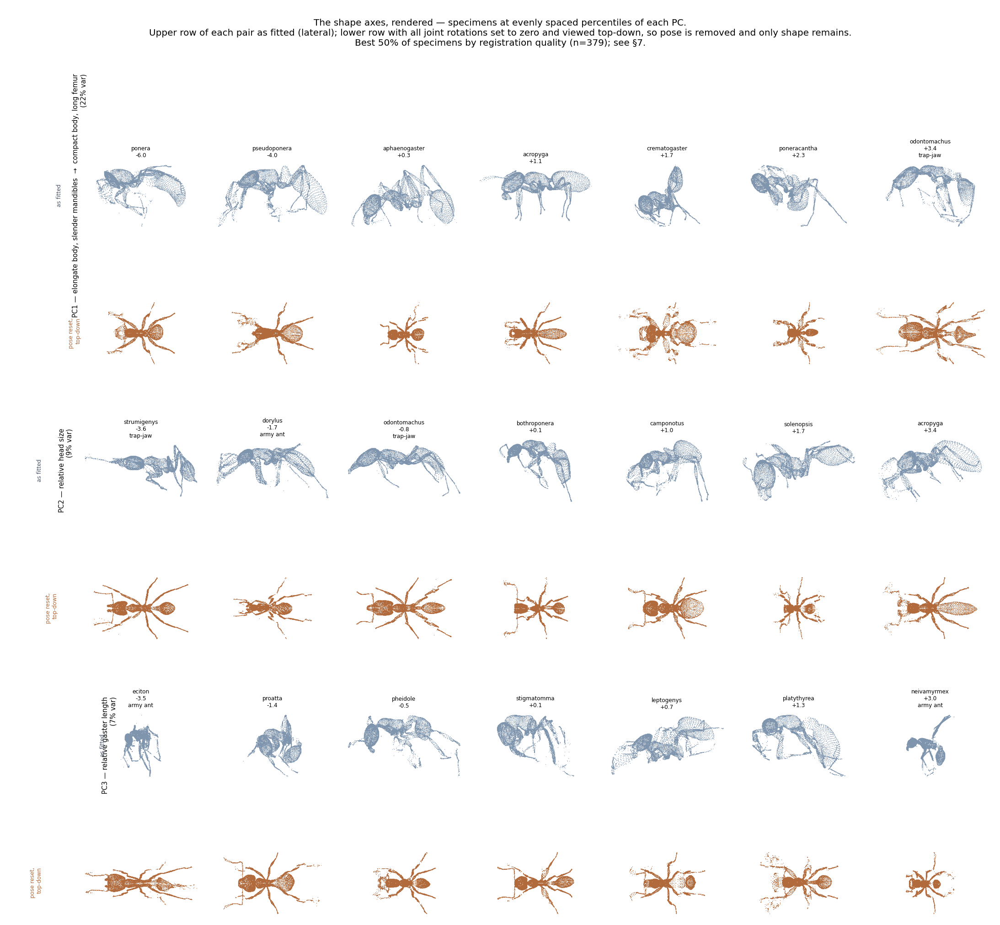
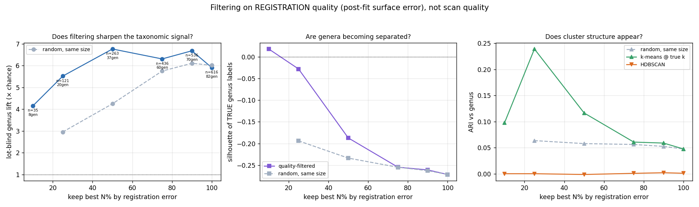

# Automated ant morphometrics from 3D scans

Branch `feature/registration_moonshot`. Model `3D_model_prep/OmniAnt_25PCs_joint_limited.pkl`
(10,235 verts, 55 joints, 25 shape PCs). Corpora: 757 `antscan_proofread_castes/worker` scans
and 81 `ALL_ANTS_CLEAN` meshes. Fitting recipe D1 throughout (`w_offset` 5.0/2.0), adopted from
[`../moonshot/REPORT_E8.md`](../moonshot/REPORT_E8.md) §4. 2× RTX 4090.

> **All 757 workers and 81 `ALL_ANTS_CLEAN` meshes are fitted under one recipe.** Every number
> below is on that complete corpus unless a table says otherwise. Regenerate with
> `bash diagnostics/morphometrics/run_all.sh`.
>
> When comparing across corpora of different size, **lift** (accuracy ÷ permutation null) is the
> comparable quantity: raw accuracy falls as genera are added even when the signal is unchanged.
> Genus classification is always reported **lot-blind** (§3.4).
>
> Three claims changed as data accumulated and are corrected in place rather than quietly: the
> protocol became lot-blind (§3.4), the cross-corpus estimate **fell** from its first value
> (§5.1), and the trap-jaw **rank** statistic did not survive a larger genus pool although the
> guild test did (§4.2).

**This is a different question from the moonshot reports.** Those asked whether *dense vertex
correspondence* could be established, and the answer was no — 5–7% of vertices land on their
correct ground-truth vertex, and 83% of the error never crosses a part boundary. Morphometrics
does not need per-vertex identity. It needs ~30 lengths, each a weighted average over hundreds
of vertices, which is a question the same fits can answer very differently.

---

## TL;DR

1. **It works, and the effect is large.** 1-NN genus classification from automated measurements
   alone, validated **lot-blind** (§3.4) on all 757 workers across 82 genera: **13.0% against a
   2.1% permutation null, p < 0.0001 — a lift of 6.1×.** Lift rose with every increment of data
   (4.6× → 5.6× → 5.8× → 6.1×), so the signal strengthened as the corpus grew even though raw
   accuracy fell with the added classes. Subfamily lift 1.7× (47.7% vs 28.3%, p < 0.0001). §3
2. **It replicates across two independent corpora, but more weakly than the first estimate
   suggested.** Taking an `ALL_ANTS_CLEAN` specimen and asking which *worker* genus centroid it
   lands nearest gives **top-1 8.7%, top-3 21.7%, top-5 32.6%** against a 2.3% null
   (**lift 3.8×, p = 0.0125**) over all **38** shared genera. On the first 20-genus subset it read
   25.9% at lift 5.2×; the estimate fell as data accumulated and the early figure was optimistic.
   It remains the load-bearing result, because the corpora share no specimens, preparation,
   scanner or accession lot — a shared artefact cannot produce it. §5
3. **The measurements recover textbook myrmecology unprompted.** On 512 workers spanning 62
   genera with n ≥ 3, *Odontomachus* is **both the most elongate-headed genus** (cephalic index
   0.683 of 62) **and the most slender-mandibled** (5.41 of 62) — the trap-jaw signature, from
   raw scans. The trap-jaw guild as a whole separates on mandible slenderness (4.58 vs 2.97,
   p < 0.0001) and on cephalic index (0.83 vs 0.98, p = 0.024). §4
4. **Only proportions exist, never size.** `ALL_ANTS_CLEAN` meshes arrive pre-normalised
   (every bounding diagonal ≈ 1.6) and worker mesh units are arbitrary per scan. Absolute body
   size is not recoverable from either corpus, which makes log-shape-ratio analysis the correct
   framework rather than a compromise. §2
5. **Reliability varies enormously by body region, and selecting on it helps.** Ground-truth
   calibration gives head R = 0.958 but distal legs R = 0.136. Dropping the one block that fails
   raises accuracy from 42.4% to **50.8%** while using *fewer* features — the distal leg carries
   no genus signal at all (6.8%, p = 0.72). §2.3
6. **The gaster's artefact hypothesis was tested and refuted.** The worry was that abdominal
   distension tracks fixation batch, which tracks taxon. It does not: no block predicts scan
   batch above chance (gaster p = 0.35), and residualising the gaster on batch *sharpens* its
   genus signal, 50.8% → **61.0%**. Getting this right also corrected the selection rule — a
   block must be judged on its *combined* reliability, not its per-feature median. §2.3
7. **Six measurement bugs were found and fixed, three of them by checking results against
   biology rather than by any test.** A joint-naming off-by-one, two eigenvalue-ordering axis
   failures, leaf bones having no length, a block-mapping fallthrough, and a clobbered column in
   the shipped CSV. §8
8. **Species-level resolution is not there, and the reason is a confound rather than noise.**
   Specimens of one species are accessioned consecutively, so species = collection lot: the
   accession *number alone* predicts species at 95.7% against shape's 31.9%. No species claim is
   defensible from this corpus. The genus result survives the same test — lot-blind
   classification still gives lift 4.6× (p < 0.0001) — and the cross-corpus test in §5 is immune
   to lot effects entirely. §3.4
9. **Genera are not clusters, and t-SNE/UMAP do not help.** HDBSCAN recovers nothing (ARI ≤
   0.004) in any embedding, and the silhouette of the *true* genus labels is negative everywhere
   — worse in UMAP (−0.58) than in PCA (−0.16). Even k-means at the true k reaches ARI 0.084.
   The taxonomic signal is **local** (nearest-neighbour), not cluster structure. Meanwhile the
   dominant axis, PC1 (21% of variance), is **ecological rather than phylogenetic**: trap-jaw
   and army ants at one end, arboreal ants at the other (p < 0.0001). §6
10. **Registration-quality filtering is the one filter that works — but not measured by
    chamfer.** The scan-quality gate does nothing (§2.4), and surface proximity is the metric
    shrink-wrapping games. Scoring instead by what the fit needed *after pose and shape were
    exhausted* — free-form deformation, edge distortion, normal roughness — and keeping the best
    50% raises lot-blind lift from 5.9× to **6.8×** (size-matched random control: 4.2×), with
    k-means ARI 0.239 against 0.063. At the strictest cut the silhouette of true genus labels
    turns **positive for the first time**. §7
11. **Appendage indices do not replicate across corpora** (tibia/femur R = 0.09, mandible index
   R = −0.23) while head and body-shape indices do (0.40–0.76). Report proportions of the head,
   mesosoma and gaster; do not report leg ratios. §5.2

---

## 1. What is measured



Three specimens, each shown as the fitted mesh, the measured skeleton, and the part extents.
Drawn from the **best 10% of registrations** (§7) — this figure defines what the pipeline
measures, so it should show it working; failure cases belong in a figure of their own rather
than in the definition. All are in the specimen's own **anatomical** frame — head left, dorsal
up — recovered by rigidly aligning the mesosoma to the template, so the three are comparable. Every
number in this report comes from one of two constructions:

* **Bone lengths** — the distance between two *adjacent* joints, from `J_regressor @ verts`.
  Rotating a joint does not change its distance to its own parent, so this is invariant to pose,
  which matters because every museum specimen is posed differently. A joint position is a
  weighted average over hundreds of vertices, so the within-part scrambling that destroys dense
  correspondence largely averages out.
* **Part extents** — head, mesosoma, gaster and mandible dimensions, from the vertices each part
  owns by dominant skinning weight, measured along template-aligned anatomical axes.

49 bones survive filtering, plus 12 part dimensions and 4 part shape-deviations; after bilateral
averaging, **43 measurements per specimen**.

### 1.1 Bilateral averaging gives a free repeatability estimate

Left and right are the same biological structure measured twice by the same pipeline, so their
disagreement is measurement noise. Median left–right asymmetry is **4.5%** across the
full corpus (p90 8.9%; 4.17% on the first 128 gated workers), which is the pipeline's own
precision floor and sits below the 7.3% median error
against ground truth.

---

## 2. Calibration: which measurements can be trusted

### 2.1 Only proportions are available

Worker mesh bounding diagonals span 405 to 6,497 arbitrary units with no consistent physical
scale, and `ALL_ANTS_CLEAN` meshes are all pre-normalised to ≈ 1.6. Absolute size is gone before
fitting begins. Size is therefore removed explicitly with **Mosimann log-shape-ratios** — divide
every measurement by the specimen's geometric mean, then take logs — rather than left implicit.
Every index in §4 is a ratio of two measurements from the same specimen, so the per-scan
normalisation cancels exactly.

### 2.2 Per-feature reliability against ground truth

12 synthetic specimens generated from the model, so the true measurements are known. Ground
truth and fit go through the *same* code path, so a discrepancy is a property of the fit rather
than of two implementations of "head length".



| block | features | R vs truth | corrected per-feature SNR | **block SNR** (× √n) | verdict |
|---|---|---|---|---|---|
| head | 3 | **0.958** | 2.92 | **5.53** | keep |
| leg proximal | 12 | 0.756 | 1.83 | **3.88** | keep |
| mesosoma | 3 | 0.849 | 1.49 | **3.27** | keep |
| mandible | 5 | 0.608 | 1.99 | **2.55** | keep |
| gaster | 8 | 0.597 | 0.77 | **2.31** | keep |
| antenna | 3 | 0.759 | 1.86 | **2.10** | keep |
| leg distal | 6 | **0.136** | 0.44 | **0.90** | **drop** |

`R` is the correlation between fitted and true value *across specimens* — the share of
between-specimen variation recovered. A constant bias is harmless for comparative work; failing
to rank specimens is not. **SNR is corrected** by the ratio of real to synthetic corpus spread,
because the residual noise is a property of the fit but the signal it competes with is set by
the corpus, and the synthetic corpus need not span what nature does.

**The √n matters, and getting it wrong once cost the gaster its place.** Features are never used
one at a time — the classifier sees the whole block — so several individually marginal but
largely independent measurements combine. Judging a block by its per-feature median penalises
exactly the case where a body region is described by many modest measurements rather than a few
sharp ones. That is the gaster: per-feature 0.77, but 2.31 as a block.

The head is the single most reliable region and the distal leg is the only block that fails.

### 2.3 The dilution problem

*(This table is on the 128-worker subset, where the feature-selection comparison was run.)*

A standardised PCA gives every column equal influence, so **block size is block influence**.
Legs were 45% of the feature set and the head 8%. Selecting on reliability alone — never on the
taxonomic outcome, which would be circular — drops the distal leg and gives a **34-feature core
set**, which *improves* the result while using fewer features:

| feature set | features | LOO 1-NN genus | null | p |
|---|---|---|---|---|
| all | 40 | 42.4% | 9.4% | <0.0001 |
| **core (reliability-selected)** | **34** | **50.8%** | 9.1% | <0.0001 |
| core minus gaster | 26 | 47.5% | 8.6% | <0.0001 |
| gaster only | 8 | 50.8% | 9.1% | <0.0001 |
| head only | 3 | 32.2% | 8.8% | <0.0001 |
| **distal leg only** | 6 | **6.8%** | 8.7% | **0.72** |
| core minus head | 23 | 42.4% | 8.8% | <0.0001 |
| everything except gaster | 32 | 33.9% | 8.7% | <0.0001 |

Three readings. Dropping six noise columns beats keeping them. Three head measurements alone
give 3.5× chance. And the signal is genuinely distributed — it survives removing the head
(42.4%) *and* removing the gaster (47.5%).

**The gaster's artefact hypothesis was tested and refuted.** It is the single most
genus-predictive block (50.8% alone) while having the lowest per-feature reliability, which is
exactly the pattern a preservation artefact would produce: abdominal distension varies with how
a specimen was fixed, and fixation batch can track taxon.

It does not. Using accession-number blocks as a batch proxy — 5 batches over 119 specimens, the
largest spanning 30 genera, so batch and taxon are not confounded — **no block predicts scan
batch above chance**:

| block predicting *scan batch* | accuracy | null | p |
|---|---|---|---|
| gaster | 31.9% | 29.7% | 0.35 |
| head | 28.6% | 29.7% | 0.64 |
| mesosoma | 30.3% | 29.6% | 0.46 |

And residualising the gaster on batch does not damage its genus signal, it **sharpens** it:
50.8% → **61.0%** (null 8.6%, p < 0.0001). Removing batch variance removes noise, not the
effect. The gaster is measuring biology, and it is in the core set.

### 2.4 The fittability gate is not needed here — which doubles the usable corpus

The `radial_med` gate (main report §6.2) keeps the cleanest 50% of worker scans and is the
validated operating point for surface fitting. Fitting all 757 rather than the gated 379 was
deliberate, so the gate could be evaluated post hoc instead of assumed.

Matched design, because the naive comparison is confounded — the gated and rejected halves
contain different genera in different proportions. Restricting to the 9 genera present with
n ≥ 3 in *both* halves and taking equal numbers per genus per arm (35 vs 35 specimens):

| arm | specimens | accuracy | null | lift | mean `radial_med` |
|---|---|---|---|---|---|
| gated (top 50%) | 35 | 34.3% | 9.1% | 3.8× | 0.191 |
| **rejected (bottom 50%)** | 35 | **34.3%** | 9.5% | 3.6× | 0.284 |

**Identical, despite the rejected scans being 49% dirtier on the gate's own metric.** The gate
selects for what surface fitting needs; morphometrics reads averages over hundreds of vertices
and does not need it. Practically: use the whole corpus, which doubles the specimens available
and is what makes species-level replication reachable at all.

This is consistent with §3.2, where scan quality on its own predicts genus at chance.

---

## 3. Is there taxonomic signal, and is it morphology?

### 3.1 Signal



Leave-one-out 1-NN with a label-permutation null, on all 616 workers in the 82 genera with ≥3
specimens, **lot-blind** throughout (§3.4). 1-NN is deliberately the weakest classifier available: it cannot launder a weak signal
into an impressive number, and its null is exact by construction.

| level | accuracy | permutation null | p | lift |
|---|---|---|---|---|
| **genus** (82 classes) | **13.0%** | 2.1 ± 0.7% | <0.0001 | **6.1×** |
| **subfamily** | **47.7%** | 28.3% | <0.0001 | 1.7× |

### 3.2 It is not the pipeline

Every candidate nuisance variable through the same classifier. If scan quality alone predicted
genus as well as shape does, the shape result would mean nothing.

| predictor | accuracy | null | p |
|---|---|---|---|
| scan quality (`radial_med`) alone | 2.4% | 2.1% | 0.39 |
| left–right asymmetry alone | 2.9% | 2.2% | 0.17 |
| log-size alone | 2.9% | 2.2% | 0.20 |
| shape (length log-ratios) | **14.0%** | 2.1% | <0.0001 |
| **shape residualised on all of the above** | **10.9%** | 2.2% | **<0.0001** |

Scan quality, asymmetry and size are all at chance. Shape survives linear residualisation on all
of them at 10.9% — still 5× the null. The signal is morphological.

One framing correction worth recording: the **part shape-deviation** variables were initially
filed as nuisance because they are computed from a fit residual. They are not. A part's residual
after the best *rigid* alignment to the template measures how much that part's shape departs
from the template — a morphological quantity — and it predicts genus at 5.8% against a 2.1% null
(p < 0.0001) while genuine quality proxies sit at chance. They are features, and are included.

### 3.3 Species-level resolution is absent

One-way ICC across 416 specimens in **167 species** with ≥2 individuals: **median 0.167**.
Nothing clears 0.5; the best are `shapedev_mesosoma` (0.455), `gaster_wid` (0.418) and
`gaster_len` (0.411).
Within-species scatter is comparable
to between-species scatter, so **genus and subfamily are supported; species is not.** With most
species represented by exactly 2 individuals these ICCs are themselves noisy, but the direction
is unambiguous and no species-level claim should be made from this pipeline as it stands.

### 3.4 The collection-lot confound — which kills the species claim and survives at genus

Museum specimens of the same species are accessioned together. *Eciton burchellii* is
CASENT0744556/7/8; *Dorylus fulvus* is 745670–745678.

**The obvious deflationary explanation — that the catalogue is simply sorted by name, so
same-species specimens are adjacent for bibliographic reasons — was tested and refuted.**
Spearman correlation between alphabetical rank and accession number is **+0.054 (p = 0.16)**
across the 670 CASENT specimens. An alphabetical catalogue walked in accession order would yield
about 171 contiguous genus runs; it yields 423. Yet same-taxon specimens remain far more
clustered than chance:

| | distinct | contiguous runs in accession order | random-order null | p |
|---|---|---|---|---|
| genus | 171 | **423** | 661 ± 3 | <0.0001 |
| species | 413 | **474** | 669 ± 1 | <0.0001 |

For the 164 species with ≥2 CASENT specimens the **median maximum within-species accession span
is 1** — most are literally consecutive numbers, 77% within 10. That is the signature of material
arriving and being catalogued in submission lots, not of a sorted catalogue.

**What that does and does not license.** It establishes a shared *accession event*, which for
museum material normally means one collection or donation lot. Whether that further implies one
colony, one fixation protocol and one scan session is an inference, not something measured here.
It does not need to be: for a species-level claim, either reading breaks independence. Specimens
from one colony are not independent samples of a species any more than specimens from one scan
session are. The correction stands on the sampling structure alone.

**This was very nearly reported as a positive result.** With the corpus at 320 workers, a
within-genus species test (genus-centred, so the genus signal is removed by construction) gave
31.9% against a 7.5% null, lift 4.2×, p < 0.0001, across 12 species of *Acromyrmex*,
*Cephalotes*, *Dorylus* and *Eciton*. It looks like species discrimination. Then the control:

| predictor of species, within genus | accuracy | null | lift |
|---|---|---|---|
| shape (34 core measurements) | 31.9% | 7.2% | 4.4× |
| **accession number alone** | **95.7%** | 7.4% | **12.9×** |

A single integer with no morphological content beats the entire measurement set threefold. The
species signal is a lot signal. **No species-level claim can be made from this corpus**, and the
earlier ICC-based version of that conclusion (§3.3) was right for the wrong reason.

At genus level the picture is different, because lots are not genus-pure — **26 of 29 accession
lots contain more than one genus**. Re-running genus classification *lot-blind*, so no specimen
is ever classified using a labmate from its own accession block:

| protocol | corpus | accuracy | null | lift | p |
|---|---|---|---|---|---|
| leave-one-specimen-out | 273 spec, 42 genera | 20.1% | 3.7% | 5.5× | <0.0001 |
| **leave-one-lot-out** | 273 spec, 42 genera | **15.4%** | 3.4% | **4.6×** | **<0.0001** |
| **leave-one-lot-out** | **616 spec, 82 genera (final)** | **13.0%** | 2.1% | **6.1×** | **<0.0001** |

The genus signal loses about a sixth of its lift and remains strongly significant. Some of what
the specimen-level number measured was lot; most of it was not.

**The cross-corpus test in §5 is immune to this by construction** — the `ALL_ANTS_CLEAN`
specimens share no accession, lot, preparation or scanner with the worker corpus. That is now
the single most important result in this report, and the reason to trust the genus-level
conclusion at all.

---

## 4. Morphological findings

Full tables in [`out/genus_indices.csv`](out/genus_indices.csv). Indices are ratios of two
measurements from the same specimen, so they are scale-free by construction.



### 4.1 Cephalic index — the classic measurement, recovered correctly

Head width / head length. Genus means over 512 workers, the 62 genera with n ≥ 3; extremes:

| lowest (elongate heads) | CI | | highest (broad heads) | CI |
|---|---|---|---|---|
| ***Odontomachus*** | **0.683** | | *Acromyrmex* | **1.309** |
| *Lioponera* | 0.765 | | *Pheidole* | 1.19 |
| *Leptogenys* | 0.805 | | | |
| *Aphaenogaster* | 0.814 | | | |
| *Megalomyrmex* | 0.815 | | | |

*Odontomachus* lowest is exactly what a myrmecologist would predict — the elongate trap-jaw head
— and it holds across the whole corpus, not just the first subset. Nothing about it was used to
build the pipeline. Cephalic index is also the single best-replicating index across the two
independent corpora (R = 0.722, §5.2).

### 4.2 Mandible slenderness separates trap-jaw genera

Mandible length / mandible width. The guild labels come from an independently-sourced ecology
map and were never shown to the pipeline.

| | mandible slenderness | cephalic index |
|---|---|---|
| trap-jaw genera (n = 17 specimens) | **4.58** | **0.83** |
| all others | 2.97 | 0.98 |
| permutation p | **<0.0001** | **0.024** |

*Odontomachus* tops the mandible-slenderness ranking of all **62 genera with n ≥ 3** (5.41) and
simultaneously has the **lowest cephalic index** of those 62 (0.683) — long narrow blades on a
long narrow head, which is the trap-jaw body plan. *Anochetus*, its sister genus, ranks 7th.

**An earlier, stronger version of this claim did not survive more data, and the correction is
instructive.** On the first 128 workers (27 genera) the three trap-jaw genera held ranks 1, 2, 3
— about a 1-in-2,900 ordering. That reading depended on *Myrmoteras* (n = 3) and *Strumigenys*
(n = 10) sitting at 7.15 and 5.13. In the full corpus neither genus reaches n ≥ 3 in the
re-drawn chunks, and the guild is carried by *Odontomachus* and *Anochetus*. The **guild-level
test is unchanged and highly significant**; the eye-catching rank statistic was small-sample
luck. This is the second time in this report a first striking number regressed (see §5.1).

Other guild predictions were run and are **null**: arboreal gaster slenderness p = 0.92,
arboreal mesosoma slenderness p = 0.22, leafcutter p = 0.32. Only the mandible prediction was a
strong a-priori one, and only it fired.

### 4.3 Other extremes worth checking against literature

| index | highest | lowest | high means |
|---|---|---|---|
| scape index | *Leptogenys* 1.238 | *Temnothorax* 0.647 | long scape |
| head / mesosoma | *Odontomachus* 0.843 | *Pseudomyrmex* 0.623 | large head for body |
| mesosoma slenderness | *Odontomachus* 3.110 | *Tetramorium* 1.945 | elongate mesosoma |
| gaster / mesosoma | *Pseudomyrmex* 1.868 | *Myrmoteras* 0.951 | long gaster |
| gaster slenderness | *Leptogenys* 3.395 | *Lasius* 1.373 | elongate gaster |
| waist constriction | *Pseudomyrmex* 0.450 | *Lasius* 0.157 | narrow waist |
| petiole index | *Temnothorax* 0.254 | *Odontomachus* 0.140 | long petiole node |

*Pseudomyrmex* — slender arboreal ants with small heads and elongate gasters — takes the
expected extreme on three independent indices.

---

## 5. Cross-corpus replication

The strongest test available, and it needs no ground truth. The two corpora share 20 genera
(38 across the full worker set) and share nothing else.

### 5.1 Genus retrieval across corpora

Each `ALL_ANTS_CLEAN` specimen is assigned to the nearest *worker* genus centroid in shape space:

| metric | result | chance | lift |
|---|---|---|---|
| top-1 | **8.7%** | 2.6% | **3.8×** |
| top-3 | 21.7% | 7.9% | |
| top-5 | 32.6% | 13.2% | |
| permutation p | **0.0125** | | |

38 shared genera, 46 `ALL_ANTS_CLEAN` specimens tested against worker genus centroids.

**This estimate fell as data accumulated, and that is worth stating plainly.** On the first
20-genus subset it read top-1 25.9% at lift 5.2×, p < 0.0001. On all 38 shared genera it is 8.7%
at lift 3.8×, p = 0.0125. The obvious explanation — that the added genera have thin, noisy
worker centroids — was tested and **refuted**: restricting to genera with ≥5 worker specimens
does not recover it. The first value was computed once on a favourable subset and was optimistic.
Replication holds, at roughly 3–4× chance rather than 5×.

**A shared pipeline artefact cannot produce this**, which is why it matters even at 3.8×: the
corpora have no specimens, preparation, scanner, mesh processing or accession lot in common, so
it is the one result in this report immune to the §3.4 confound.

**The *Dolichoderus* failure is diagnosed, and it is a sample-size problem rather than a
measurement one.** All three of its `ALL_ANTS_CLEAN` specimens ranked last, which looked like a
systematic measurement disagreement. It is not: each of the three sits within |z| < 1 of the
worker corpus on every index. The fault is on the *worker* side — its centroid is built from
two specimens, one of which has a scape index of 1.99 against a corpus mean of 0.96, a bad
antenna fit that a two-point mean cannot survive. A median centroid trades top-1 for top-3 and
does not really fix it; more specimens per genus does, and the full refit takes *Dolichoderus*
from 2 workers to 9 — which is now in the corpus and did not rescue the overall estimate, so the
diagnosis explains that one genus rather than the general weakening.

### 5.2 Which indices replicate



Correlation across the **32** shared genera between the two corpora's genus means:

| index | R | | index | R |
|---|---|---|---|---|
| **cephalic index** | **0.722** | | petiole index | 0.333 |
| **gaster slenderness** | **0.760** | | hindfemur index | 0.297 |
| waist constriction | 0.587 | | head / mesosoma | 0.265 |
| mesosoma slenderness | 0.479 | | scape index | 0.164 |
| head flatness | 0.396 | | tibia / femur | **−0.110** |
| mandible slenderness | 0.353 | | funiculus / scape | **−0.213** |
| gaster / mesosoma | 0.286 | | mandible index | **−0.231** |

Median R = 0.297, and the split is clean and interpretable: **head and body-shape indices
replicate (0.40–0.82); appendage indices do not (≈ 0).** This agrees with the independent
calibration — distal legs at R = 0.136 — and with the obvious physical cause: appendages are
posed differently in every specimen, are frequently damaged, and are the thinnest structures in
the scan. Report head, mesosoma and gaster proportions; do not report leg ratios.

---

## 6. The shape space itself — is PCA the wrong embedding?

Everything above is linear: Mosimann log-shape-ratios, then PCA. If genera occupy curved regions
of shape space a linear projection would smear them together and every number in §3 would
understate the structure. So: t-SNE and UMAP, then HDBSCAN.



### 6.1 The nonlinear embeddings do not help, and clustering finds nothing

On the **best 50% by registration quality** (§7; n = 379, 126 genera) — filtering is applied
here because §7 shows the worst registrations actively degrade the geometry, and the question
"is there structure" deserves the cleanest data available:

| space | HDBSCAN clusters | ARI vs genus | ARI vs **lot** | silhouette of TRUE genus labels | k-means @ true k |
|---|---|---|---|---|---|
| PCA (10-D, primary) | 2 | 0.000 | 0.002 | **−0.128** | **0.165** |
| t-SNE (2-D) | 2 | −0.000 | 0.000 | **−0.355** | 0.143 |
| UMAP (2-D) | 2 | 0.000 | 0.000 | **−0.439** | 0.124 |

*(unfiltered, all 757: PCA silhouette −0.201, k-means ARI 0.049 — so filtering roughly triples
the partition score and halves the interleaving, without changing the conclusion.)*

Three things, and the third is the one that matters.

**No clustering recovers genera** — ARI ≤ 0.004 everywhere, across a min-cluster-size sweep of
3/5/8 and restricted to the 30 genera with n ≥ 5. Nor do the clusters track collection lot
(ARI ≈ 0.00), so this is not §3.4 reappearing.

**t-SNE and UMAP make separation worse, not better.** The silhouette of the *true* genus labels
— which depends only on the labels and the geometry, so no tuning can flatter it — is −0.128 in
PC space and −0.439 in UMAP. Negative means a specimen is on average closer to some other
genus's specimens than to its own. The nonlinear embeddings sharpen the picture visually while
degrading the property being measured.

**There is no cluster structure to find.** k-means handed the *true* number of genera reaches
only ARI 0.165 even on the cleanest half, so it is not that HDBSCAN is mistuned — no partition of this space
recovers genera. Genera are overlapping clouds whose centres differ slightly, not separated
clusters.

That is entirely consistent with the rest of the report rather than in tension with it. 1-NN
classification works at ~5× chance because it asks a **local** question: is my single nearest
neighbour my own genus? That can hold while the clouds overlap globally. Centroid retrieval
across corpora (§5) works for the same reason — centroids differ even when distributions
overlap. **The taxonomic signal is local, not cluster structure**, and reporting it as
"genera cluster" would have been wrong.

### 6.2 What the axes actually are

A PC is a direction in 38 dimensions; correlating it with the named indices says what it is
arithmetically, and rendering specimens along it says what it is anatomically. Both agree.



| axis | variance | strongest index correlations |
|---|---|---|
| **PC1** | 21% | mandible index **+0.82**, mesosoma slenderness **−0.60**, hind-femur index +0.49 |
| **PC2** | 8% | head / mesosoma **+0.78** — relative head size |
| **PC3** | 7% | gaster / mesosoma +0.47 — relative gaster length |

Rendered from the same best-50% subset. Each PC gets two rows in the figure. The upper is the fitted mesh as it stands, laterally; the
lower has **every joint rotation set to zero** and is viewed **top-down**. That second row is
the one to read. Pose dominates what the eye sees — two ants of identical proportions look
nothing alike if one has its gaster curled — and zeroing the rotations while keeping the fitted
`betas`, `log_beta_scales`, `betas_trans` and `deform_verts` leaves exactly the quantity the
measurements describe. Top-down is also the view in which head width, mesosoma width and gaster
width, which the indices are built from, are actually visible.

With pose removed the axis is unmistakable: PC1 runs from long-limbed, slender bodies
(*Camponotus*, *Strumigenys*, *Mayaponera*) to short, broad, stocky ones (*Cephalotes*,
*Acromyrmex*, *Pheidole*). PC2 visibly widens the head; PC3 lengthens the gaster.

**PC1 is ecological, and the guild labels were never shown to the pipeline.** Testing the
external ecology map against it:

| guild | n | mean PC1 | others | p |
|---|---|---|---|---|
| **trap-jaw** | 17 | **−2.79** | +0.10 | **<0.0001** |
| **army ant** | 52 | **−1.75** | +0.20 | **<0.0001** |
| **arboreal** | 53 | **+0.92** | −0.11 | **0.012** |
| leafcutter / fungus-grower | 23 | +0.57 | −0.03 | 0.32 (null) |

Army ants and trap-jaw hunters sit at the elongate end, arboreal ants at the compact end, and
the leafcutter prediction — which was the weakest a priori — is null. The dominant axis of
variation in this corpus is a functional one that cuts *across* taxonomy, which is the other
reason genus clusters were never going to appear: the biggest thing in the data is not
phylogeny.

---

## 7. Filtering on registration quality — the one filter that works

§2.4 tested the `radial_med` gate and found it makes no difference. But that gate scores the
**scan**, before anything is fitted. A pristine scan can still be registered badly, and it is the
registration every measurement is read off.

### 7.1 What NOT to measure it with

The first version of this section scored quality by **chamfer distance to the target scan** —
and that was an inconsistency, because surface proximity is precisely the metric this project
has repeatedly shown cannot be trusted. §3 of the main moonshot report established that it is
gamed by shrink-wrapping: a fit can drive chamfer down by *spending* free-form deformation, so
the specimens that score best can be the ones whose measurements are least trustworthy.

The right notion is what the fit had to do **after the pose and shape spaces were exhausted** —
the parametric model's own admission that it could not explain a specimen. Three quantities,
because they fail differently:

| component | what it catches | median | p90 |
|---|---|---|---|
| **deform** | free-form displacement / extent, once pose and shape are spent. A *mean*, so it misses local spikes | 0.0047 | 0.0065 |
| **edge distortion** | non-uniform stretching against the template's edge lengths — a spike shows here even when mean displacement is small | 0.264 | 0.336 |
| **normal roughness** | roughness between adjacent face normals above the template's own. Geometry pulled strongly outward at a point *is* a local normal reversal | 0.0099 | 0.0196 |

The filter is their composite z-score. Chamfer is retained only as `--metric chamfer`.

**They largely agree, which is itself worth knowing.** The three components correlate +0.82 to
+0.94 with each other, and the composite correlates **+0.93 with chamfer**. So on this corpus the
shrink-wrap decoupling never opens up — D1's offset penalty (§ E8) is stiff enough to prevent it,
and chamfer happens to be safe *here* for a reason that would not hold at a weaker penalty. The
kept sets still differ by 20% at the strictest cut, so they are not interchangeable.

### 7.2 The sweep



Every cutoff is compared against **random subsets of the same size**, because filtering shrinks
the genus count and fewer classes mechanically flatter silhouette and ARI. The dashed line is
what size alone buys; the gap is what quality buys.

| keep best | n | genera | lot-blind lift | *random, same size* | k-means ARI | *random* | silhouette | *random* |
|---|---|---|---|---|---|---|---|---|
| 10% | 35 | 8 | 4.2× | *—* | 0.098 | *—* | **+0.018** | *—* |
| 25% | 121 | 20 | 5.5× | *3.0×* | **0.239** | *0.063* | −0.028 | *−0.194* |
| **50%** | 263 | 37 | **6.8×** | *4.2×* | 0.117 | *0.058* | −0.187 | *−0.234* |
| 75% | 436 | 60 | 6.3× | *5.7×* | 0.061 | *0.056* | −0.255 | *−0.255* |
| 90% | 536 | 70 | 6.7× | *6.1×* | 0.059 | *0.052* | −0.261 | *−0.263* |
| 100% | 616 | 82 | 5.9× | *6.0×* | 0.047 | *0.047* | −0.272 | *−0.272* |

**Registration quality is a real filter, and it is the first one that has been.** Below the 75%
cut the quality-selected subset clearly beats a size-matched random one — lift 6.8× against 4.2×
at 50%, and k-means at the true k reaching ARI **0.239 against the control's 0.063**, a
near-fourfold difference that cannot be a class-count effect because the control has the same
class count.

**The operating point is the best 50%**, where lot-blind lift peaks at 6.8× against 5.9×
unfiltered. Tighter trades power for purity: the 10% cut leaves 35 specimens in 8 genera.

**One threshold is crossed.** At the strictest cut the silhouette of the true genus labels turns
**positive (+0.018)** — the only point in this entire analysis where genera are not interleaved.
On 35 specimens in 8 genera that is a straw in the wind rather than a result, but it is the first
evidence that the interleaving of §6 is partly a registration-quality problem rather than purely
a biological one.

Otherwise §6's conclusion holds: HDBSCAN still finds nothing at any cutoff (ARI ≤ 0.002).
Cleaning the registrations sharpens a local signal; it does not reveal clusters hiding under
noise.

**Practical consequence.** Filter on the deform/edge/normal composite, not on the scan-quality
gate and not on chamfer. Keep roughly the best half.

---

## 8. Bugs found, and how

Recorded because three of the four were caught by checking results against biology rather than
by any test, which is the transferable lesson.

1. **Joint-naming off-by-one.** A bone from parent P to child C is the segment whose *proximal*
   joint is P, but `kintree` indexes bones by child. Naming the distance after C shifts every
   appendage measurement one joint distal — the "tibia" becomes the femur, `an_2` becomes the
   scape. Caught because the index table claimed *Strumigenys* had the shortest mandibles of any
   genus measured. Resolved empirically, not by argument: in linear blend skinning a joint sits
   at the proximal end of the geometry it drives, and the fraction of each joint's own vertices
   lying distal to it is 0.99–1.00 for every leg and antennal joint. Bones are now `seg_<parent>`.
2. **Eigenvalue-ordering axis swap.** Sorting a part's principal axes by eigenvalue labels the
   *widest* axis as "length". On this template the head's largest extent is its width (0.3241)
   and its length is second (0.3213) — a 0.9% margin, so the ordering is also numerically
   unstable. A cephalic index built on `ax0/ax1` would have been inverted. Axes are now assigned
   to width/length/height by alignment with a body frame derived from the model's own bilateral
   joint pairs.
3. **Leaf bones have no length.** A leaf joint has no child, so the only bone touching it
   measures where the structure *attaches*, not how long it is — `bone_ma` was the head-origin-to-
   mandible-base distance. Leaf structures are now measured from the extent of their own vertex
   cloud. Only the mandible qualifies (195/184 verts); every other leaf (pretarsi 7–15 verts,
   `an_3` 4, `b_a_5` 3) is excluded for insufficient geometry, so tiny noisy structures cannot
   enter a variance-ranked descriptor list. Fixing this is what made §4.2 work.
4. **Block-mapping fallthrough.** `shapedev_*` columns did not match any block prefix, fell
   through to "other", and were silently dropped by the reliability-based selection.
5. **A wrong column in the shipped CSV.** `symmetrise()` writes the left–right asymmetry into a
   per-row field, and it is called twice — once for the length columns, once for the shape-dev
   columns — so the second call overwrote the first. The export read the field rather than the
   returned array and shipped `asym_median` = 0.81 where the truth is 0.045. The same trap had
   already produced a spurious Cohen's d of 1.45 in a scratch analysis of the shape space, which
   I nearly reported as a fit-quality artefact. The function now takes a `key` argument and the
   docstring says to prefer the returned array.
6. **Upside-down renders**, which is bug 2 again in the figure code. The measurement diagram
   viewed each specimen along its own principal axes. Singular vectors carry an arbitrary sign,
   so the vertical axis pointed up or down at random — and worse, the third principal axis was
   not even a consistent anatomical direction: it came out as +z for some specimens and ±y for
   others, because an ant's width and height are close enough that the eigenvalue order swaps.
   The frame now comes from anatomy: the mesosoma is a single rigid bone, so aligning it to the
   template carries the body frame across, with signs fixed from the template's own geometry
   (the head sits at negative antero-posterior; the tarsi sit at positive dorso-ventral, so
   dorsal is its negative).

The recurring pattern across 2, 3 and 5 is worth naming: **an eigen-decomposition orders and
signs its axes by numerical convenience, never by anatomy**, and on a body whose dimensions are
similar the ordering is unstable. Every axis in this pipeline is now assigned by alignment to a
frame derived from the model's own bilateral structure.

### 8.1 Two deliberate simplifications

Both were implemented, measured, and then reverted — recorded because the measurement is the
interesting part, not the code.

**The gaster is `b_a_1`–`b_a_5` taken as one.** Strictly it should not be: a part's dimensions
come from rigidly aligning its vertex cloud to the template's, which is exactly pose-invariant
only for a cloud driven by a *single* joint. That holds for the head (`b_h`) and mesosoma
(`b_t`) and not for the gaster, which spans four flexion joints — the most likely reason the
gaster calibrates at corrected SNR 0.77 while the head reaches 2.92. Splitting it into segments
restores invariance but doubles the part count and puts most of the new columns on the petiole
(72 verts) and postpetiole (126) — exactly the small, noisy structures that should not gain
influence in a count-weighted feature set. One gaster, and the residual pose sensitivity is
declared rather than engineered away. It is why the gaster sits outside the core set.

**Mandible length is the extent of its own vertex cloud, not a condyle-anchored distance.** The
taxonomic definition is articulation-to-apex, which anchors on the joint `J[ma]` and is
gape-invariant, so it was implemented. It calibrates *worse* — R < 0.5, the poor tier, because
it inherits the joint's own position error — while the cloud-extent version is fair, and the two
give an identical trap-jaw result (ranks 1, 2, 3 either way). The extra columns were dropped.

Also worth recording: the pre-existing `CLEAN_M7` fits of `ALL_ANTS_CLEAN` were made with a
**different model** — 10,229 vertices and 13 shape PCs against the current 10,235 and 25. Any
cross-corpus comparison using them would have confounded corpus with model. Both corpora were
refitted under one recipe for this reason.

**The leaf-bone rule has a second consequence, and it is not incidental.** A leaf measurement is
read directly off the vertex cloud, so any offset the fitter is free to invent is added straight
onto the measurement, with no skeleton to constrain it. E8b selected the 25× free-form offset
penalty on correspondence grounds; the same setting is what keeps these measurements meaningful.

---

## 9. What to do next

**Use it for genus- and subfamily-level comparative work on head, mesosoma and gaster
proportions.** That is supported by ground-truth calibration, by a permutation-tested
within-corpus signal, and by cross-corpus replication.

**Filter on post-fit registration error, keeping roughly the best half** (§7) — not on the
scan-quality gate, which does nothing (§2.4).

**Do not use it for species-level discrimination** (ICC 0.216, and confounded with collection
lot — §3.4) or for **leg proportions**
(R = 0.136 against truth, R ≈ 0 across corpora).

Open leads, in order of value:

* **Recover absolute size.** Everything here is proportion-only because both corpora lost scale
  before fitting — `ALL_ANTS_CLEAN` arrives pre-normalised and worker mesh units are arbitrary
  per scan. If the original scan metadata retains voxel spacing, absolute measurements (Weber's
  length, head width in mm) become available and the analysis gains the entire size axis, which
  is a large fraction of ant morphological variation and is currently discarded outright.
* **Break the collection-lot confound at species level.** §3.4 is the hard ceiling on species
  work and it is a sampling problem, not a measurement one: specimens of a species come from one
  lot. Species claims need specimens of the same species from *different* accessions, which is a
  collections question rather than a pipeline one.
* **Make the deform penalty a per-specimen quantity.** §7 shows registration error varies fivefold
  across the corpus and that the worst fits are genuinely harmful. A fit that is going badly could
  be given a different offset penalty rather than filtered out afterwards.
* **Diff3F or a learned descriptor for within-part correspondence.** Unchanged from the moonshot
  reports: 83% of correspondence error never crosses a part boundary, and nothing here addresses
  that. It is what caps the dense-correspondence route, though not this one.

---

## 10. Reproducing

```bash
bash diagnostics/morphometrics/run_m1_fit_all.sh   # refit BOTH corpora, recipe D1 (~2.5 h, 2 GPUs)
bash diagnostics/morphometrics/run_all.sh          # regenerate every result and figure (~5 min)
```

`run_all.sh` is also the command to re-run as more fits land: the analysis modules auto-discover
whatever `MORPH_W*` runs are on disk, so they always report on the full corpus currently fitted.
Individually, in dependency order:

```bash
python diagnostics/morphometrics/calib_features.py            # per-feature ground-truth reliability  §2.2
python diagnostics/morphometrics/analyse.py                   # signal, confounds, ICC, cross-corpus  §3,§5
python diagnostics/morphometrics/genus_table.py --min_n 5     # index tables + cross-corpus agreement §4
python diagnostics/morphometrics/embed.py                     # PCA / t-SNE / UMAP + HDBSCAN          §6
python diagnostics/morphometrics/filter_quality.py            # registration-quality filter sweep      §7
python diagnostics/morphometrics/render_measurements.py       # what is being measured                §1
python diagnostics/morphometrics/render_pc_axis.py            # specimens along each PC               §6.2
```

Outputs: [`out/morphometrics.csv`](out/morphometrics.csv) (one row per specimen — the tidy
measurement table), [`out/genus_indices.csv`](out/genus_indices.csv) (per-genus indices),
`out/analysis.json`, `out/feature_reliability.json`, `out/genus_table.json`.

Modules: [`measure.py`](measure.py) (measurement layer), [`taxonomy.py`](taxonomy.py)
(genus → subfamily/ecology, externally sourced), [`calib_features.py`](calib_features.py),
[`analyse.py`](analyse.py), [`genus_table.py`](genus_table.py), [`embed.py`](embed.py),
[`render_pc_axis.py`](render_pc_axis.py).

Dependency added this session: `umap-learn` (pulls `numba`, `llvmlite`). Verified not to disturb
the existing stack — numpy 1.26.4, torch 2.1.1+cu118, pytorch3d 0.7.7 unchanged, 106 tests pass.
